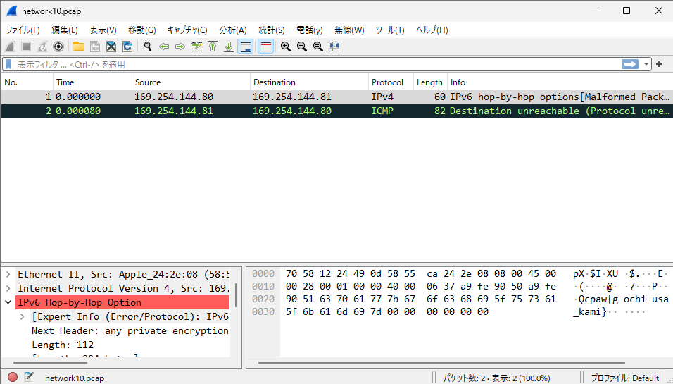

# はじめに

部内 CTF 初心者会用に作った CpawCTF 2024 のカンニングシートです。

# Level 1

## Q1.[Misc] Test Problem

以下のフラグを提出すれば正解です。

```title="flag"
cpaw{this_is_Cpaw_CTF}
```

## Q6.[Crypto] Classical Cipher

シーザー暗号です。3文字面しただけなので、 -3 すれば解読できます。[ASCII コード表](https://www.tuatmcc.com/blog/2024-01-26-ascii-table/)を見たらわかりやすいと思います。

```c
#include <stdio.h>
#include <string.h>

int main()
{
    char flag[] = "fsdz{Fdhvdu_flskhu_lv_fodvvlfdo_flskhu}";
    int n = strlen(flag);
    for(int i = 0; i < n; i++){
        if (('A' <= flag[i] && flag[i] <= 'Z')
            || ('a' <= flag[i] && flag[i] <= 'z')){
            flag[i] -= 3;
        }
    }
    printf("%s", flag);
}
```

<details>
<summary>フラグ</summary>

```title="flag"
cpaw{Caesar_cipher_is_classical_cipher}
```

</details>

ここでアルファベットだけ選んでますが、シーザー暗号になってるのがアルファベットだけなので、これで問題ないです。

```c
('A' <= flag[i] && flag[i] <= 'Z')
          || ('a' <= flag[i] && flag[i] <= 'z')
```

アルファベット以外もやるとこうなります。

```
cpawxCaesar\cipher\is\classical\cipherz
```

## Q7.[Reversing] Can you execute ?

`exec_me` をダウンロードしてください。

はじめになんのバイナリファイルかを調べます。 `file` コマンドを使います。

```bash
file exec_me
```

こんなのが出てきます。

```
exec_me: ELF 64-bit LSB executable, x86-64, version 1 (SYSV), dynamically linked, interpreter /lib64/ld-linux-x86-64.so.2, for GNU/Linux 2.6.24, BuildID[sha1]=663a3e0e5a079fddd0de92474688cd6812d3b550, not stripped
```

`ELF` ファイルであることがわかりました。これは Linux の実行ファイルです。実行してみます。

```bash
./exec_me
```

出てきましたね。

<details>
<summary>フラグ</summary>

```
cpaw{Do_you_know_ELF_file?}
```

</details>

## Q8.[Misc] Can you open this file ?

`file` コマンドを使います。

```bash
file open_me
```

```
open_me: Composite Document File V2 Document, Little Endian, Os: Windows, Version 10.0, Code page: 932, Author: v, Template: Normal.dotm, Last Saved By: v, Revision Number: 1, Name of Creating Application: Microsoft Office Word, Total Editing Time: 28:00, Create Time/Date: Mon Oct 12 04:27:00 2015, Last Saved Time/Date: Mon Oct 12 04:55:00 2015, Number of Pages: 1, Number of Words: 3, Number of Characters: 23, Security: 0
```

`Document` ファイルのようです。 `Name of Creating Application: Microsoft Office Word` って書いてあるのでこのファイルは `Word` で作られたようです。

Word で開いてみましょう。

<details>
<summary>フラグ</summary>


```
cpaw{Th1s_f1le_c0uld_be_0p3n3d}
```

</details>

## Q9.[Web] HTML Page

ページを開きましょう。右クリックか、 `F12` を押して開発者ツールを開いてください。

`ctr+F` を押してページエレメントを `cpaw{` で検索すると出てきます。

<details>
<summary>フラグ</summary>


```
cpaw{9216ddf84851f15a46662eb04759d2bebacac666}
```

</details>

## Q10.[Forensics] River

写真のメタ情報を読む問題です。 [こちら](http://exif-check.org/)のサイトで読むことができます。


<details>
<summary>フラグ</summary>

甲突川(こうつきがわ)って言うらしい。

```
cpaw{koutsukigawa}
```

</details>

## Q11.[Network]pcap

`pcap` はパケットキャプチャファイルです。 `Wireshark` などのツールで開くことができます。

[Wireshark のダウンロード](https://www.wireshark.org/download.html)

<details>
<summary>フラグ</summary>



```
cpaw{gochi_usa_kami}
```

ごちうさ神！

</details>

## Q12.[Crypto]HashHashHash

ハッシュ関数は、任意の長さのデータを固定長のデータに変換する関数です。ハッシュ関数は、同じデータに対しては必ず同じハッシュ値を返し、異なるデータに対しては異なるハッシュ値を返します。

今回は SHA-1 という種類のハッシュ関数です。

あるハッシュ値をググったりすると、ハッシュ値と元のデータのテーブルを持っているサイトが出てくるので、それを使って解読することができます。

<details>
<summary>フラグ</summary>

[こーゆうサイト](https://md5hashing.net/hash/sha1/e4c6bced9edff99746401bd077afa92860f83de3)を使って解読してみましょう。

```
cpaw{Shal}
```

</details>

## Q14.[PPC]並べ替えろ

ソートするプログラムを書きましょう。

<details>
<summary>フラグ</summary>

```c
#include <stdio.h>
#include <stdlib.h>

int cmpfunc(const void *a, const void *b)
{
 return (*(int *)b - *(int *)a);
}

int main()
{
 int ciphertext[] = {15, 1, 93, 52, 66, 31, 87, 0, 42, 77, 46, 24, 99, 10, 19, 36, 27, 4, 58, 76, 2, 81, 50, 102, 33, 94, 20, 14, 80, 82, 49, 41, 12, 143, 121, 7, 111, 100, 60, 55, 108, 34, 150, 103, 109, 130, 25, 54, 57, 159, 136, 110, 3, 167, 119, 72, 18, 151, 105, 171, 160, 144, 85, 201, 193, 188, 190, 146, 210, 211, 63, 207};
 int n = sizeof(ciphertext) / sizeof(ciphertext[0]);
 qsort(ciphertext, n, sizeof(int), cmpfunc);
 for (int i = 0; i < n; i++)
 {
  printf("%d", ciphertext[i]);
 }
 return 0;
}
```

```
cpaw{2112102072011931901881711671601591511501461441431361301211191111101091081051031021009994938785828180777672666360585755545250494642413634333127252420191815141210743210}
```

</details>

# Level 2

## Q13.[Stego]隠されたフラグ

モールス信号です。[こーゆうサイト](https://morsedecoder.com/ja/)を使うとできます。

<details>
<summary>フラグ</summary>

```
cpaw{hidden_message:)}
```

</details>

## Q15.[Web] Redirect

`http://q15.ctf.cpaw.site/` にアクセスすると `http://q9.ctf.cpaw.site/` にリダイレクトされます。ブラウザの拡張機能で `http://q15.ctf.cpaw.site/` にアクセスしたときの通信データを見てみましょう。 `ログを保持` や `Preserve log` をオンにしてください。

<details>
<summary>フラグ</summary>

`http://q15.ctf.cpaw.site/` にアクセスしたときのレスポンスヘッダーにフラグがあります。


```
cpaw{4re_y0u_1ook1ng_http_h3ader?}
```

</details>
