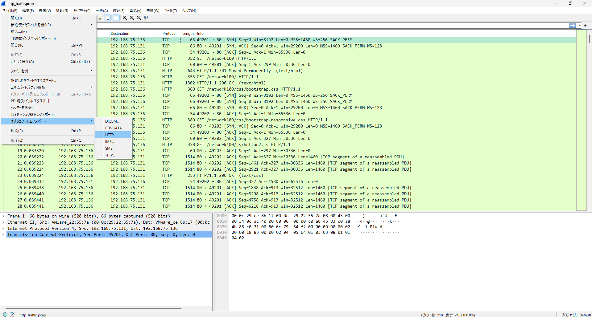
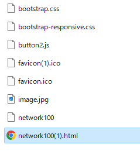
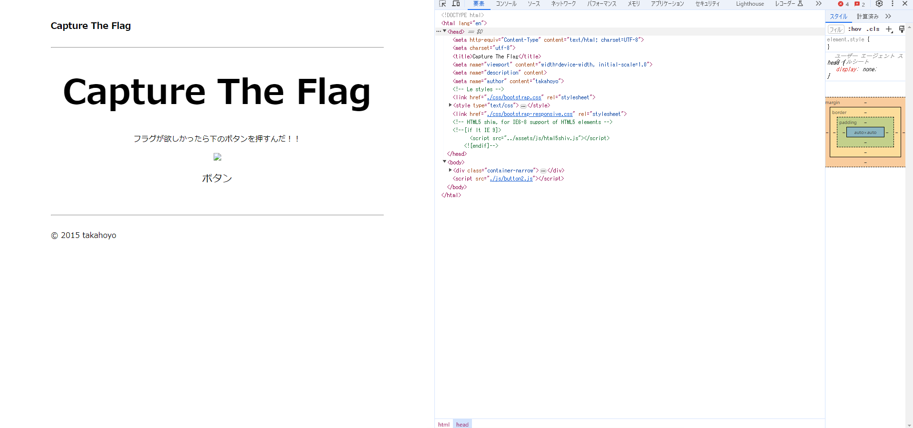
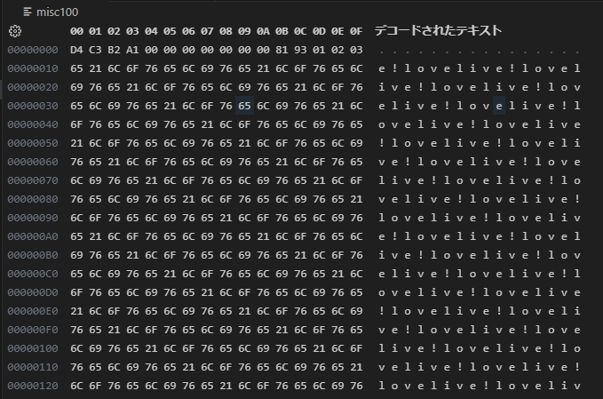
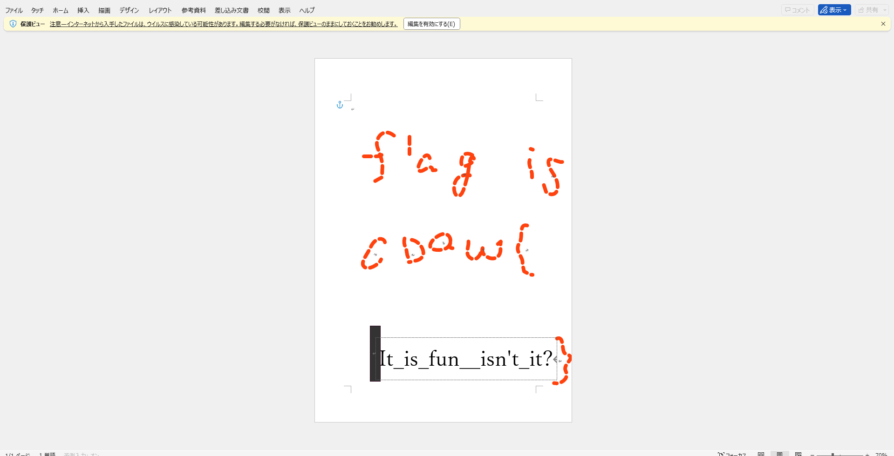
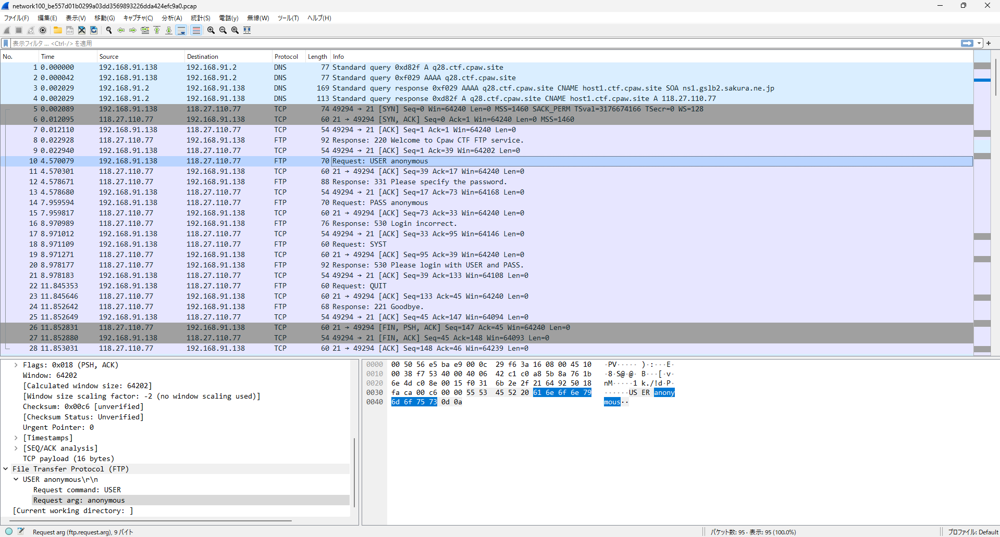
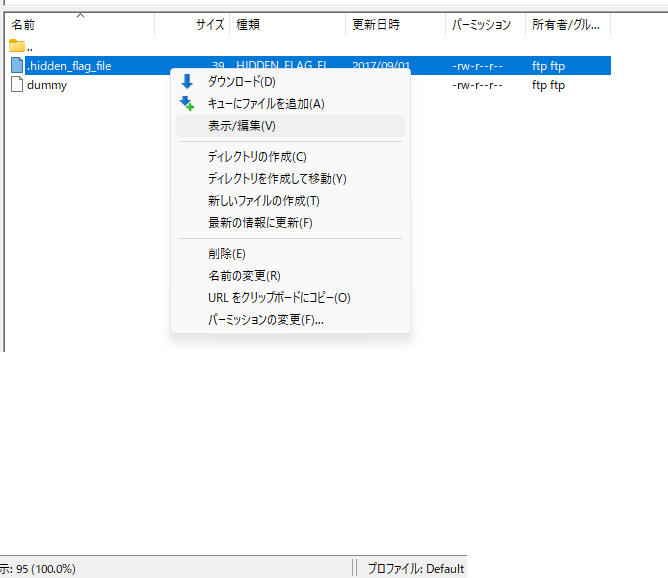

# はじめに

部内 CTF 初心者会用に作った CpawCTF 2024 のカンニングシートです。

# Level 1

## Q1.[Misc] Test Problem

以下のフラグを提出すれば正解です。

```title="flag"
cpaw{this_is_Cpaw_CTF}
```

## Q6.[Crypto] Classical Cipher

シーザー暗号です。3文字面しただけなので、 -3 すれば解読できます。[ASCII コード表](https://www.tuatmcc.com/blog/2024-01-26-ascii-table/)を見たらわかりやすいと思います。

```c
#include <stdio.h>
#include <string.h>

int main()
{
    char flag[] = "fsdz{Fdhvdu_flskhu_lv_fodvvlfdo_flskhu}";
    int n = strlen(flag);
    for(int i = 0; i < n; i++){
        if (('A' <= flag[i] && flag[i] <= 'Z')
            || ('a' <= flag[i] && flag[i] <= 'z')){
            flag[i] -= 3;
        }
    }
    printf("%s", flag);
}
```

<details>
<summary>フラグ</summary>

```title="flag"
cpaw{Caesar_cipher_is_classical_cipher}
```

</details>

ここでアルファベットだけ選んでますが、シーザー暗号になってるのがアルファベットだけなので、これで問題ないです。

```c
('A' <= flag[i] && flag[i] <= 'Z')
          || ('a' <= flag[i] && flag[i] <= 'z')
```

アルファベット以外もやるとこうなります。

```title="notflag"
cpawxCaesar\cipher\is\classical\cipherz
```

## Q7.[Reversing] Can you execute ?

`exec_me` をダウンロードしてください。

はじめになんのバイナリファイルかを調べます。 `file` コマンドを使います。

```txt
file exec_me
```

こんなのが出てきます。

```txt
exec_me: ELF 64-bit LSB executable, x86-64, version 1 (SYSV), dynamically linked, interpreter /lib64/ld-linux-x86-64.so.2, for GNU/Linux 2.6.24, BuildID[sha1]=663a3e0e5a079fddd0de92474688cd6812d3b550, not stripped
```

`ELF` ファイルであることがわかりました。これは Linux の実行ファイルです。実行してみます。

```bash
./exec_me
```

出てきましたね。

<details>
<summary>フラグ</summary>

```title="flag"
cpaw{Do_you_know_ELF_file?}
```

</details>

## Q8.[Misc] Can you open this file ?

`file` コマンドを使います。

```bash
file open_me
```

```txt
open_me: Composite Document File V2 Document, Little Endian, Os: Windows, Version 10.0, Code page: 932, Author: v, Template: Normal.dotm, Last Saved By: v, Revision Number: 1, Name of Creating Application: Microsoft Office Word, Total Editing Time: 28:00, Create Time/Date: Mon Oct 12 04:27:00 2015, Last Saved Time/Date: Mon Oct 12 04:55:00 2015, Number of Pages: 1, Number of Words: 3, Number of Characters: 23, Security: 0
```

`Document` ファイルのようです。 `Name of Creating Application: Microsoft Office Word` って書いてあるのでこのファイルは `Word` で作られたようです。

Word で開いてみましょう。

<details>
<summary>フラグ</summary>


```title="flag"
cpaw{Th1s_f1le_c0uld_be_0p3n3d}
```

</details>

## Q9.[Web] HTML Page

ページを開きましょう。右クリックか、 `F12` を押して開発者ツールを開いてください。

`ctr+F` を押してページエレメントを `cpaw{` で検索すると出てきます。

<details>
<summary>フラグ</summary>


```title="flag"
cpaw{9216ddf84851f15a46662eb04759d2bebacac666}
```

</details>

## Q10.[Forensics] River

写真のメタ情報を読む問題です。 [こちら](http://exif-check.org/)のサイトで読むことができます。


<details>
<summary>フラグ</summary>

甲突川(こうつきがわ)って言うらしい。

```title="flag"
cpaw{koutsukigawa}
```

</details>

## Q11.[Network]pcap

`pcap` はパケットキャプチャファイルです。 `Wireshark` などのツールで開くことができます。

[Wireshark のダウンロード](https://www.wireshark.org/download.html)

<details>
<summary>フラグ</summary>


```title="flag"
cpaw{gochi_usa_kami}
```

ごちうさ神！

</details>

## Q12.[Crypto]HashHashHash

ハッシュ関数は、任意の長さのデータを固定長のデータに変換する関数です。ハッシュ関数は、同じデータに対しては必ず同じハッシュ値を返し、異なるデータに対しては異なるハッシュ値を返します。

今回は SHA-1 という種類のハッシュ関数です。

あるハッシュ値をググったりすると、ハッシュ値と元のデータのテーブルを持っているサイトが出てくるので、それを使って解読することができます。

<details>
<summary>フラグ</summary>

[こーゆうサイト](https://md5hashing.net/hash/sha1/e4c6bced9edff99746401bd077afa92860f83de3)を使って解読してみましょう。

```title="flag"
cpaw{Shal}
```

</details>

## Q14.[PPC]並べ替えろ

ソートするプログラムを書きましょう。

<details>
<summary>フラグ</summary>

```c
#include <stdio.h>
#include <stdlib.h>

int cmpfunc(const void *a, const void *b)
{
 return (*(int *)b - *(int *)a);
}

int main()
{
    int ciphertext[] = {15, 1, 93, 52, 66, 31, 87, 0, 42, 77, 46, 24, 99, 10, 19, 36, 27, 4, 58, 76, 2, 81, 50, 102, 33, 94, 20, 14, 80, 82, 49, 41, 12, 143, 121, 7, 111, 100, 60, 55, 108, 34, 150, 103, 109, 130, 25, 54, 57, 159, 136, 110, 3, 167, 119, 72, 18, 151, 105, 171, 160, 144, 85, 201, 193, 188, 190, 146, 210, 211, 63, 207};
    int n = sizeof(ciphertext) / sizeof(ciphertext[0]);
    qsort(ciphertext, n, sizeof(int), cmpfunc);
    for (int i = 0; i < n; i++)
    {
        printf("%d", ciphertext[i]);
    }
    return 0;
}
```

```title="flag"
cpaw{2112102072011931901881711671601591511501461441431361301211191111101091081051031021009994938785828180777672666360585755545250494642413634333127252420191815141210743210}
```

</details>

# Level 2

## Q13.[Stego]隠されたフラグ

モールス信号です。[こーゆうサイト](https://morsedecoder.com/ja/)を使うとできます。

<details>
<summary>フラグ</summary>

```title="flag"
cpaw{hidden_message:)}
```

</details>

## Q15.[Web] Redirect

`http://q15.ctf.cpaw.site/` にアクセスすると `http://q9.ctf.cpaw.site/` にリダイレクトされます。ブラウザの拡張機能で `http://q15.ctf.cpaw.site/` にアクセスしたときの通信データを見てみましょう。 `ログを保持` や `Preserve log` をオンにしてください。

<details>
<summary>フラグ</summary>

`http://q15.ctf.cpaw.site/` にアクセスしたときのレスポンスヘッダーにフラグがあります。


```title="flag"
cpaw{4re_y0u_1ook1ng_http_h3ader?}
```

</details>

## Q16.[Network+Forensic]HTTP Traffic

WireShark で開いてみましょう。そして WireShark で通信してるファイルを復元します。ファイル → オブジェクトをエクスポート → HTTP で、すべて保存してください。



`network100` ダミーか、、、

`network100(1).html` にして、ブラウザで開いてみましょう。





うまく表示されない、、、どうやら `bootstrap.css` と `button2.js` がそれぞれ `css` と `js` というフォルダの中にあるようです。フォルダを作って、それぞれのファイルを移動してください。

<details>
<summary>フラグ</summary>


```title="flag"
cpaw{Y0u_r3st0r3d_7his_p4ge}
```

</details>

## Q17.[Recon]Who am I ?

`@porisuteru スペシャルフォース2` で検索してみましょう。

<details>
<summary>フラグ</summary>

```title="flag"
cpaw{parock}
```

</details>

# Q18.[Forensic]leaf in forest

`pcap` かと思ったら違いました、、、 先頭 16 byte 以降に `lovelive!` がいっぱい書かれています。たまに大文字や `{}` が入っています。なので、 16 byte 以降で `A-Z` と `{}` と `_` だけを取り出します。



<details>
<summary>フラグ</summary>

```c
#include <stdio.h>
#include <stdlib.h>

char buf[65565];
char result[65565];
int main()
{
    const char path[] = "misc100";
    int index = 0;
    FILE *fp = fopen(path, "r");

    fread(buf, 1, sizeof(buf), fp);
    fclose(fp);

    for (int i = 16; i < sizeof(buf); i++)
    {
        if ('A' <= buf[i] && buf[i] <= 'Z' || buf[i] == '{' || buf[i] == '}' || buf[i] == '_')
            result[index++] = buf[i];
    }

    puts(result);
    return 0;
}
```

```title="flag"
cpaw{mgrep}
```

</details>

## Q19.[Misc]Image

zip ファイルですが、解凍できません。 `file` コマンドで調べてみましょう。

```txt
misc100.zip: OpenDocument Drawing
```

どうやら `OpenDocument Drawing` というファイルのようです。  `OpenDocument Drawing` というのは `Word` で開くことができます。 `Word` などのファイルは実態が `zip` であることがよくあります。

<details>
<summary>フラグ</summary>



```title="flag"
cpaw{It_is_fun__isn't_it?}
```

</details>

## Q20.[Crypto]Block Cipher

ソースコードを見た感じ、コンパイルして引数に暗号文とテキトーな数字を入れるとフラグが出てくるようです。

数字は 1 から順に入れていってみましょう。

<details>
<summary>フラグ</summary>

4 回目で出ました。

```bash
$ ./a.out ruoYced_ehpigniriks_i_llrg_stae 1
cpaw{ruoYced_ehpigniriks_i_llrg_stae}
$ ./a.out ruoYced_ehpigniriks_i_llrg_stae 2
cpaw{urYoec_dheipngriki_s_illgrs_ate}
$ ./a.out ruoYced_ehpigniriks_i_llrg_stae 3
cpaw{ourecYe_diphingkiri_sll__grats}
$ ./a.out ruoYced_ehpigniriks_i_llrg_stae 4
cpaw{Your_deciphering_skill_is_great}
```

```title="flag"
cpaw{Your_deciphering_skill_is_great}
```

</details>

## Q21.[Reversing]reversing easy

普通に実行すると `cpaw{}` だけが出てきます。 `gdb` を使って中のアセンブリを見てみます。以下のコマンドで起動します。

```bash
gdb rev100
```

main 関数のアセンブリを見てみます。

```gdb
(gdb) disas main
```

```gdb
Dump of assembler code for function main:
   0x0804849d <+0>:     push   %ebp
   0x0804849e <+1>:     mov    %esp,%ebp
   0x080484a0 <+3>:     and    $0xfffffff0,%esp
   0x080484a3 <+6>:     sub    $0x50,%esp
   0x080484a6 <+9>:     mov    %gs:0x14,%eax
   0x080484ac <+15>:    mov    %eax,0x4c(%esp)
   0x080484b0 <+19>:    xor    %eax,%eax
   0x080484b2 <+21>:    movl   $0x77617063,0x46(%esp)
   0x080484ba <+29>:    movw   $0x7b,0x4a(%esp)
   0x080484c1 <+36>:    movl   $0x79,0x20(%esp)
   0x080484c9 <+44>:    movl   $0x61,0x24(%esp)
   0x080484d1 <+52>:    movl   $0x6b,0x28(%esp)
   0x080484d9 <+60>:    movl   $0x69,0x2c(%esp)
   0x080484e1 <+68>:    movl   $0x6e,0x30(%esp)
   0x080484e9 <+76>:    movl   $0x69,0x34(%esp)
   0x080484f1 <+84>:    movl   $0x6b,0x38(%esp)
   0x080484f9 <+92>:    movl   $0x75,0x3c(%esp)
   0x08048501 <+100>:   movl   $0x21,0x40(%esp)
   0x08048509 <+108>:   movw   $0xa7d,0x15(%esp)
   0x08048510 <+115>:   movb   $0x0,0x17(%esp)
   0x08048515 <+120>:   movl   $0x5,0x1c(%esp)
   0x0804851d <+128>:   lea    0x46(%esp),%eax
   0x08048521 <+132>:   mov    %eax,0x4(%esp)
   0x08048525 <+136>:   movl   $0x8048620,(%esp)
   0x0804852c <+143>:   call   0x8048350 <printf@plt>
   0x08048531 <+148>:   cmpl   $0x5,0x1c(%esp)
   0x08048536 <+153>:   je     0x804855e <main+193>
   0x08048538 <+155>:   movl   $0x0,0x18(%esp)
   0x08048540 <+163>:   jmp    0x8048557 <main+186>
   0x08048542 <+165>:   mov    0x18(%esp),%eax
   0x08048546 <+169>:   mov    0x20(%esp,%eax,4),%eax
   0x0804854a <+173>:   mov    %eax,(%esp)
   0x0804854d <+176>:   call   0x8048390 <putchar@plt>
   0x08048552 <+181>:   addl   $0x1,0x18(%esp)
   0x08048557 <+186>:   cmpl   $0x8,0x18(%esp)
   0x0804855c <+191>:   jle    0x8048542 <main+165>
   0x0804855e <+193>:   lea    0x15(%esp),%eax
   0x08048562 <+197>:   mov    %eax,0x4(%esp)
   0x08048566 <+201>:   movl   $0x8048620,(%esp)
   0x0804856d <+208>:   call   0x8048350 <printf@plt>
   0x08048572 <+213>:   mov    $0x0,%eax
   0x08048577 <+218>:   mov    0x4c(%esp),%edx
   0x0804857b <+222>:   xor    %gs:0x14,%edx
   0x08048582 <+229>:   je     0x8048589 <main+236>
   0x08048584 <+231>:   call   0x8048360 <__stack_chk_fail@plt>
   0x08048589 <+236>:   leave  
   0x0804858a <+237>:   ret    
End of assembler dump.
```

`0x080484b2` で `0x46(%esp)` に `$0x77617063` を代入しています。[アスキーコード表](https://tuatmcc.com/blog/2024-01-26-ascii-table/)を見ると `wapc` になります。 リトルエンディアンなので逆になっているので、 `cpaw` であることがわかります。 このことから `0x080484b2` から `0x08048515` で `mov` を使っているので、プラグのテキストを代入していると推測できます。

`0x0804851d` から `0x0804852c` は `printf` を呼び出しています。

`0x08048531` で `0x1c(%esp)` と数字の `5` を比較して、 `0x08048536` で等しければ `0x804855e` にジャンプします。 `0x1c(%esp)` ですが、 `0x08048515` で `5` を代入してから変更をしていないので、必ず `0x804855e` にジャンプします。

`0x0804855e` から `0x0804856d` は `printf` を呼び出しています。

`0x08048572` 以降は main 関数の終了処理です。

`0x08048536` で必ずジャンプしてしまうため、 `0x08048538` から `0x0804855c` の間にフラグを出力する処理があると推測します。そのため、 `0x08048531` を処理する直前に `0x1c(%esp)` に `5` 以外の数字を代入して、 `0x08048536` でジャンプしないようにします。

`0x08048531` にブレークポイントを刺します。

```gdb
(gdb) break *0x08048531
```

`r` で実行します。

```gdb
(gdb) r
```

`0x08048531` で停止します。 `disass` でアセンブリを見て見ましょう。矢印で指しているところが今の命令です。

```gdb
(gdb) disass
Dump of assembler code for function main:
   0x0804849d <+0>:     push   %ebp
   0x0804849e <+1>:     mov    %esp,%ebp
   0x080484a0 <+3>:     and    $0xfffffff0,%esp
   0x080484a3 <+6>:     sub    $0x50,%esp

   ***** 省略 *****

   0x08048515 <+120>:   movl   $0x5,0x1c(%esp)
   0x0804851d <+128>:   lea    0x46(%esp),%eax
   0x08048521 <+132>:   mov    %eax,0x4(%esp)
   0x08048525 <+136>:   movl   $0x8048620,(%esp)
   0x0804852c <+143>:   call   0x8048350 <printf@plt>
=> 0x08048531 <+148>:   cmpl   $0x5,0x1c(%esp)
   0x08048536 <+153>:   je     0x804855e <main+193>
   0x08048538 <+155>:   movl   $0x0,0x18(%esp)
   0x08048540 <+163>:   jmp    0x8048557 <main+186>
   
   ***** 省略 *****
```

`0x1c(%esp)` に `5` 以外の数字を代入します。ここでは `0x1c(%esp)` に `0` を代入します。

```gdb
(gdb) p *(int*)($esp + 0x1c) = 0
```

`c` で続行します。

```gdb
(gdb) c
```

<details>
<summary>フラグ</summary>

```title="flag"
cpaw{yakiniku!}
```

</details>

## Q22.[Web]Baby's SQLi - Stage 1-

`palloc_home` テーブルを表示する SQL を書きましょう。

```sql
select * from palloc_home;
```

<details>
<summary>フラグ</summary>

```title="flag"
cpaw{palloc_escape_from_stage1;(}
```

</details>

## Q28.[Network] Can you login？

Wireshark で開いてみましょう。



FTP 通信をしています。これはファイル転送プロトコルです。 FTP は暗号化せず、ユーザ名やパスワードが平文で送信されるため、セキュリティ上の問題があります。実際、 No.10 と No.14 のパケットを見ると、ユーザ名 `anonymous` とパスワード `anonymous` が平文で送信されています。しかし、 No.16 のパケットを見るとログインに失敗しているので、このユーザ名とパスワードは違うようです。 No.38 と No.42 のパケットを見ると、ユーザ名 `cpaw_user` とパスワード `5f4dcc3b5aa765d61d8327deb882cf99` が平文で送信されています。 これを使ってログインしてみましょう。

FTP では、 FTP クライアントが必要です。 [FileZilla](https://filezilla-project.org/) などを使ってログインしてみましょう。

ホスト (接続先) ははじめに DNS に問い合わせしている `q28.ctf.cpaw.site` です。 ユーザ名は `cpaw_user` です。 パスワードは `5f4dcc3b5aa765d61d8327deb882cf99` です。接続したら、 上にある `サーバー` → `強制的に隠しファイルを表示` をクリックしてください。

`.hidden_flag_file` にフラグがあります。 ファイルを選択し、右クリックして表示してください。



<details>
<summary>フラグ</summary>

```title="flag"
cpaw{f4p_sh0u1d_b3_us3d_in_3ncryp4i0n}
```

</details>

# Level 3

## Q23.[Reversing]またやらかした！

普通に実行しても何も表示されませんでした。

gdb を使います。

```bash
gdb rev200
```

main 関数のアセンブリを見てみます。

```gdb
Dump of assembler code for function main:
   0x080483ed <+0>:     push   %ebp
   0x080483ee <+1>:     mov    %esp,%ebp
   0x080483f0 <+3>:     push   %edi
   0x080483f1 <+4>:     push   %ebx
   0x080483f2 <+5>:     add    $0xffffff80,%esp
   0x080483f5 <+8>:     movl   $0x7a,-0x78(%ebp)
   0x080483fc <+15>:    movl   $0x69,-0x74(%ebp)
   0x08048403 <+22>:    movl   $0x78,-0x70(%ebp)
   0x0804840a <+29>:    movl   $0x6e,-0x6c(%ebp)
   0x08048411 <+36>:    movl   $0x62,-0x68(%ebp)
   0x08048418 <+43>:    movl   $0x6f,-0x64(%ebp)
   0x0804841f <+50>:    movl   $0x7c,-0x60(%ebp)
   0x08048426 <+57>:    movl   $0x6b,-0x5c(%ebp)
   0x0804842d <+64>:    movl   $0x77,-0x58(%ebp)
   0x08048434 <+71>:    movl   $0x78,-0x54(%ebp)
   0x0804843b <+78>:    movl   $0x74,-0x50(%ebp)
   0x08048442 <+85>:    movl   $0x38,-0x4c(%ebp)
   0x08048449 <+92>:    movl   $0x38,-0x48(%ebp)
   0x08048450 <+99>:    movl   $0x64,-0x44(%ebp)
   0x08048457 <+106>:   movl   $0x19,-0x7c(%ebp)
   0x0804845e <+113>:   lea    -0x40(%ebp),%ebx
   0x08048461 <+116>:   mov    $0x0,%eax
   0x08048466 <+121>:   mov    $0xe,%edx
   0x0804846b <+126>:   mov    %ebx,%edi
   0x0804846d <+128>:   mov    %edx,%ecx
   0x0804846f <+130>:   rep stos %eax,%es:(%edi)
   0x08048471 <+132>:   movl   $0x0,-0x80(%ebp)
   0x08048478 <+139>:   jmp    0x8048491 <main+164>
   0x0804847a <+141>:   mov    -0x80(%ebp),%eax
   0x0804847d <+144>:   mov    -0x78(%ebp,%eax,4),%eax
   0x08048481 <+148>:   xor    -0x7c(%ebp),%eax
   0x08048484 <+151>:   mov    %eax,%edx
   0x08048486 <+153>:   mov    -0x80(%ebp),%eax
   0x08048489 <+156>:   mov    %edx,-0x40(%ebp,%eax,4)
   0x0804848d <+160>:   addl   $0x1,-0x80(%ebp)
   0x08048491 <+164>:   cmpl   $0xd,-0x80(%ebp)
   0x08048495 <+168>:   jle    0x804847a <main+141>
   0x08048497 <+170>:   mov    $0x0,%eax
   0x0804849c <+175>:   sub    $0xffffff80,%esp
   0x0804849f <+178>:   pop    %ebx
   0x080484a0 <+179>:   pop    %edi
   0x080484a1 <+180>:   pop    %ebp
   0x080484a2 <+181>:   ret    
End of assembler dump.
```

`0x080483f5` から `0x08048457` がフラグを代入していると推測できます。

`0x08048497` にブレークポイントを刺して、 `-0x78(%ebp)` 以降のスタックの中身を見てみましょう。

```gdb
(gdb) break *0x08048497
```

実行

```gdb
(gdb) r
```

`-0x78(%ebp)` 以降のスタックの中身を 128 byte ほど表示します。

```gdb
(gdb) x/128c $ebp - 0x78
```

```gdb
(gdb) x/128c $ebp - 0x78
0xffffc800:     122 'z' 0 '\000'        0 '\000'        0 '\000'        105 'i' 0 '\000'        0 '\000'        0 '\000'
0xffffc808:     120 'x' 0 '\000'        0 '\000'        0 '\000'        110 'n' 0 '\000'        0 '\000'        0 '\000'
0xffffc810:     98 'b'  0 '\000'        0 '\000'        0 '\000'        111 'o' 0 '\000'        0 '\000'        0 '\000'
0xffffc818:     124 '|' 0 '\000'        0 '\000'        0 '\000'        107 'k' 0 '\000'        0 '\000'        0 '\000'
0xffffc820:     119 'w' 0 '\000'        0 '\000'        0 '\000'        120 'x' 0 '\000'        0 '\000'        0 '\000'
0xffffc828:     116 't' 0 '\000'        0 '\000'        0 '\000'        56 '8'  0 '\000'        0 '\000'        0 '\000'
0xffffc830:     56 '8'  0 '\000'        0 '\000'        0 '\000'        100 'd' 0 '\000'        0 '\000'        0 '\000'
0xffffc838:     99 'c'  0 '\000'        0 '\000'        0 '\000'        112 'p' 0 '\000'        0 '\000'        0 '\000'
0xffffc840:     97 'a'  0 '\000'        0 '\000'        0 '\000'        119 'w' 0 '\000'        0 '\000'        0 '\000'
0xffffc848:     123 '{' 0 '\000'        0 '\000'        0 '\000'        118 'v' 0 '\000'        0 '\000'        0 '\000'
0xffffc850:     101 'e' 0 '\000'        0 '\000'        0 '\000'        114 'r' 0 '\000'        0 '\000'        0 '\000'
0xffffc858:     110 'n' 0 '\000'        0 '\000'        0 '\000'        97 'a'  0 '\000'        0 '\000'        0 '\000'
0xffffc860:     109 'm' 0 '\000'        0 '\000'        0 '\000'        33 '!'  0 '\000'        0 '\000'        0 '\000'
0xffffc868:     33 '!'  0 '\000'        0 '\000'        0 '\000'        125 '}' 0 '\000'        0 '\000'        0 '\000'
0xffffc870:     0 '\000'        -80 '\260'      -6 '\372'       -9 '\367'       -128 '\200'     -53 '\313'      -1 '\377'       -9 '\367'
0xffffc878:     32 ' '  -48 '\320'      -1 '\377'       -9 '\367'       25 '\031'       101 'e' -38 '\332'      -9 '\367'
```

`0xffffc838` 以降に 4 byte ずつ `cpaw{` が入ってるのが見えます。 文字列を int 型として扱っているのでしょう。

<details>
<summary>フラグ</summary>

```title="flag"
cpaw{vernam!!}
```

</details>

## Q24.[Web]Baby's SQLi - Stage 2-

sQL インジェクションの問題です。

``select * from user_table where pass = '$pass';`` という SQL であると推測します。

`$pass` が入力されたパスワードです。 ここで、パスワードに ``' or 1 = 1 --`` という文字列をいれると、 SQL は ``select * from user_table where pass = '' or 1 = 1 --';`` となり、 `1 = 1` は常に真なので、すべてのユーザが表示されます。 `--` はコメントアウトの記号です。 ほかの条件があっても、 `--` 以降はコメントとして見られるため、無視されます。

<details>
<summary>フラグ</summary>

```title="flag"
cpaw{p@ll0c_1n_j@1l3:)}
```

</details>

## Q26.[PPC]Remainder theorem

プログラムを書きましょう！

```c
#include <stdio.h>
#include <stdlib.h>

int main()
{
	unsigned long long x = 32134;
	unsigned long long mod;
	while (1)
	{
		if (x % 3438478 == 193127)
		{
			printf("%lld\n", x);
			break;
		}
		x += 1584891;
		if (x < 0)
		{
			printf("No solution\n");
			break;
		}
	}

	return 0;
}
```

<details>
<summary>フラグ</summary>

```title="flag"
cpaw{35430270439}
```

</details>

## Q29.[Crypto] Common World

`hint.txt` を見ると、同じ公開鍵で暗号化しています。 RSA 暗号で同じ公開鍵で暗号化すると Common Modulus Attack ができます。

```python
def excgcd(a, b):
    if(b != 0):
        d, y, x = excgcd(b, a % b)
        y -= (a // b) * x
        return d, x, y
    return a, 1, 0

def commonModulusAttack(N, e_1, c_1, e_2, c_2):
    d, s_1, s_2 = excgcd(e_1, e_2)
    return (pow(c_1, s_1 ,N) * pow(c_2, s_2,N)) % N

N = 236934049743116267137999082243372631809789567482083918717832642810097363305512293474568071369055296264199854438630820352634325357252399203160052660683745421710174826323192475870497319105418435646820494864987787286941817224659073497212768480618387152477878449603008187097148599534206055318807657902493850180695091646575878916531742076951110529004783428260456713315007812112632429296257313525506207087475539303737022587194108436132757979273391594299137176227924904126161234005321583720836733205639052615538054399452669637400105028428545751844036229657412844469034970807562336527158965779903175305550570647732255961850364080642984562893392375273054434538280546913977098212083374336482279710348958536764229803743404325258229707314844255917497531735251105389366176228741806064378293682890877558325834873371615135474627913981994123692172918524625407966731238257519603614744577
e_1 = 11
c_1 = 80265690974140286785447882525076768851800986505783169077080797677035805215248640465159446426193422263912423067392651719120282968933314718780685629466284745121303594495759721471318134122366715904 
e_2 = 13
c_2 = 14451037575679461333658489727928902053807202350950440400755535465672646289383249206721118279217195146247129636809289035793102103248547070620691905918862697416910065303500798664102685376006097589955370023822867897020714767877873664

m = commonModulusAttack(N, e_1, c_1, e_2, c_2)
print(m)
```

<details>
<summary>フラグ</summary>

```title="flag"
cpaw{424311244315114354}
```

</details>
