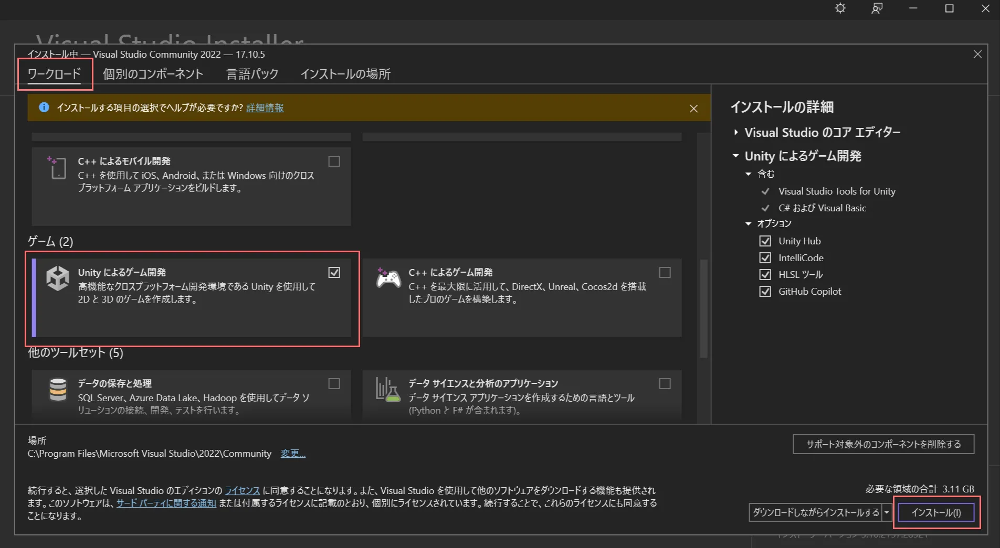

* 環境構築編 ← 今ここ
* [入門編](https://tuatmcc.com/blog/UnityLec2024Step1/)
* [応用編](https://tuatmcc.com/blog/UnityLec2024Step2/)
* [発展編](https://tuatmcc.com/blog/UnityLec2024Step3/)

# Unity 講習会 環境構築編

Unity 講習会では、 Unity 本体と、コードエディタとして Visual Studio を使います。ここでは、そのふたつのインストールについて行います。

## Unity

Unity は Unity Hub をインストールしてから Unity 本体をインストールします。

Unity Hub は[ここから](https://unity.com/ja/download)ダウンロードして、インストーラーを起動してください。

利用規約に同意し、インストール場所は特に気にしなければそのままでOKです。

Unity Hub を起動して、サインインしてください。アカウントがない人は作成してください。メールアドレスは学校のでも個人のでもどちらでもOKですが、学校のでやると後からProライセンスを無料で取れたりと便利です。

サインインしたら、左上の歯車のマークから設定を開き、License -> Add で `Get a free personal license` を選んでください。これで Unity を無料で使えるようになります。

次に Unity 本体をインストールします。左のほうの Installs -> 右上の Install Editor -> OTHER VERSIONS の Recommended verion のやつをインストールしてください。

## Visual Studio

**Mac では Visual Studio が使えないようです。Mac では vscode か Rider を推奨します。 Rider を使うには、[こちらの記事](https://tuatmcc.com/blog/RiderStudents/)を読んでください。**

[ここから](https://visualstudio.microsoft.com/ja/downloads/)ダウンロード

コミュニティをダウンロードして、インストーラーを起動してください。

Visual Studio Installer が起動したら、ワークロードを少しスクロールし、Unityによるゲーム開発を選択してから、左下のインストールを押してください。

Visual Studio がインストールされたらマイクロソフトアカウントでログインしてください。個人のアカウントでも学校のアカウントでのどっちでもOKです。

ログイン出来たら Visual Studio は閉じて構いません。

# MCC Unity講習会

* 環境構築編 ← 今ここ
* [入門編](https://tuatmcc.com/blog/UnityLec2024Step1/)
* [応用編](https://tuatmcc.com/blog/UnityLec2024Step2/)
* [発展編](https://tuatmcc.com/blog/UnityLec2024Step3/)
