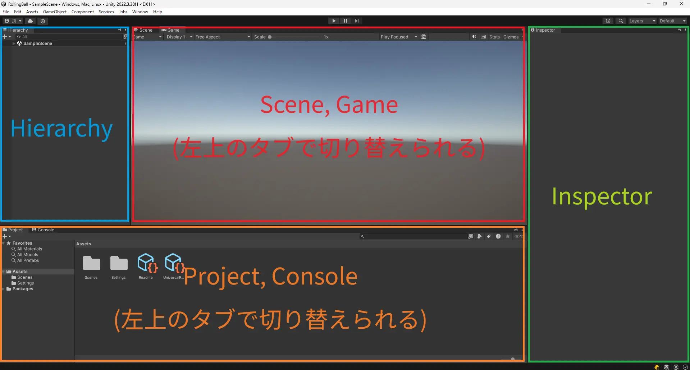
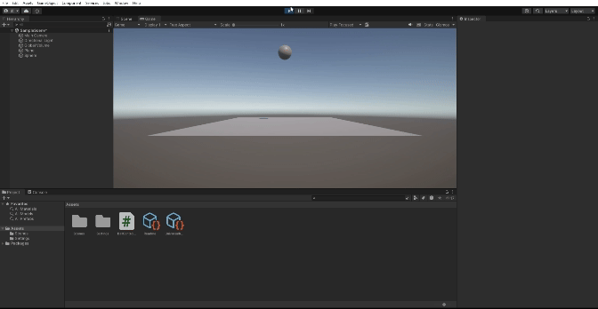
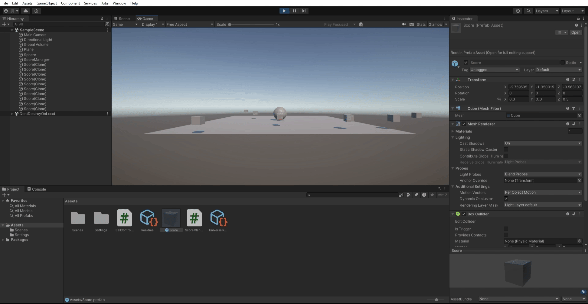

# 1. はじめに

* この記事は Unity 講習会 2024 入門編の資料です
* Unity Hub と Unity 2022.3.38f1 をインストール済み(※ 2022.3.38f1 はあくまで例)
* 任意の IDE がある(Visual studio, Rider など)

## 1.1. 題材

玉転がしゲームを作る

## 1.2. 学ぶこと

### 1.2.1. Component

* Transform
  * 座標移動
  * 回転
* Rigidbody
  * 自由落下
  * AddForce
* Collider
  * SphereCollider 3D
    * OnCollision
    * OnTrigger
* Prefab
* AudioSource
* AudioListener
* Camera
* Canvas
  * Text
  * Button
  * Image

### 1.2.2. Asset

* Folder
  * 特殊ディレクトリ
  * はじめは大文字で後は小文字
* Script
  * ファイル作成時にファイル名とクラス名に気をつける
    * クラス名はファイル名と同じにする
    * すべて英文字
* Texture
* Material
* AudioClip
* Prefab
* Scene

### 1.2.3. Script

* MonoBehaviour
* [SerializeField]
* Start
* Update
* GetComponent
* OnCollisionEnter
* OnTriggerEnter
* Instantiate
* Destroy
* AddForce
* AusioSource.Play
* AusioSource.PlayOneShot
* Input.GetKey

## 1.3. ゲーム仕様

* 起動したらタイトル
* スペース押してタイトル消えてスコアとアイテムが初期化される
* "WASD" で玉を操作
* 玉がアイテムに触れたらスコアが増える
* スコアが 10 になったらゲームクリア
* ゲームオーバーかゲームクリアしたらタイトルに戻る
* 加速タイルに乗ったら玉が加速する
* 動く足場とかも作る
* 玉が穴に落ちたらゲームオーバー

# 2. プロジェクトを作る

## 2.1. Unity Hub でプロジェクトを作る

1. Unity Hub を起動

* `New Project` ボタンを押す

2. `Universal 3D` を選択

* `Project Name` は自由 (写真の例では `RollingBall` と入力)

3. `location` は自由 (特に気にしなければそのままで OK )
4. `Connect to Unity Cloud` はチェックを外す
5. `Use Unity Version Control` はチェックを外す
6. `Create project` ボタンを押す


7. こんな感じに鳴ってればOK


以下のタブが見えています。

* Scene
  * シーンを編集する
* Game
  * レンダリングされたゲーム画面
* Hierarchy
  * シーンに配置されたオブジェクトのリスト
* Project
  * プロジェクトのファイル一覧(エクスプローラーのようなもの)
* Inspector
  * 選択したオブジェクトのプロパティ
* Console
  * ログの表示



# 3. フィールドを作る

ここでは、玉転がしゲームのフィールドを作ります

## 3.1. 地面を作る

Hierarchyで右クリック -> 3D Object -> Plane を選択


Hierarchyに`Plane`が追加され、板が現れました！


Hierarchyで`Plane`を選択すると、Inspectorに`Plane`のプロパティが表示されます。

`Plane`には`Trasform`, `Mesh Filter`, `Mesh Renderer`, `Mesh Collider`の要素(Component)がついています。それぞれの役針は以下の通りです。

* Transform
  * 座標や傾きといった3D空間の位置情報プロパティ

* Mesh Filter, Mesh Renderer
  * レンダリングに関するプロパティ

* Collider (Mesh Collider)
  * 3Dモデルに当たり判定をつけるプロパティ

* (Material)
  * マテリアルを設定するプロパティ

## 3.2. ボールを作る

Hierarchyで右クリック -> 3D Object -> Sphere を選択


このままでは地面にめり込んでいるので、`Trasform`の`Position`を(0, 5, 0)に変更します。


いい感じの位置になりました！


# 4. ボールを重力で落下させる

ここでは、ボールを重力で落下させます。

## 4.1. Rigidbody を追加する

ゲームオブジェクトに物理演算を追加するには、Unity の物理演算の要素の `Rigidbody` を追加します。

`Hierarchy`で`Sphere`を選択し、`Inspector`で下の方にある`Add Component` -> `Physics` -> `Rigidbody` をクリック


`Sphere`に`Rigidbody`が追加されました！


上の方にある再生ボタンを押してみてください。ボールが落下します。


ボールが自由落下するのを確認できたら、必ず再生ボタンを押して再生を停止してください。

# 5. ボールを操作する

ここでは、ボールを操作するためのスクリプトを作成します。

## 5.1. スクリプトを作成する

`Project`タブで右クリック -> `Create` -> `C# Script` を選択


このとき、ファイル名を `BallController` に変更してください。


`BallController`　をダブルクリックして開くと、visual studio が起動します。(※このとき、visual studio が起動しなかった場合、TAの人にお知らせください)


`BallController.cs` が開かれていることを確認してください。`.cs` は C# の拡張子です。(C言語だと`.c`, C++だと`.cpp`, pythonだと`.py`)

## 5.2. スクリプトを書き換える

以下のようにスクリプトを書き換えてください。プログラムの説明は後で行います。

```csharp title="BallController.cs" showLineNumbers
using System.Collections;
using System.Collections.Generic;
using UnityEngine;

public class BallController : MonoBehaviour
{
+   private Rigidbody rb;

    // Start is called before the first frame update
    void Start()
    {
+       rb = GetComponent<Rigidbody>();
    }

    // Update is called once per frame
    void Update()
    {
+       if(Input.GetKey(KeyCode.W))
+       {
+           rb.AddForce(new Vector3(0, 0, 1));
+       }
+       if(Input.GetKey(KeyCode.S))
+       {
+           rb.AddForce(new Vector3(0, 0, -1));
+       }
+       if(Input.GetKey(KeyCode.A))
+       {
+           rb.AddForce(new Vector3(-1, 0, 0));
+       }
+       if(Input.GetKey(KeyCode.D))
+       {
+           rb.AddForce(new Vector3(1, 0, 0));
+       }
    }
}
```

5行目の `public class BallController : MonoBehaviour` の部分で、 `class` の後が `BallController` になっていることを確認してください。大文字小文字、全角半角の違いにも注意してください。

## 5.3. スクリプトを Sphere にアタッチする

Project にある `BallController` を `Sphere` にドラッグアンドドロップしてください。


すると、`Sphere` の Inspector に `BallController` がコンポーネントとして追加されるのがわかります。これで、スクリプトをゲームオブジェクトにアタッチできました。

## 5.4. ゲームを再生してみる

再生ボタンを押してみてください。`W`, `A`, `S`, `D` キーを押すと、ボールが前後左右に動くことがわかります。(周りに壁とか無いから落ちるけど...)



確認ができたら、再生ボタンを押して再生を停止してください。

# 5.5. プログラムの説明

`BallController` をダブルクリックして開いてください。

変数 `rb` は `Rigidbody` 型の変数です。任意のゲームオブジェクトに付いている `Rigidbody` コンポーネントを代入することで、その `Rigidbody` を**参照**できます。

`Start` 関数は、再生ボタンを押したら最初に一度だけ実行される関数です。 Unity が呼び出してくれます。ここでは、Start 関数の中で、そのスクリプトがアタッチしている `Rigidbody` コンポーネントを `GetComponent` 関数で取得しています。`GetComponent` 関数は、アタッチしているゲームオブジェクトの指定したコンポーネントを取得する関数です。ここでは、`Rigidbody` コンポーネントを指定しています。

`Update` 関数は、再生ボタンを押したら毎フレーム実行される関数です。 Unity が呼び出してくれます。ここでは、 `Input.GetKey` 関数を使って、引数で指定されたキーボードのキーが入力されたかをif文で判定し、入力されたら `Rigidbody` の `AddForce` 関数を使って、ボールに力を加えています。 `Input.GetKey` 関数では、引数で指定されたキーボードのキーが押されている間、true を返します。そうでなければ、false を返します。 `AddForce` 関数は、引数で指定された方向に力を加えます。`w` キーが押されたら、Z軸に対して正の方向、`s` キーが押されたら、Z軸に対して負の方向、`a` キーが押されたら、X軸に対して負の方向、`d` キーが押されたら、X軸に対して正の方向に力を加えます。力の大きさはそれぞれ 1 です。`new Vector3` で Unity のベクトル情報を生成し、`AddForce` 関数の引数に渡しています。

# 6. 得点を生成させる

ここでは、ステージ上に得点をランダムな場所に生成させます。

## 6.1. 得点となるゲームオブジェクトのPrefabを作成する

`Hierarchy`で右クリック -> `3D Object` -> `Cube` を選択


オブジェクト名は `Score` に変更してください。ゲームオブジェクトを選択して F2 キーを押すか、右クリックして `Rename` を選択して名前を変更できます。


`Score` を Project にドラッグアンドドロップしてください。 Prefab として保存されます。


Prefab とは、ゲームオブジェクトの設計図のようなものです。ゲームオブジェクトそのものではありません。

`Score` の Prefab が作成できたら、 Hierarchy にある `Score` を削除してください。削除は、ゲームオブジェクトを選択して Delete キーを押すか、右クリックして `Delete` を選択して削除できます。

## 6.2. ScoreManager を作成する

得点のオブジェクトを生成するスクリプトを作成します。

`Project`タブで右クリック -> `Create` -> `C# Script` を選択

スクリプトの名前を `ScoreManager` に変更してください。


`ScoreManager` をダブルクリックして開いてください。

以下のようにスクリプトを書き換えてください。プログラムの説明は後で行います。

```csharp title="ScoreManager.cs" showLineNumbers
using System.Collections;
using System.Collections.Generic;
using UnityEngine;

public class ScoreManager : MonoBehaviour
{
+   [SerializeField] private GameObject ScoreObject;
+   [SerializeField] private int ScoreAmount = 10;

    // Start is called before the first frame update
    void Start()
    {
+       for (int i = 0; i < ScoreAmount; i++)
+       {
+           float x = Random.Range(-10.0f, 10.0f);
+           float z = Random.Range(-10.0f, 10.0f);
+           Instantiate(ScoreObject, new Vector3(x, 0.5f, z), Quaternion.identity);
+       }
    }

    // Update is called once per frame
    void Update()
    {
        
    }
}
```

Hierarchy で右クリック -> `Create Empty` を選択

ゲームオブジェクト名を `ScoreManager` に変更してください。


EnptyObject は、コンポーネントが何もついていないゲームオブジェクトです。このゲームオブジェクトに`ScoreManager`をアタッチします。

`ScoreManager` を Project から Hierarchy にドラッグアンドドロップしてください。そして、`ScoreManager` の Inspector にある `Score Object` に `Score` の Prefab をドラッグアンドドロップしてください。


再生ボタンを押してみてください。ステージ上にランダムな位置に `Score` が生成されることがわかります。


確認ができたら、再生ボタンを押して再生を停止してください。

## 6.3. プログラムの説明

`ScoreManager` をダブルクリックして開いてください。

変数 `ScoreObject` は `GameObject` 型の変数です。`Score` の Prefab を代入することで、その Prefab を**参照**できます。

変数 `ScoreAmount` は `int` 型の変数です。`Score` の Prefab を元に、 Score オブジェクトを生成する回数を指定します。

この2つの変数は、`[SerializeField]` という属性をつけています。これを変数につけることで、Inspector から変数を設定できるようにしています。こうすれば、必要なパラメーターを Inspector から設定できるので、スクリプトを変更する必要がなくなります。

`Random.Range` 関数は、引数で指定された範囲のランダムな値を返します。ここでは、`-10` から `10` の範囲のランダムな値を `x` と `z` に代入しています。

`Instantiate` 関数は、第1引数で指定された Prefab を元に、第2引数指定された位置に、第3引数で指定した角度でゲームオブジェクトを生成します。ここでは、`ScoreObject` を `new Vector3(x, 0.5f, z)` の位置に生成しています。角度は `Quaternion.identity` で指定しています。`Quaternion.identity` は、回転がない状態を表します(元のPrefabと同じ傾きって意味)。

少し Score が大きいので、 `Score` の `Scale` を (0.3, 0.3, 0.3) に変更してください。




## 6.4. カメラをボールに追従させる

ここでは、カメラをボールに追従させます。

`CameraController` という名前のスクリプトを作成して、以下のように書き換えてください。

```csharp title="CameraController.cs" showLineNumbers
using System.Collections;
using System.Collections.Generic;
using UnityEngine;

public class CameraController : MonoBehaviour
{
    // Start is called before the first frame update

+   [SerializeField] private Transform PlayerObject;
+   [SerializeField] private Vector3 offset;

    void Start()
    {
        
    }

    // Update is called once per frame
    void Update()
    {
+       transform.position = PlayerObject.position + offset;
    }
}
```

`CameraController` をドラッグアンドドロップで `Main Camera` にアタッチしてください。

そして、`Main Camera` の Inspector にある `Player Object` に `Sphere` をドラッグアンドドロップしてください。


`Main Camera` の Inspector にある `CameraController` コンポーネントの `Offset` を (0, 5, -10) に変更してください。


また、 `Main Camera` の Transform の Position を (0, 10, -10), Rotation を (30, 0, 0) に変更してください。


再生ボタンを押してみてください。カメラがボールに追従させることができました。


確認ができたら、再生ボタンを押して再生を停止してください。

## 6.5. スクリプトの説明

`CameraController` をダブルクリックして開いてください。

変数 `PlayerObject` は `Transform` 型の変数です。`Sphere` の Transform コンポーネントを代入することで、その Transform を**参照**できます。

変数 `offset` は `Vector3` 型の変数です。カメラの位置を調整するための変数です。`PlayerObject` の位置に `offset` を加えた位置にカメラを移動させます。

`transform.position` は、そのスクリプトをアタッチしたゲームオブジェクトの位置を表します。ここでは、`PlayerObject` の位置に `offset` を加えた位置にカメラを移動させています。

# 7. 得点を回収する

ここでは、ボールが得点に触れたら得点を回収する処理を追加します。

## 7.1. `BallController` が得点を回収するできるようにする

`BallController` を以下のように書き換えてください。

```csharp title="BallController.cs" showLineNumbers
using System.Collections;
using System.Collections.Generic;
using UnityEngine;

public class BallController : MonoBehaviour
{
    private Rigidbody rb;
+   private int score = 0;

    // Start is called before the first frame update
    void Start()
    {
        rb = GetComponent<Rigidbody>();
    }

    // Update is called once per frame
    void Update()
    {
        if(Input.GetKey(KeyCode.W))
        {
          rb.AddForce(new Vector3(0, 0, 1));
        }

        if(Input.GetKey(KeyCode.S))
        {
            rb.AddForce(new Vector3(0, 0, -1));
        }

        if(Input.GetKey(KeyCode.A))
        {
            rb.AddForce(new Vector3(-1, 0, 0));
        }

        if(Input.GetKey(KeyCode.D))
        {
            rb.AddForce(new Vector3(1, 0, 0));
        }
    }

+   private void OnCollisionEnter(Collision collision)
+   {
+       if(collision.gameObject.name == "Score(Clone)")
+       {
+           score++;
+           Debug.Log("Score: " + score);
+           Destroy(collision.gameObject);
+       }
+   }
}
```

実行して、ボールが得点に触れると、得点が回収されることを確認してください。


下の方のコンソールタブを見てください。得点を取ると、コンソールに現在のスコアが表示されます。また、得点を取ると、 Hierarchy にある `Score` が消えることがわかります。

確認ができたら、再生ボタンを押して再生を停止してください。

## 7.2. スクリプトの説明

`BallController` をダブルクリックして開いてください。

変数 `score` は `int` 型の変数です。得点を保持します。

`OnCollisionEnter` 関数は、ゲームオブジェクトが他のゲームオブジェクトに衝突したときに呼び出される関数です。ここでは、引数で渡された `Collision` 型の変数 `collision` に衝突したゲームオブジェクトの情報が入っています。`collision.gameObject.name` で衝突したゲームオブジェクトの名前を取得できます。ここでは、`collision.gameObject.name` が `Score(Clone)` だったら、得点を加算し、コンソールに現在のスコアを表示し、衝突したゲームオブジェクトを削除しています。`Debug.Log` 関数は、コンソールにログを表示する関数です。C#では便利なことに、文字列型と数値型を足すと、自動的に文字列連結になります。`Destroy` 関数は、引数で指定されたゲームオブジェクトを削除します。ここでは、衝突したゲームオブジェクト(Score)を削除しています。

# 8. ステージの調整

ここでは、ステージを調整します。

`Plane` の `Scale` を (5, 1, 5) に変更してください。


ステージの壁も作りましょう。`Hierarchy`で右クリック -> `3D Object` -> `Cube` を選択。名前は `Wall` に変更してください。そして 4 方向分作るので、`Wall` を選択したまま `Ctrl + D` で複製してください。以下の画像のようになります。


4 つの Wall の Position と Scale をそれぞれ以下のように変更してください。(写真は1つ目)

* Position (0, 1.5, 20), Scale (40, 3, 1)
* Position (0, 1.5, -20), Scale (40, 3, 1)
* Position (20, 1.5, 0), Scale (1, 3, 40)
* Position (-20, 1.5, 0), Scale (1, 3, 40)


また、今のままでは、スコアにふれると一瞬ボールの動きが止まってしまいます。これは物理演算をするための当たり判定もあるためです。そこで、Project にある `Score` プレバブの `Box Collider` の `Is Trigger` にチェックを入れてください。そして、`BallController` の `OnCollisionEnter` 関数を `OnTriggerEnter` 関数に変更してください。

```csharp title="BallController.cs" showLineNumbers /other/#s
using System.Collections;
using System.Collections.Generic;
using UnityEngine;

public class BallController : MonoBehaviour
{
    private Rigidbody rb;
    private int score = 0;

    // Start is called before the first frame update
    void Start()
    {
        rb = GetComponent<Rigidbody>();
    }

    // Update is called once per frame
    void Update()
    {
        if(Input.GetKey(KeyCode.W))
        {
            rb.AddForce(new Vector3(0, 0, 1));
        }

        if(Input.GetKey(KeyCode.S))
        {
            rb.AddForce(new Vector3(0, 0, -1));
        }

        if(Input.GetKey(KeyCode.A))
        {
            rb.AddForce(new Vector3(-1, 0, 0));
        }

        if(Input.GetKey(KeyCode.D))
        {
            rb.AddForce(new Vector3(1, 0, 0));
        }
    }

+   private void OnTriggerEnter(Collider other)
-   private void OnCollisionEnter(Collision collision)
    {
        if(other.gameObject.name == "Score(Clone)")
        {
            score++;
            Debug.Log("Score: " + score);
            Destroy(other.gameObject);
        }
    }
}
```

再生ボタンを押してみてください。スコアにふれてもボールの動きが止まらなくなりました。


確認ができたら、再生ボタンを押して再生を停止してください。

## 8.1. スクリプトの説明

Collision は、物理演算をするための当たり判定を持っています。OnCollisionEnter は、物理演算をするための当たり判定があるゲームオブジェクトが他のゲームオブジェクトに衝突したときに呼び出される関数です。 Trigger は、物理演算をするための当たり判定を持っていません。OnTriggerEnter は、Trigger があるゲームオブジェクトが他のゲームオブジェクトに触れたときに呼び出される関数です。

# 9. スコアを表示する

ここでは、スコアを表示する UI を作成します。

## 9.1. テキストの追加

`Hierarchy`で右クリック -> `UI` -> `Legacy` -> `Text` を選択


Canvas の子要素として `Text` が追加されました。 Game タブの真ん中の方に `New Text` というテキストが表示しているのがわかります。


Canvas とは、 Unity で UI を使うときに必要なゲームオブジェクトです。UI を表示するためのゲームオブジェクトを Canvas の子要素として追加することで、画面に UI を表示できます。

## 9.2. テキストの調整

`Text` の Position を (-470, 242, 0)、 `Text` を `Score: 0`、Font Size を 27 に変更してください。 Color では好きな色にすることができます。


これで、左上の方にスコアが表示されるようになりました。


## 9.3. スコアを表示するスクリプトを作成する

`BallController` にスコアを表示するスクリプトを追加します。

```csharp title="BallController.cs" showLineNumbers
using System.Collections;
using System.Collections.Generic;
using UnityEngine;
+ using UnityEngine.UI;

public class BallController : MonoBehaviour
{
    private Rigidbody rb;
    private int score = 0;
+   [SerializeField] private Text scoreText;

    // Start is called before the first frame update
    void Start()
    {
        rb = GetComponent<Rigidbody();
+       scoreText.text = "Score: " + score;
    }

    // Update is called once per frame
    void Update()
    {
        if(Input.GetKey(KeyCode.W))
        {
            rb.AddForce(new Vector3(0, 0, 1));
        }

        if(Input.GetKey(KeyCode.S))
        {
            rb.AddForce(new Vector3(0, 0, -1));
        }

        if(Input.GetKey(KeyCode.A))
        {
            rb.AddForce(new Vector3(-1, 0, 0));
        }

        if(Input.GetKey(KeyCode.D))
        {
            rb.AddForce(new Vector3(1, 0, 0));
        }
    }

    private void OnTriggerEnter(Collider other)
    {
        if(other.gameObject.name == "Score(Clone)")
        {
            score++;
            Debug.Log("Score: " + score);
            Destroy(other.gameObject);
+           scoreText.text = "Score: " + score;
        }
    }
}
```

Hierarchy にある `Sphere` を選択し、`BallController` の Inspector にある `Score Text` に `Text` をドラッグアンドドロップしてください。


再生ボタンを押してみてください。スコアが表示されることを確認してください。取るたびにスコアが増えていくことがわかります。


確認ができたら、再生ボタンを押して再生を停止してください。

## 9.4. スクリプトの説明

`BallController` をダブルクリックして開いてください。

`using UnityEngine.UI;` は、UI を使うためのおまじないです。

変数 `scoreText` は `Text` 型の変数です。`Text` コンポーネントを代入することで、その `Text` を**参照**できます。

`scoreText.text` は、`Text` コンポーネントの `text` プロパティを表します。ここでは、`scoreText.text` に `Score: 0` を代入しています。これで、最初にスコアが `Score: 0` として表示されます。

`scoreText.text` に `Score: + score` を代入することで、スコアが更新され、スコアが表示されます。

# 10. ゲームタイトルシーンを作成する

ここでは、ゲームのタイトルシーンを作成します。

Scene とは、 Unity でゲームを作るときに必要なゲームオブジェクトや設定を保存するためのファイルです。 Scene は、ゲームのステージやメニュー画面など、ゲームの一部分を表します。今まで作成したステージは、`SampleScene` という名前の Scene に保存されています。 Project タブの `Assets/Scences` の中に `SampleScene` という名前の Scene があるのがわかります。

## 10.1. ゲームタイトルシーンを作成する

Project -> `Assets/Scenes` で右クリック -> `Create` -> `Scene` を選択


Scene の名前を `Title` に変更してください。そして、`Title` をダブルクリックして開いてください。


シーンを作成したら、 `Build Settings` で `Title` シーンを追加してください。

File -> `Build Settings` を選択し、`Add Open Scenes` をクリックして `Title` シーンを追加してください。


## 10.2. タイトル

`Hierarchy`で右クリック -> `UI` -> `Legacy` -> `Text` を選択

オブジェクト名は `Title` に変更してください。そして、`Title` の Position を (0, 0, 0) に変更してください。`Title` の Text を `RollingBall` 、Font Size を 50 、Hight と Width を (250, 270) になるように調整してください。


## 10.3. スタートボタン

`Hierarchy`で右クリック -> `UI` -> `Legacy` -> `Button` を選択

オブジェクト名は `StartButton` に変更してください。そして、`StartButton` の Position を (0, -50, 0) に変更してください。`StartButton` の Text を `Start` に変更してください。

Hierarchy で　`StartButton` の子オブジェクトに、ボタンのテキストがあります。このテキストの `Text` を `Start` に変更してください。


## 10.4. シーン遷移

`Assets` で右クリック -> `Create` -> `C# Script` を選択

スクリプトの名前を `TitleManager` に変更してください。

`TitleManager` をダブルクリックして開いてください。

以下のようにスクリプトを書き換えてください。

```csharp title="TitleManager.cs" showLineNumbers
using System.Collections;
using System.Collections.Generic;
using UnityEngine;
+ using UnityEngine.SceneManagement;

public class TitleManager : MonoBehaviour
{
+   public void OnButtonClicked()
+   {
+       SceneManager.LoadScene("SampleScene");
+   }
}
```

Hierarchy で右クリック -> `Create Empty` を選択

オブジェクト名は `TitleManager` に変更してください。そして、`TitleManager` に `TitleManager` をアタッチしてください。


`StartButton` を選択し、`Inspector` で Buttonコンポーネントの `On Click()` の右下の方にある `+` をクリック。左下には Hierarchy の `TitleManager` をドラッグアンドドロップ。そして `NoFunction` をクリックしての `TitleManager -> OnButtonClicked` を選択してください。


再生ボタンを押してみてください。タイトル画面が表示され、`Start` ボタンを押すと、ゲーム画面に遷移します。


確認ができたら、再生ボタンを押して再生を停止してください。

Title シーンから SampleScene シーンに遷移することができました。

# 10.5. スクリプトの説明

`TitleManager` をダブルクリックして開いてください。

`using UnityEngine.SceneManagement;` は、シーンを使うためのおまじないです。

`SceneManager.LoadScene` 関数は、引数で指定されたシーンに遷移します。ここでは、`SampleScene` に遷移しています。

`public void OnButtonClicked()` は、`StartButton` がクリックされたときに呼び出される関数です。これは、`StartButton` の `Button` コンポーネントの `On Click()` に設定したためです。よって、`StartButton` がクリックされたときに、`SceneManager.LoadScene` 関数を呼び出して、`SampleScene` に遷移します。

# 11. ゲームクリアを作成する

ここでは、ゲームクリアのシーンを作成します。

## 11.1. ゲームクリアシーンを作成する

Project -> `Assets/Scenes` で右クリック -> `Create` -> `Scene` を選択

Scene の名前を `GameClear` に変更してください。そして、`GameClear` をダブルクリックして開いてください。


File -> `Build Settings` を選択し、`Add Open Scenes` をクリックして `GameClear` シーンを追加してください。

Hierarchy で右クリック -> `UI` -> `Legacy` -> `Text` を選択

オブジェクト名は `GameClear` に変更してください。そして、`GameClear` の Position を (0, 0, 0) に変更してください。`GameClear` の Text を `Game Clear` 、Font Size を 50 、Hight と Width を (300, 270) になるように調整してください。


## 11.2. シーン遷移

クリアシーンでクリックするとタイトル画面に遷移するようにします。

`Assets` で右クリック -> `Create` -> `C# Script` を選択

スクリプトの名前を `GameClearManager` に変更してください。

`GameClearManager` をダブルクリックして開いてください。

以下のようにスクリプトを書き換えてください。

```csharp title="GameClearManager.cs" showLineNumbers
using System.Collections;
using System.Collections.Generic;
using UnityEngine;
+ using UnityEngine.SceneManagement;

public class GameClearManager : MonoBehaviour
{
+   public void OnButtonClicked()
+   {
+       SceneManager.LoadScene("Title");
+   }
}
```

Hierarchy で右クリック -> `Create Empty` を選択

オブジェクト名は `GameClearManager` に変更してください。そして、`GameClearManager` に `GameClearManager` をアタッチしてください。

Hierarchy で右クリック -> `UI` -> `Legacy` -> `Button` を選択

オブジェクト名は `GameClearButton` に変更してください。そして、`GameClearButton` の Position を (0, -50, 0) に変更してください。`GameClearButton` の Text を `Title` に変更してください。

`GameClearButton` を選択し、`Inspector` で Buttonコンポーネントの `On Click()` の右下の方にある `+` をクリック。左下には Hierarchy の `GameClearManager` をドラッグアンドドロップ。そして `NoFunction` をクリックしての `GameClearManager -> OnButtonClicked` を選択してください。


再生ボタンを押してみてください。ゲームクリア画面が表示され、`Title` ボタンを押すと、タイトル画面に遷移します。


確認ができたら、再生ボタンを押して再生を停止してください。

GameClear シーンから Title シーンに遷移することができました。

# 11.3. スコアをすべて取ったらゲームクリアにする

`BallController` にゲームクリアの処理を追加します。

```csharp title="BallController.cs" showLineNumbers
using System.Collections;
using System.Collections.Generic;
using UnityEngine;
using UnityEngine.UI;
+ using UnityEngine.SceneManagement;

public class BallController : MonoBehaviour
{
    private Rigidbody rb;
    private int score = 0;
    [SerializeField] private Text scoreText;

    // Start is called before the first frame update
    void Start()
    {
        rb = GetComponent<Rigidbody();
        scoreText.text = "Score: " + score;
    }

    // Update is called once per frame
    void Update()
    {
        if(Input.GetKey(KeyCode.W))
        {
            rb.AddForce(new Vector3(0, 0, 1));
        }

        if(Input.GetKey(KeyCode.S))
        {
            rb.AddForce(new Vector3(0, 0, -1));
        }

        if(Input.GetKey(KeyCode.A))
        {
            rb.AddForce(new Vector3(-1, 0, 0));
        }

        if(Input.GetKey(KeyCode.D))
        {
            rb.AddForce(new Vector3(1, 0, 0));
        }
    }

    private void OnTriggerEnter(Collider other)
    {
        if(other.gameObject.name == "Score(Clone)")
        {
            score++;
            Debug.Log("Score: " + score);
            Destroy(other.gameObject);
            scoreText.text = "Score: " + score;
+           if(score == 10)
+           {
+               SceneManager.LoadScene("GameClear");
+           }
        }
    }
}
```

再生ボタンを押してみてください。スコアが 10 になると、ゲームクリア画面に遷移します。


確認ができたら、再生ボタンを押して再生を停止してください。

これで、ゲームの一連の流れが完成しました。

# 12. マテリアルで見た目

ここでは、マテリアルを使って見た目を変更します。

## 12.1. スコアの見た目を変更する

`SampleScene` を開いてください。

Project で右クリック -> `Create` -> `Material` を選択

マテリアルの名前を `ScoreMaterial` に変更してください。


`ScoreMaterial` を選択し、`Inspector` で `Base Map` の色を好きな色に変更してください。(例では黄色っぽい色にしてみました)


`Score` プレバブに `ScoreMaterial` をドラッグアンドドロップしてください。


再生ボタンを押してみてください。スコアの色が変わっていることがわかります。


確認ができたら、再生ボタンを押して再生を停止してください。

## 12.2. ボールの見た目を変更する

以下のテクスチャをボールに貼り付けてみようと思います。


[ここをクリックでダウンロード](./img/BallTexture.png)

ダウンロードしたら、`Assets` にドラッグアンドドロップしてください。

Assets で右クリック -> `Create` -> `Material` を選択

マテリアルの名前を `BallMaterial` に変更してください。

`BallMaterial` を選択し、`Inspector` で `Base Map` の `Texture` に `BallTexture` をドラッグアンドドロップしてください。


`BallMaterial` を Hierarchy の `Sphere` にドラッグアンドドロップしてください。


ボールの見た目が変わっていることがわかります。

再生ボタンを押してみてください。


# 13. 音を鳴らす

ここでは、ボールが得点に触れたときに音を鳴らしたり、BGMを鳴らす処理を追加します。

今回は、ボールを取ったときの音に効果音ラボの音、BGMにはNCSの音を使います。

[効果音ラボ](https://soundeffect-lab.info/sound/button/)

[NCS](https://ncs.io/)

この中から、好きな音をダウンロードしてください。例では効果音ラボから `成功音` 、NCS から `Cartoon, Jéja - On & On (feat. Daniel Levi) [NCS Release]` `Diamond Eyes - Worship [NCS Release]` `Egzod, Maestro Chives, Neoni - Royalty [NCS Release]` をダウンロードしました

ダウンロードしたら、`Assets` にドラッグアンドドロップしてください。


## 13.1. 得点を取ったときの効果音を鳴らす

Hierarchy で `Sphere` を選択し、`Inspector` で `Add Component` をクリック -> `Audio` -> `Audio Source` を選択

`BallController` を開いて以下を追加してください。

```csharp title="BallController.cs" showLineNumbers
using System.Collections;
using System.Collections.Generic;
using UnityEngine;
using UnityEngine.SceneManagement;
using UnityEngine.UI;

public class BallController : MonoBehaviour
{
    private Rigidbody rb;
    private int score = 0;
+	private AudioSource audioSource;
    [SerializeField] private Text scoreText;
+	[SerializeField] private AudioClip ScoreSound;

	// Start is called before the first frame update
	void Start()
    {
        rb = GetComponent<Rigidbody>();
+		audioSource = GetComponent<AudioSource>();
    }

    // Update is called once per frame
    void Update()
    {
        if(Input.GetKey(KeyCode.W))
		{
			rb.AddForce(new Vector3(0, 0, 1));
		}

        if(Input.GetKey(KeyCode.S))
        {
            rb.AddForce(new Vector3(0, 0, -1));
		}

        if(Input.GetKey(KeyCode.A))
		{
			rb.AddForce(new Vector3(-1, 0, 0));
        }

		if(Input.GetKey(KeyCode.D))
        {
            rb.AddForce(new Vector3(1, 0, 0));
		}
    }

    private void OnTriggerEnter(Collider other)
	{
		if (other.gameObject.name == "Score(Clone)")
		{
			score++;
			Debug.Log("Score: " + score);
			Destroy(other.gameObject);
			scoreText.text = "Score: " + score;
+			audioSource.PlayOneShot(ScoreSound);
			if (score == 10)
			{
				SceneManager.LoadScene("GameClear");
			}
		}
	}
}
```

`Sphere` の Inspector から `Add Component` -> `Audio` -> `Audio Source` を選択

`Sphere` の `BallController` の Inspector にある `Score Sound` に `成功音` をドラッグアンドドロップしてください。


再生ボタンを押してみてください。スコアにふれると音が鳴ることがわかります。

## 13.2. BGMを鳴らす

`Hierarchy` で `Main Camera` を選択し、`Inspector` で `Add Component` をクリック -> `Audio` -> `Audio Source` を選択

`Main Camera` の Inspector にある `Audio Source` の `AudioClip` にお好きな曲をドラッグアンドドロップしてください。そして、 `Play On Awake` と `Loop` にチェックを入れてください。


これを他の2つのシーン (`Title`, `GameClear`) にも行ってください。

再生ボタンを押してみてください。BGMが流れることがわかります。