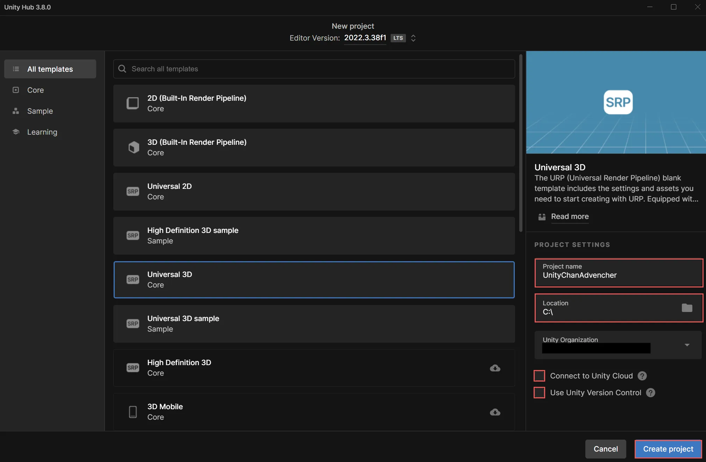
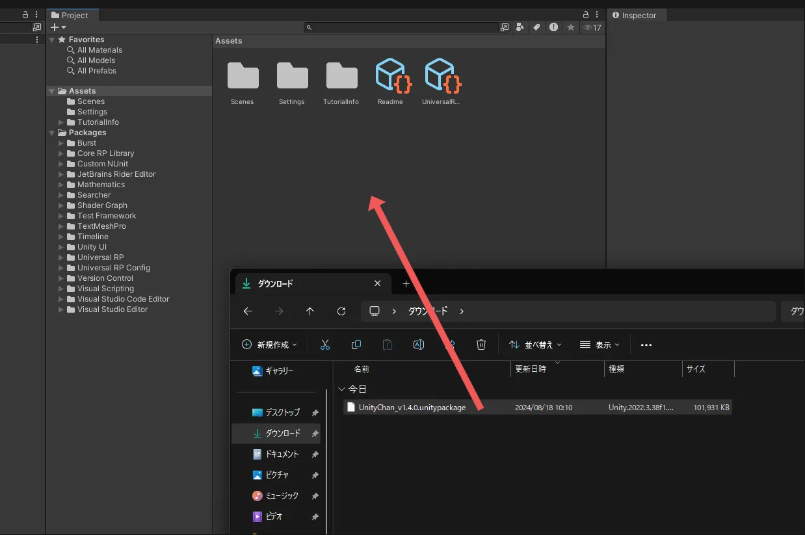
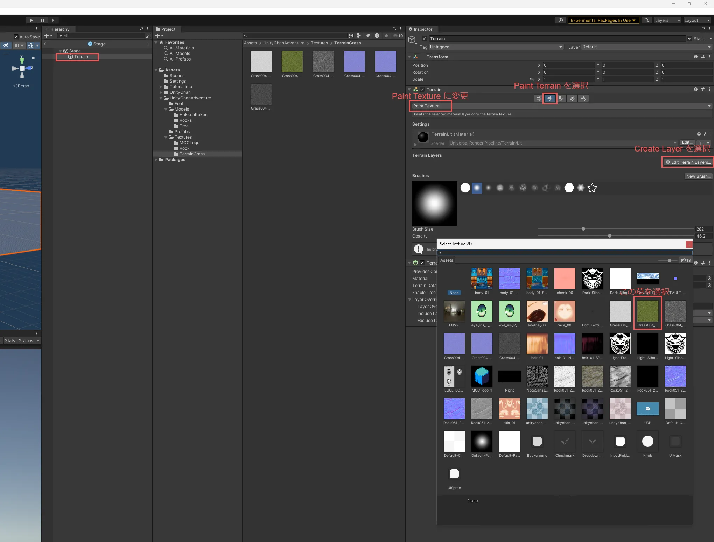
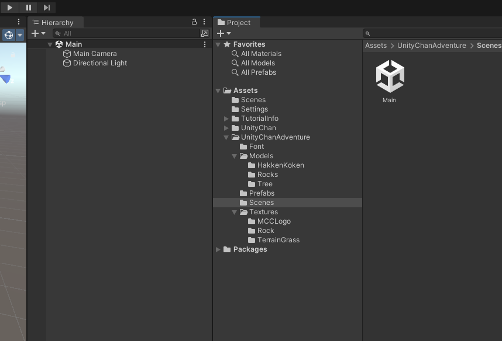
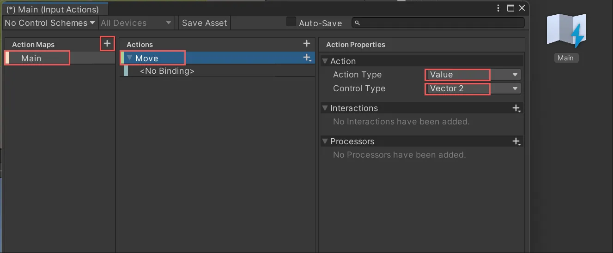

# 1. はじめに

* この記事は Unity 講習会 2024 応用編の資料です
* Unity Hub と Unity 2022.3.38f1 をインストール済み(※ 2022.3.38f1 はあくまで例)
* 任意の IDE がある(Visual studio, Rider など)
* Unity ちょっと触ったことがある人

## 1.1. 題材

Unityちゃんアドベンチャーゲーム

## 1.2. 学ぶこと

* EditorLayout
* Animation
* Physics
* PrefabVariant
* UnityPackage
* InputSystem
* TextMeshPro
* Cinemachine
* Terrain
* Skybox
* PostProcessing

## 1.3. ゲーム仕様

Unityちゃんが障害物を避けながらアイテムを回収してくるゲーム

応用編、発展編に2回にわたって作ります。

HP が 0 になるとゲームオーバー

# 2. プロジェクトを作る

1. Unity Hub を起動

* `New Project` ボタンを押す

2. `Universal 3D` を選択

* `Project Name` は自由 (写真の例では `UnityChanAdventur` と入力)

3. `location` は自由 (特に気にしなければそのままで OK )
4. `Connect to Unity Cloud` はチェックを外す
5. `Use Unity Version Control` はチェックを外す
6. `Create project` ボタンを押す




## 2.1. Unity Editor のレイアウト

Unity Editor のレイアウトは、エディタの右上にある `Layout` ボタンから変更できます。デフォルトのままで問題ありませんが、個人的に `2 by 3` にすると Scene タブと Game タブが同時に見れるのでおすすめです。


# 3. プロジェクトの設定

## 3.1. 解像度の設定

Game タブの `Free Aspect` になってる部分を `Full HD (1920x1080)` に変更します。


ここの設定によって、ゲームの画面サイズが変わります。今回は `Full HD (1920x1080)` に設定します。

# 4. UnityちゃんとUnityChanAdventurのアセットのインポート

ここでは、 Unityちゃんと UnityChanAdventu rのアセットの UnityPackage をダウンロードしインポートします。

UnityPackage とは、Unity Editor で使えるアセットのパッケージファイルです。Unityちゃんの UnityPackage には、Unityちゃんの 3D モデルやアニメーション、マテリアル、シェーダーなどが含まれています。

## 4.1. UnityちゃんのUnityPackageをインポート

1. [Unityちゃんの公式サイト](https://unity-chan.com/) にアクセス
2. 右上の `Data Download` をクリック
3. 利用規約に同意してダウンロードページヘ
4. `ユニティちゃん 3Dモデルデータ` をダウンロード
5. ダウンロードしたファイルを Unity Editor の `Project` タブの `Assets` にドラッグアンドドロップ



6. `import Unity Package` 画面が表示されるので、 `Import` ボタンを押す


これで Assets の中に UnityChan フォルダーができてれば OK です。

## 4.2. toonshader　のインポート

`Window` -> `Package Manager` で `Package Manager` を開く


`+` ボタンを押して `Add package from git URL` を選択し、 `com.unity.toonshader` を入力して `Add` ボタンを押す(Enter を押してもOK)


## 4.3. UnityChanAdventurのアセットのUnityPackageをインポート

UnityChanAdventurのアセットをダウンロードします。以下のリンクより、Google Drive にアクセスしてください。

[UnityChanAdventurのアセット](https://drive.google.com/file/d/1rgrjjgJ8XjRMFYfynyDe7-jFOEwK-MzN/view?usp=sharing)

UnityChan をインポートしたとき同様。ダウンロードしたファイルを Unity Editor の `Project` タブの `Assets` にドラッグアンドドロップし、`import Unity Package` 画面が表示されたら、 `Import` ボタンを押す。


# 5. Trrain で地形を作る

ここでは、Terrain を使って地形を作ります。

Terrain は、 Unity で簡単に地形や植生といった世界を構築するためのツールです。

## 5.1. Terrain を作る

まず、 Prefab いれるフォルダを作り、ステージ用のプレハブを作ります。

`Assets` の `UnityChanAdventure` 内で右クリック -> `Create` -> `Folder` を選択し、 `Prefabs` と入力して `Enter` キーを押します。(`Prefabs` の `P` は大文字です。)

作った `Prefabs` フォルダで右クリック -> `Create` -> `Prefab` を選択し、 `Stage` と入力して `Enter` キーを押します。 `Stage` プレハブができたらダブルクリックして開きます。なにもない世界が `Scene` タブに出れば OK です。次に `Hierarchy` で右クリック -> `3D Object` -> `Terrain` を選択します。すると、大きな板(地面)ができます。


## 5.2. Terrain に草を生やす

Terrain に草を生やします。

ヒエラルキーでTerrainオブジェクトを選択し、インスペクターで `Paint Terrain` を選択し、`Set Hight` になってるところを `Paint Texture` に変更します。そして、 `Terrain Layers` で `Edit Terrain Layers` を押し、`Create Layer` を押します。プロジェクト内の画像一覧が表示されるので、草の画像を選択します。



草が生えました！草のテクスチャは `/Assets/UnityChanAdventure/Textures/TerrainGrass` の中にあります。Terrain のレイヤーデータは開いてるフォルダに作られます。このファイルの名前を変えると、レイヤーの名前も変わります。以下の画像ではレイヤー名を `Kusa` に変更しています。


## 5.3. Terrain に地形を作る

Terrain に地形を作ります。ヒエラルキーでTerrainオブジェクトを選択し、インスペクターで `Peint Terrain` を選択し、先ほど`Paint Texture` にしたところを `Set Hight` に変更します。Terrain の地形は、イラスト書くようにブラシで書くことができます。`Height` はブラシで書ける最大の高さで、 `Brushes` はブラシの形を選べます。`Brush Size` はブラシの大きさ、`Opacity` はブラシの濃さ(強さ)です。好きなブラシで強さ、サイズをセットし、 Scene で Terrain にクリックして地形を作ります。あまり高くしすぎると Unityちゃんが登れなくなってしまうので注意してください。


## 5.4. Terrain をシーンに置く

Terrain をシーンに置きます。`/Assets/UnityChanAdventure` に `Scenes` フォルダを作り、その中に `Main` シーンを作ります。そしてダブルクリックで `Main` シーンを開いてください。



次に、先程作成した `Stage` プレハブを `Hierarchy` にドラッグアンドドロップします。


これで、Terrain がシーンに置かれました。

# 6. Unityちゃんをシーンに置く

ここでは、Unityちゃんをシーンに置きます。そして、Chinemachine を使ってカメラを設定し、Animation を使って Unityちゃんを動かします。

## 6.1. Unityちゃんのプレハブを作る

Unityちゃんのモデルの本体は `/Assets/UnityChan/Models` の中にあります。このモデルをプレハブにして、シーンに置きます。`UnityChan` を右クリックして、`Create -> PrefabVariant` を選択します。`UnityChan` プレハブができたら、`UnityaChanAventur` の `Prefabs` フォルダにドラッグアンドドロップして移動させてください。


移動させたらダブルクリックして開きます。 unitychan の中には `Character1_Reference` と `mesh_root` があります。ヒエラルキーでゲームオブジェクト名のとなりにある▼をクリックするとツリーを開くことができます。 `Character1_Reference` は Unityちゃんのボーン情報で、 `mesh_root` は Unityちゃんの各パーツのモデルデータです。(3Dモデルの仕組みについてはこのUnity講習会では詳しく触れません。「スキニング」とか「リギング」って検索すると色々出てきます)

`unitychan` に Rigidbody と Capsule Collider を追加します。`unitychan` を選択して、インスペクターの `Add Component` をクリックし、`Rigidbody` を追加します。次に、`Add Component` をクリックし、`Capsule Collider` を追加します。

Rigidbody では、 `Constraints` の `Freeze Rotation` の `X`, `Z` をチェックします。これで Unityちゃんが回転しなくなります。Capsule Collider は、Unityちゃんの当たり判定を表します。Unityちゃんの形に合わせて調整します。`Center` を `(0, 0.8, 0)` に、`Radius` を `0.2` に、`Height` を `1.6` にします。


Mainシーンを開いてUnityちゃんのプレハブを置きましょう。`<`を押せば Main シーンに戻ります。`UnityChan` プレハブを `Hierarchy` にドラッグアンドドロップします。


# 7. Unityちゃんを `WASD` で動かす

ここでは、Unityちゃんを `WASD` で動かすスクリプトを書きます。キー入力には `InputSystem` を使います。

## 7.1. InputSystem をインストール

`Window` -> `Package Manager` で `Package Manager` を開きます。`Packages` を `Unity Registry` に変更し、`InputSystem` の `Install` ボタンを押します。


`Edit` -> `Project Settings` で、 `Input System Package` を選択し、`Create settings asset` ボタンを押す。


`Assets` で UnityChanAdventure フォルダ内で右クリック -> `Create` -> `Input Actions` を選択し、Input Action Assets を作ります。名前は `Main` と入力してください。


## 7.2. キー設定

Input Action Assets を開いて、Action Map の `+` ボタンを押して Action Map を追加します。名前は `Main` と入力してください。`Main` を選択して、 Actions にある `New Action` を `Move` に名前を変えてください(ダブルクリックすると変えられます)。`Action Properties` で `Action` の `Action Type` を `Button` から `Value` に変更して、 `Control Type` を `Vector2` に変更します(Control Type は Action Type を Value にしたら出てきます)。



`<No Binding>` は使わないので右クリックで消しちゃってOKです。


`Move` の `+` を押して `Add Up\Down\Reft\Right Composite` を追加します。名前は `2D Vector` から `WASD` に変更します。


`WASD` の `Up` を選択し、 Path の何も無いところをクリックして、出てきた左端の部分をクリックします (見にくいですが、Unityのバグのせいです)。そして、キーボードの `W` キーを押します。これで `W` キーが `Up` に割り当てられました。同様に、`A` キーを `Left`、`S` キーを `Down`、`D` キーを `Right` に割り当てます。


Unity のバグで見にくい部分ですが、本来は `Listen` と書いてあります。以下の画像は Unity のバグを修正したやつです。これを押すと入力されたキーが割り当てられます。キーボード以外にも、アケコンやゲームパッドなども割り当てることができます。(バグの原因は Unity Editor のプログラムのスペルミスでした。)


WASD 全てに割り当てたらこんなかんじになります。


## 7.3. GameManager を作る

`Assets` で /Assets/UnityChanAdventure/Prefabs フォルダ内で右クリック -> `Create` -> `Prefab` を選択し、`GameManager` と入力してください。ダブルクリックして開いてください。そしてダブルクリックで開いて、`Add Component` を押して、`Player Input` を追加します。そして `Actions` に `Main` をドラッグアンドドロップします。


## 7.4. Unityちゃんを動かすスクリプトを書く

`Assets` で `/Assets/UnityChanAdventure` で右クリックし、 `Scripts` フォルダーを作り、その Scripts フォルダ内で右クリック -> `Create` -> `C# Script` を選択し、`UnityChanController` と入力してください(大文字小文字に気をつけてください)。ダブルクリックして開いてください。以下のスクリプトを書いてください。

```csharp title="UnityChanController.cs"
using System.Collections;
using System.Collections.Generic;
using UnityEngine;
using UnityEngine.InputSystem;

public class UnityChanController : MonoBehaviour
{
    private Rigidbody rb;
    private float speed;
    private float rotationSpeed;
    private Vector2 moveInput;

    [SerializeField] private float moveSpeedConst = 5.0f;
    [SerializeField] private float rotationSpeedConst = 5.0f;

    void Start()
    {
        rb = GetComponent<Rigidbody>();
    }

    void FixedUpdate()
    {
        speed = moveInput.y * moveSpeedConst;
        rotationSpeed = moveInput.x * rotationSpeedConst;

        rb.velocity = transform.forward * speed + new Vector3(0f, rb.velocity.y, 0f);
        rb.angularVelocity = new Vector3(0, rotationSpeed, 0);
    }

    public void OnMove(InputAction.CallbackContext context)
    {
        moveInput = context.ReadValue<Vector2>();
    }
}
```

Unityちゃん のプレハブを開いてください。 `UnityChanController` スクリプトを Unityちゃんのプレハブにアタッチします。`UnityChanController` を `unitychan` にドラッグアンドドロップします。すると、`unitychan` に `UnityChanController` がアタッチされます。


Main シーンに `GameManager` プレハブを置いてください。`GameManager` を選択して、`GameManager` のインスペクターの `Player Input` で、 `Behavior` を `Invoke Unity Events` にして、 `Events` -> `Main` -> `Move` で `+` を押して、 Main シーンにある `unitychan` をドラッグアンドドロップします。そして、 `nofunction` を `UnityChanController` の `OnMove` に変更します。


実行して、 `WASD` で Unityちゃんが動くことを確認してください。


# 8. Unityちゃんをアニメーションさせる

ここでは、Unityちゃんをアニメーションさせます。

## 8.1. AnimationController を作る

`/Assets/UnityChanAdventure` に `Animations` フォルダを作り、その中で右クリック -> `Create` -> `Animator Controller` を選択し、`UnityChanAnimatorController` と入力してください。ダブルクリックして開いてください。Unity のアニメーションのステートマシンを編集できます。


## 8.2. アニメーションを追加する

Animator で右クリックして、`Create State` -> `Empty` を選択し、ステートを作ってください。作ったステートを選択し。インスペクターから名前を `New State` から `Idle` に変更してください。そして、 `/Assets/UnityChan/Animations` の中にある `Unitychan_WAIT00` の中にある `WAIT00` アニメーションをドラッグアンドドロップして、 `Idle` ステートにアニメーションを追加してください。


次に Animator で右クリックをして、`Create State` -> `From New Blend Tree` を選択し、ステートを作ってください。作ったステートを選択し、インスペクターから名前を `Brend Tree` から `Move` に変更してください。そして、`Move` をダブルクリックで開きます。開くと `Base Layer > Move >` になってるのがわかります(先どの全体のものではBase Layerでした)。 `Blend Tree` を選択して、 `Blend Type` を `1D` から `2D Freeform Directional` に変更します。 `Motion` の `+` を押して　`Add Motion Field` を選択し、
`/Assets/UnityChan/Animations` の中にある `Unitychan_RUN00_F` 、 `Unitychan_RUN00_L` 、 `Unitychan_RUN00_R` の中にある `RUN00_F` 、 `RUN00_L` 、 `RUN00_R` をドラッグアンドドロップして、それぞれ追加してください(3つ追加すうので、`+` は3回押します)。そして、それぞれの `Pos X`, `Pos Y` を `RUN00_F` は (`0`, `1`)、 `RUN00_L` は (`-1`, `0`)、 `RUN00_R` は (`1`, `0`) に変更してください。


## 8.3. アニメーションのステートマシンのパラメーターを設定する

Animator の右上にある `Parameters` をクリックして、`+` を押して、`Float` を選択し、`speed` と `rotate` 入力してください。`Blend` は右クリックして消してOKです。2つのパラメーターを作成したら、 Blend Tree の Inspector の Parametars にプルダウンメニュー(▼)から左側に `rotate` 、右側に `speed` を設定してください。


## 8.4. UnityChanController を unitychan につける

`/Assets/UnityChanAdventure/Prefabs` の中にある `unitychan` (シーンにあるやつじゃないよ)を開いて、`UnityChanAnimatorController` を `unitychan` のインスペクターの `Animator` の `Controller` に `UnityChanAnimatorController` をドラッグアンドドロップしてください。


## 8.5. speed パラメーターでアニメーションのステートを変える

Animator で BaseLayer にて、 `Idle` と `Move` を遷移できるようにします。ステートを選択して、右クリックで `Make Transition` を選択し、遷移先のステートをクリックします。 `Idle` と `Move` を両方行き来できるように双方向に矢印を付けてください。


`Idle` から `Move` に遷移する条件を設定します。`Idle` から `Move` への矢印を選択し、インスペクターの `Conditions` に `+` を押して、 `speed` を選択し、 `Greater` で `0.1` にしてください。これで、 `speed` が `0.1` 以上になったら `Idle` から `Move` に遷移します。また、 `Has Exit Time` はチェックを外してください。このチェックを外すと、アニメーションが終わらなくても遷移できるようになります。


逆に、`Move` から `Idle` に遷移する条件は `speed` が `0.1`未満になったら遷移させます。`Has Exit Time` はチェックを外すことを忘れないでください。


そして `UnityChanController` スクリプトを以下のように変更してください。

```diff title="UnityChanController.cs"
using System.Collections;
using System.Collections.Generic;
using UnityEngine;
using UnityEngine.InputSystem;

public class UnityChanController : MonoBehaviour
{
    private Rigidbody rb;
    private float speed;
    private float rotationSpeed;
    private Vector2 moveInput;
+   private Animator animator;

    [SerializeField] private float moveSpeedConst = 5.0f;
    [SerializeField] private float rotationSpeedConst = 5.0f;

    void Start()
    {
        rb = GetComponent<Rigidbody>();
+       animator = GetComponent<Animator>();
    }

    void FixedUpdate()
    {
        speed = moveInput.y * moveSpeedConst;
        rotationSpeed = moveInput.x * rotationSpeedConst;

        rb.velocity = transform.forward * speed + new Vector3(0f, rb.velocity.y, 0f);
        rb.angularVelocity = new Vector3(0, rotationSpeed, 0);
    }

    public void OnMove(InputAction.CallbackContext context)
    {
        moveInput = context.ReadValue<Vector2>();
+       animator.SetFloat("speed", moveInput.y);
+       animator.SetFloat("rotate", moveInput.x);
    }
}
```

実行して、 Unityちゃんが `WASD` で動くときにアニメーションが変わることを確認してください。


Unity のアニメーションはステートマシンで切り替えます。現在再生したいアニメーションを1つのステートに設定します。あるステートを再生中に、Animator Controller で定義したパラメーターで、遷移条件に合う矢印(transition)があれば、そのステートに遷移します。パラメーターの種類は Integer、 Float、 Bool、 Trigger の4種類があり、それぞれ整数、実数、真偽値、トリガーです。トリガーは True にすると遷移後、自動で False になります。

アニメーションのパラメーターは、  `SetFloat` でパラメーターの名前を String で指定して変更できます。 `Animator.StringToHash` を使うと、アニメーションのパラメーターの変更が少し軽くなったりします。

# 9. CinemaMachine でカメラを設定する

ここでは、CinemaMachine を使ってカメラを設定します。

CinemaMachine は、Unity のカメラを制御するためのフレームワークです。カメラの位置、回転、視野、フォーカス、ブレンドなどを簡単に設定できます。

## 9.1. CinemaMachine をインストール

`Window` -> `Package Manager` で `Package Manager` を開きます。`Packages` を `Unity Registry` に変更し、`Cinemachine` の `Install` ボタンを押します。


## 9.2. カメラにCinemaMachineを設定する

Main シーンにある `Main Camera` を選択して、`Add Component` を押して、`Cinemachine Brain` を追加します。


## 9.3. unitychan に仮想カメラを設定する

`/Assets/UnityChanAdventure/Prefabs` の中にある `unitychan` (シーンにあるやつじゃないよ)を開いて、 `unitychan` を右クリックして、 `Cinemachine` -> `FreeLook Camera` を選択してください。


`ChinemachineFreeLookCamera` の `Follow` に `unitychan` を、 `Look At` に `Character1_Hips` をドラッグアンドドロップしてください。


再生して確認してみましょう。カメラが Unityちゃんを追いかけるようになっているはずです。


ノーコードでここまでできました。 Cinemachine で設定できるカメラの動きはたくさんあります。ググったらいろいろ出てきます。
[Cinemachineで設定できる挙動をまとめてみました](https://qiita.com/jusmiso/items/34fa5a97cc440674b801)
[【Unity】Cinemachineの全機能を解説！ありとあらゆるカメラワークを高クオリティに作る方法総まとめ](https://light11.hatenadiary.com/entry/2019/10/24/220542)

# 10. ステージを作る

ここでは、ステージを作ります。今のところ、地面しかありません。ステージにものを置いて、飾り付けてゆきます。

## 10.1. Terrain に道を作る

Terrain では、地形を作るときと同じように、塗るようにして道を作る事ができます。 `Stage` プレハブを開き、Terrain コンポーネントで、 `Paint Terrain` を選択し、 `Paint Texture` に切り替え、`Edit Terrain Layers` を押して、`Create Layer` を押して、道のテクスチャを選択してください。名前は `Michi` とかにしときましょう。


サイズは小さめで、強さは 100 にするといい感じに道が描けます。


## 10.2. 木を生やす

木を生やすために、木のプレハブを作ります。 `/Assets/UnityChanAdventure/Models/Tree` の中にある `Tree` を選択し、右クリックして、`Create -> Prefab Variant` を選択してください。`Tree` プレハブができたら、`UnityChanAdventure` の `Prefabs` フォルダにドラッグアンドドロップしてください。


`Terrain` オブジェクトを選択し。 Terrainコンポーネント の `Paint Tree` を選択し、`Edit Trees` を押して、`Add Tree` を押してください。


`Tree Prefab` には、`/Assets/UnityChanAdventure/Prefabs` の中にある `Tree` をドラッグアンドドロップしてください。そして下の方にある `Add` を押してください。


`Tree Density` (強さ) を強くしすぎると密集過ぎちゃうので気をつけてください。


複数種類の木を生やすこともできます。 `Tree` プレハブを 2 つコピーして増やして、それぞれ `treered` と `treeyellow` にしました。


`treered` プレハブの `Mesh Renderer` の `Materials` の `Leef` を `/Assets/UnityChanAdventure/Models/Tree` の中にある `RedLeef` に変更してください。`treeyellow` プレハブも同様に `Leef` を `/Assets/UnityChanAdventure/Models/Tree` に変更してください。


いい感じに塗って木を生やしましょう


## 10.3. 岩を置く

岩のモデルは `/Assets/UnityChanAdventure/Models/Rock` にあります。岩は 4 つあります。すべての `Rock` プレハブを作り、`UnityChanAdventure` の `Prefabs` フォルダにドラッグアンドドロップしてください。


`/Assets/UnityChanAdventure` に `Materials` フォルダーを作って、 フォルダ内で右クリックし、`Create` -> `Material` でマテリアルを作ってください。名前は `Rock` にしました。


`Rock` マテリアルを選択して、 `Base Map` に `/Assets/UnityChanAdventure/Textures/Rock` の中にある石の画像をドラッグアンドドロップしてください。


`/Assets/UnityChanAdventure/Prefabs` の中にある岩をすべて選択し、`Mesh Renderer` の `Materials` の `Element 0` に `Rock` マテリアルをドラッグアンドドロップしてください。また、 `Add Component` で、 `Mesh Collider` コンポーネントを付けてください。 `Rock` プレハブを選択する際、Shift キーを押すと複数選択でき、複数選択した状態で編集すると、すべて同時に編集できます。


`/Assets/UnityChanAdventure/Prefabs` の中にある岩を適当に `Stage` に置いてください。繰り返し置けば、複製されます。複製して置いたあと、位置や角度を変えたり、組み合わせたりするだけで、同じモデルを使っても違う岩に見えたりします。位置や角度を変える際に、 `Scene` タブの左の方の矢印をクリックすると、移動、回転ができます。個数や位置、角度はお好みでどうぞ。


フィールド上に数千個置けばいい感じのフィールドが出来上がるのですが、流石に大変すぎるので、 Unity講習会中は数個でOKです。

実行してフィールドを走ってみましょう！


# 11. 空を作る

ここでは、空を作ります。空は、背景に見える青い空のことです。Unity では、空を作るために、Skybox というものを使います。

## 11.1. Skybox のマテリアルを作成する。

`/Assets/UnityChanAdventure/Materials` の中で右クリックして、`Create` -> `Material` を選択してください。名前は `DaySkybox` にしました。また、下の画像のようにDaySkyboxのインスペクターの中のshaderをPanoramicに変更してください。


`DaySkybox` マテリアルの `Spherical` に `/Assets/UnityChanAdventure/Textures` の中にある空の画像をドラッグアンドドロップしてください。


## 11.2. Skybox を設定する

上の方から `Window` -> `Rendering` -> `Lighting` を選択してください。


空がかっこよくできました！


# 12. 家を置く

今回のアセットに家のモデルも用意しています！

## 12.1. 家のプレハブを作る

`/Assets/UnityChanAdventure/Models/House` の中にある `House` を選択し、右クリックして、`Create -> Prefab Variant` を選択してください。`House` プレハブができたら、`UnityChanAdventure` の `Prefabs` フォルダにドラッグアンドドロップしてください。そして `House` プレハブを開いて、`House` の中にある以下の画像のオブジェクトをすべて選択し、 AddComponent で `Mesh Collider` を追加してください。


## 12.2. 家を置く

`House` プレハブを適当に `Stage` プレハブに置いてください。


家を平らな場所に置いたら、以下の画像のようにカメラを動かしたら色がパタパタしてる感じになると思います。これは同じ場所に同じオブジェクトがあるときに起こる [Z-fighting](https://en.wikipedia.org/wiki/Z-fighting) という現象です。対処法はどちらかのオブジェクトをほんのちょっとだけずらすことです。ヒエラルキーの `House` を選択して、`Transform` の `Position` の `Z` を今の座標から `0.0001` ほど上げてみましょう(以下の画像では最初は `0` で対処したら `0.0001` に変更しています)。


## 12.3. ドアを開ける

Unityちゃんがドアに近づいたらドアを開けられるようにしましょう！ドアはアニメーションを作って開け閉めします。 /Assets/UnityChanAdventure/Animations フォルダで右クリックし、 `Create` -> `Animator Controller` を選択してください。名前は `DoorAnimatorController` にしました。


また、同じフォルダ内で右クリックし、 `Create` -> `Animation` を選択してください。名前は `DoorOpen` にしました。


/Assets/UnityChanAdventure/Prefabs の中にある `House` を開いて、`House` の中にある `FirstFloor.001` を選択してください。これが家のドアの部分です。`FirstFloor.001` を選択して、`Add Component` で `Animator` を追加してください。そして `DoorAnimatorController` を `Animator` コンポーネントの `Controller` にドラッグアンドドロップしてください。


`DoorAnimatorController` を開いて、`DoorOpen` をドラッグアンドドロップしてください。そして、`DoorOpen` をダブルクリックしてください。すると、アニメーションの編集ウィンドウが出てきます。編集ウィンドウが出てきたら、ヒエラルキー(Houseオブジェクトがあるはず)の `FirstFloor.001` を選択してください。そして、アニメーションの編集ウィンドウで、 `Add Property` を押して、 `Transform` の `Rotation` の `+` を選択してください。 (`Transform` と書かれている左側の `▶` を押すと `Rotation` が出てきます)。


アニメーションを作りましょう。アニメーションの編集ウィンドウで、 `1:00` (1秒地点) にあるキー(白くてひし形のやつ)を `0:50` (0.5秒地点) までドラッグしてください。一番上の白いやつ(すべてを選択できる)か、上から2番目(Transformのやつを選択できる)をドラッグすればできます、そして、白い縦のバーを `0:50` まで、ドラッグしてください。上の時間メモリがついてるところをつかめばドラッグできます。白い縦のバーを `0:50` にしたら `Rotation.y` を `90` にしてください。そして、再生して確認してみてください。


ドアを閉めるアニメーションも同様に作って行きます。 `Door Close` アニメーションを作成し、`DoorAnimatorController` に追加してください。


アニメーションの編集ウィンドウで、 `DoorClose` の方を編集するには、 `FirstFloor.001` を選択して、 アニメーションの編集ウィンドウの左上の `DoorOpen` になってるところをクリックして、 `DoorClose` を選択することでできます。


`DoorClose` のアニメーションは、 `0:00` で `Rotation.y` を `90` 、`0:50` で `Rotation.y` を `0` にしてください。そして、再生して確認してみてください。


`DoorAnimatorController` を開いて、 `Parameters` に `+` ボタンを押して、 `Trigger` を選択し、名前を `OpenClose` にしてパラメーターを選択してください。


`DoorAnimatorController` の `DoorOpen` と `DoorClose` の遷移を設定します。ステートを右クリックして、`Make Transition` を選択し、遷移先のステートをクリックします。 `DoorOpen` と `DoorClose` を両方行き来できるように双方向に矢印を付けてください。そして矢印を選択し、インスペクターの `Conditions` に `+` を押して、 `OpenClose` を選択して、 `Has Exit Time` はチェックを外してください。双方個同じように設定してください。


/Assets/UnityChanAdventure/Scripts フォルダに `Interactable.cs` を作成して以下のスクリプトを書いてください。

```csharp title="Interactable.cs"
public interface Interactable
{
    void Interact();
}
```

そして、/Assets/UnityChanAdventure/Scripts フォルダに `DoorController.cs` を作成して以下のスクリプトを書いてください。

```csharp title="DoorController.cs"
using System.Collections;
using System.Collections.Generic;
using UnityEngine;

public class DoorController : MonoBehaviour, Interactable
{
    private Animator animator;

    void Start()
    {
        animator = GetComponent<Animator>();
    }

    public void Interact()
    {
        animator.SetTrigger("OpenClose");
    }
}
```

`DoorController` スクリプトを `FirstFloor.001` にアタッチしてください。そして、`FirstFloor.001` に `Add Component` から `Box Collider` を追加してください。 `Center` は `(-0.5, 1, 0)` 、 `Size` は `(3, 2, 3)` にしてください。そして `Is Trigger` にチェックを入れてください。


`UnityChanController` スクリプトを以下のように変更してください。

```diff title="UnityChanController.cs"
using System;
using System.Collections;
using System.Collections.Generic;
using UnityEngine;
using UnityEngine.InputSystem;

public class UnityChanController : MonoBehaviour
{
    private Rigidbody rb;
    private float speed;
    private float rotationSpeed;
    private Vector2 moveInput;
    private Animator animator;
+   private Interactable interactableObj;

    [SerializeField] private float moveSpeedConst = 5.0f;
    [SerializeField] private float rotationSpeedConst = 5.0f;

    void Start()
    {
        rb = GetComponent<Rigidbody>();
        animator = GetComponent<Animator>();
    }

    void FixedUpdate()
    {
        speed = moveInput.y * moveSpeedConst;
        rotationSpeed = moveInput.x * rotationSpeedConst;

        rb.velocity = transform.forward * speed + new Vector3(0f, rb.velocity.y, 0f);
        rb.angularVelocity = new Vector3(0, rotationSpeed, 0);
    }

    public void OnMove(InputAction.CallbackContext context)
    {
        moveInput = context.ReadValue<Vector2>();
        animator.SetFloat("speed", moveInput.y);
        animator.SetFloat("rotate", moveInput.x);
    }

+   private void OnTriggerEnter(Collider other)
+   {
+      if (other.gameObject.TryGetComponent<Interactable>(out var obj))
+       {
+           interactableObj = obj;
+       }
+   }
    
+   private void OnTriggerExit(Collider other)
+   {
+       if (other.gameObject.TryGetComponent<Interactable>(out var obj) && obj == interactableObj)
+       {
+           interactableObj = null;
+       }
+   }

+   public void OnInteract(InputAction.CallbackContext context)
+   {
+       if (context.performed)
+       {
+           interactableObj?.Interact();
+       }
+  }
}
```

/Assets/UnityChanAdventure にある InputActions を開いて、`Actions` に `+` を押して `Interact` を追加してください。キーはWASDを登録したときと同じように、 `Binding` の `Path` をクリックして行います。 キーボードの `E` を割り当てました。キーを割り当てられたら閉じて保存してください。


次は Main シーンを開いて、 ヒエラルキーの `GameManager` の Player Input コンポーネントで、 Events の Main の `Interact` の `+` を押して、 Main シーンにある `unitychan` をドラッグアンドドロップしてください。そして、 `nofunction` を `UnityChanController` の `OnInteract` に変更してください。


実行して、ドアに近づいて `E` を押すとドアが開くことを確認してください。


はじめにドアが開けっ放しになってしまっています。これは、アニメーションのステートマシンが開始されたとき、はじめに `DoorOpen` から開始されるせいです。`DoorAnimatorController` を開いて、 `DoorClose` を右クリックして、 `Set as Layer Default State` を選択してください。すると、 `DoorClose` が開始されるようになります。


## 12.4. 家の中でカメラをUnityちゃんに近づけさせる

家の中に入ったら、 Unityちゃんが見えなくなってしまいます。


`unitychan` プレハブを開いて、 `FreeLook Camera` の インスペクターで `CinemachineFreeLook`コンポーネントの下の方にある `Extensions` の `Add Extension` で `(select)` を押して `Cinemachine Collider` を追加してください。これで、カメラが追従するオブジェクトとの間に、他のコライダーがあると、カメラが追従するオブジェクトに近づくようになります。


実行して、家の中に入ったらカメラが Unityちゃんに近づくことを確認してください。


# 13. 夜にする

ここでは、夜にするために、夜の Skybox を設定します。 skybox はスクリプトから変更することもできます。

## Skybox を作る

`DaySkybox` を作るときのように夜の Skybox も作ります。  `/Assets/UnityChanAdventure/Materials` の中で右クリックして、`Create` -> `Material` を選択してください。名前は `NightSkybox` にしました。そして Shader を `Skybox/Procedural` に変更してください。


`NightSkybox` マテリアルの `Spherical` に `/Assets/UnityChanAdventure/Textures` の中にある夜の空の画像をドラッグアンドドロップしてください。


## Skybox を変更する

/Assets/UnityChanAdventure/Scripts フォルダに `SkyboxController.cs` を作成して以下のスクリプトを書いてください。

```csharp title="SkyboxController.cs"
using System.Collections;
using System.Collections.Generic;
using UnityEngine;

public class SkyboxController : MonoBehaviour
{
    [SerializeField] private Material daySkybox;
    [SerializeField] private Material nightSkybox;
    [SerializeField] private Light sun;

    public void ChangeSkybox()
    {
        if (RenderSettings.skybox == daySkybox)
        {
            RenderSettings.skybox = nightSkybox;
            sun.intensity = 0.1f;
        }
        else
        {
            RenderSettings.skybox = daySkybox;
            sun.intensity = 1.0f;
        }
    }
}
```

/Assets/UnityChanAdventure/Prefabs の中にある `GameManager` プレハブに `SkyboxController` をアタッチして、 `Day Skybox` と `Night Skybox` にそれぞれ `DaySkybox` と `NightSkybox` をドラッグアンドドロップしてください。


Q キーを押すと、切り替わるようにします。 /Assets/UnityChanAdventure にある InputActions を開いて、`Actions` に `+` を押して `DayChange` を追加してください。キーはWASDを登録したときと同じように、 `Binding` の `Path` をクリックして行います。 キーボードの `Q` を割り当てました。キーを割り当てられたら閉じて保存してください。


次は Main シーンを開いて、 ヒエラルキーの `GameManager` の Player Input コンポーネントで、 Events の Main の `DayChange` の `+` を押して、 Main シーンにある `GameManager` をドラッグアンドドロップしてください。そして、 `nofunction` を `SkyboxController` の `ChangeSkybox` に変更してください。そして、 `GameManager` の `Sum` に `Directional Light` をドラッグアンドドロップしてください。


実行して、 `Q` キーを押すと、昼と夜が切り替わることを確認してください。


# 14. Volume を使って Post Processing を設定する

ここでは、Volume を使って Post Processing を設定します。Post Processing は、カメラに対して、エフェクトをかけることができます。今回は、Bloom、Motion Blur、Depth Of Fieldをつけます。

## 14.1. Volume を作成する

`/Assets/UnityChanAdventure/Prefabs` の中に `Create` -> `Prefab` を選択してください。名前は `Volume` にしました。


`Volume` プレハブを開いて、`Add Component` で `Volume` を追加してください。そして、`Add Component` で `Volume` を追加してください。そして `Volume` の `Profile` に `New` を押してください。 `New` を押すと、 `Volume Profile` が /Assets に作成されます。


## 14.2. Bloom

Bloom は、明るい部分をぼかして、光の輝きを表現するエフェクトです。 `Volume` プレハブを開いて、 `Volume` コンポーネントの `Add Override` で `Post-processing` -> `Blooom` を追加してください。そして、 `Intensity` にチェックを付け、 `1` にしてください。`Intensity` は強さです。


`Main` シーンを開いて、`Main Camera` を選択して、`Camera` コンポーネントの `Rendering` の `Post Processing` のチェックを入れてください(`Rendering` の `▶` を押すと出てきます)。そして、 `Volume` プレハブを `Main` シーンにドラッグアンドドロップしてください。


実行して、Bloom がかかっていることを確認してください。夜にすると、Bloom がわかりやすくなります。以下の画像は右が Bloom なし、左が Bloom ありです。


## 14.3. Motion Blur

Motion Blur は、動いているオブジェクトをぼかして、動きを表現するエフェクトです。 `Volume` プレハブを開いて、 `Volume` コンポーネントの `Add Override` で `Post-processing` -> `Motion Blur` を追加してください。そして、 `Intensity` にチェックを付け、 `0.5` にしてください。 `Intensity` は強さです。また、 `Quality` は `Medium` にしてください(モーションブラーは重いので、パソコンのスペックによって、 `Low` や `High` にしましょう)。


実行して、Motion Blur がかかっていることを確認してください。少し残像が出るようになります。


## 14.4. Depth Of Field

Depth Of Field は、焦点を合わせることで、前後のオブジェクトをぼかすエフェクトです。 `Volume` プレハブを開いて、 `Volume` コンポーネントの `Add Override` で `Post-processing` -> `Depth Of Field` を追加してください。そして、 `Mode` にチェックを入れて、 `Gaussian` にしてください。 `Start` と `End` にチェックを入れてください。 それぞれの数値は、焦点の範囲です。デフォルトのままでもOKですが、お好みで変更してください。


実行して、Depth Of Field がかかっていることを確認してください。近くにあるものはちゃんと写って、遠くにあるものはぼやけていることがわかります。


# 15. まとめ

とりあえず一旦ここで終わりにします。今回は、Unityちゃんを操作できるようにし、ステージを作り、家を置き、カメラを設定し、空を作り、夜にする、Post Processing を設定しました。Unity は、とても広い機能を持っているので、まだまだいろいろなことができます。続きは発展編でやります！