# はじめに

部内 CTF 初心者会用に作った [picoGym Exclusive](https://play.picoctf.org/practice?originalEvent=gym) の Writeup です。

この記事は書き途中です。

# もくじ

- [First Find](#first-find)
- [Big Zip](#big-zip)
- [ASCII FTW](#ascii-ftw)
- [ASCII Numbers](#ascii-numbers)
- [Bit-O-Asm-1](#bit-o-asm-1)
- [Bit-O-Asm-2](#bit-o-asm-2)
- [Bit-O-Asm-3](#bit-o-asm-3)
- [Bit-O-Asm-4](#bit-o-asm-4)
- [GDB baby step 1](#gdb-baby-step-1)
- [GDB baby step 2](#gdb-baby-step-2)
- [GDB baby step 3](#gdb-baby-step-3)
- [GDB baby step 4](#gdb-baby-step-4)
- [Local Target](#local-target)

# First Find (General Skills)

`uber-secret.txt` というファイルを探します。 zipファイルを解答したらエクスプローラーなどで、解答したフォルダの中で `uber-secret.txt` を検索してみましょう。

<details>
<summary>フラグ</summary>

```txt
picoCTF{f1nd_15_f457_ab443fd1}
```

</details>

# Big Zip (General Skills)

`big-zip-files.zip` を解答して、 `grep` コマンドを使ってフラグを探します。

```bash
grep -r 'picoCTF{.*}' .
```

`-r` オプションはディレクトリ内のファイルを再帰的に検索するオプションです。`picoCTF{.*}` は正規表現で、`picoCTF{` で始まり、`}` で終わる文字列を検索します。`.` はカレントディレクトリを表します。

<details>
<summary>フラグ</summary>

```txt
picoCTF{gr3p_15_m4g1c_ef8790dc}
```

</details>

# ASCII FTW (Reverse Engineering)

バイナリエディタ使って `asciiftw` を見たら `0x00001188` 付近にフラグがありました。4バイトずつ読んでいくとフラグが見つかります。

バイナリエディタは個人的には `VSCode` の [`Hex Editor`](https://marketplace.visualstudio.com/items?itemName=ms-vscode.hexeditor) 拡張機能がおすすめです。

<details>
<summary>フラグ</summary>

```txt
picoCTF{ASCII_IS_EASY_7BCD971D}
```

</details>

# ASCII Numbers (General Skills)

[ASCIIコード表](https://tuatmcc.com/blog/2024-01-26-ascii-table/)を使って文字に直す方法もありますが、 Python のコードを書いて楽にフラグを取得することもできます。

```python
binstr = "0x70 0x69 0x63 0x6f 0x43 0x54 0x46 0x7b 0x34 0x35 0x63 0x31 0x31 0x5f 0x6e 0x30 0x5f 0x71 0x75 0x33 0x35 0x37 0x31 0x30 0x6e 0x35 0x5f 0x31 0x6c 0x6c 0x5f 0x74 0x33 0x31 0x31 0x5f 0x79 0x33 0x5f 0x6e 0x30 0x5f 0x6c 0x31 0x33 0x35 0x5f 0x34 0x34 0x35 0x64 0x34 0x31 0x38 0x30 0x7d".split(" ")
flag = ""
for i in binstr:
 flag += chr(int(i, 16))

print(flag)
```

ubuntu なら、python3 がインストールされているので、`slove.py`というファイルにコードを書いたら、以下のコマンドで実行できます。

```bash
python3 slove.py
```

<details>
<summary>フラグ</summary>

```txt
picoCTF{45c11_n0_qu35710n5_1ll_t311_y3_n0_l135_445d4180}
```

</details>

# Bit-O-Asm-1 (Reverse Engineering)

`eax` はアキュムレータと呼ばれるレジスタです。`mov` はアセンブリ言語で値を代入する命令です。 この問題では `<+15>` で `eax` に `0x30` が代入されてます。 10進数に直すのを忘れないでください。

<details>
<summary>フラグ</summary>

```txt
picoCTF{48}
```

</details>

# Bit-O-Asm-2 (Reverse Engineering)

今度は `<+22>` で `eax` には `DWORD PTR [rbp-0x4]` に格納されている値が代入されています。`DWORD PTR [rbp-0x4]` は `rbp` から `0x4` バイト分離れたアドレスに格納されている値を指します。`rbp` はベースポインタと呼ばれるレジスタです。この問題では `DWORD PTR [rbp-0x4]` には `<+15>` で `0x9fe1a` が代入されています。10進数に直すのを忘れないでください。

<details>
<summary>フラグ</summary>

```txt
picoCTF{654874}
```

</details>

# Bit-O-Asm-3 (Reverse Engineering)

`imul` は掛け算をする命令です。 `add` は足し算をする命令です。 `<+15>`、`<+22>` で `DWORD PTR [rbp-0xc]` には `0x9fe1a`、`DWORD PTR [rbp-0x8]` には `0x4` が格納されています。 `<+29>` で `eax` に `DWORD PTR [rbp-0xc]` を代入し、 `<+32>` で `eax` に `DWORD PTR [rbp-0x8]` を掛けて、 `<+36>` で `eax` に `0x1f5` を足しています。 `<+41>`、`<+44>` では、`DWORD PTR [rbp-0x4]` に `eax` を代入した後、 `eax` に代入しているので、`eax` は値が変わりません。プログラムっぽく書くと以下のようになります。

```
*(rbp-0xc) = 0x9fe1a
*(rbp-0x8) = 0x4
eax = *(rbp-0xc)
eax *= *(rbp-0x8)
eax += 0x1f5
```

これらのことを考えると、以下の計算式が成り立ちます。16進数を10進数に直すのを忘れないでください。

```
eax = (0x9fe1a * 0x4) + 0x1f5
```

<details>
<summary>フラグ</summary>

```txt
picoCTF{2619997}
```

</details>

# Bit-O-Asm-4 (Reverse Engineering)

`<+22>` の `cmp` 命令は比較する命令です。次の `<+29>` にある `jle` は `cmp` で比較した結果が `<=` の場合に指定されたアドレス(ここでは`<+37>`)にジャンプする命令です。 `jmp` 命令は無条件に指定されたアドレス(ここでは`<+41>`)にジャンプする命令です。このアセンブリをプログラムっぽく書くと以下のようになります。

```
*(rbp-0x4) = 0x9fe1a

if (*(rbp-0x4) > 0x2710){
    *(rbp-0x4) -= 0x65
}else{
    *(rbp-0x4) += 0x65
}

eax = *(rbp-0x4)
```

`*(rbp-0x4)` は `0x9fe1a` で `0x2710` より大きいので、`0x65` 引かれます。10進数に直すのを忘れないでください。

<details>
<summary>フラグ</summary>

```txt
picoCTF{654773}
```

</details>

# GDB baby step 1 (Reverse Engineering)

渡されたELFファイルで、`eax` に代入されている値を答えるようです。ちなみに実行したらエラーを吐いてプログラムが終了しました。`gdb` を使うと、ELFファイルのアセンブリを見ることができます。以下のコマンドで `gdb` を起動します。

```bash
gdb ./debugger0_a
```

main 関数のアセンブリを見るには以下のコマンドを実行します。

```
disass main
```

ここまでこれれば、`eax` に代入されている値がわかります。16進数を10進数に直すのを忘れないでください。

<details>
<summary>フラグ</summary>

```txt
picoCTF{549698}
```

</details>

# GDB baby step 2 (Reverse Engineering)

先程の問題同様、`gdb` でELFファイルのアセンブリを見ます。以下のコマンドで `gdb` を起動します。

```bash
gdb ./debugger0_b
```

main 関数のアセンブリを見ましょう。

```
disass main
```

```
0x0000000000401106 <+0>:     endbr64 
0x000000000040110a <+4>:     push   %rbp
0x000000000040110b <+5>:     mov    %rsp,%rbp
0x000000000040110e <+8>:     mov    %edi,-0x14(%rbp)
0x0000000000401111 <+11>:    mov    %rsi,-0x20(%rbp)
0x0000000000401115 <+15>:    movl   $0x1e0da,-0x4(%rbp)
0x000000000040111c <+22>:    movl   $0x25f,-0xc(%rbp)
0x0000000000401123 <+29>:    movl   $0x0,-0x8(%rbp)
0x000000000040112a <+36>:    jmp    0x401136 <main+48>
0x000000000040112c <+38>:    mov    -0x8(%rbp),%eax
0x000000000040112f <+41>:    add    %eax,-0x4(%rbp)
0x0000000000401132 <+44>:    addl   $0x1,-0x8(%rbp)
0x0000000000401136 <+48>:    mov    -0x8(%rbp),%eax
0x0000000000401139 <+51>:    cmp    -0xc(%rbp),%eax
0x000000000040113c <+54>:    jl     0x40112c <main+38>
0x000000000040113e <+56>:    mov    -0x4(%rbp),%eax
0x0000000000401141 <+59>:    pop    %rbp
0x0000000000401142 <+60>:    ret
```

ループしてて計算がめんどいですね。`<main+59>` にブレークポイントを指し、そこでプログラムを一時停止させ、`eax` の値を見れば良さそうです。以下のコマンドで `<main+59>` にブレークポイントを設定します。

```
break *0x0000000000401141
```

以下のコマンドでプログラムを実行します。

```
run
```

`Breakpoint 1, 0x0000000000401141 in main ()` と表示されたら、以下のコマンドで `eax` の値を見ます。16進数を10進数に直すのを忘れないでください。

```
print $eax
```

<details>
<summary>フラグ</summary>

```txt
picoCTF{307019}
```

</details>

# GDB baby step 3 (Reverse Engineering)

`0x2262c96b` をメモリに書き込んだら、メモリの中身を見てみてその並び順を答える問題です。以下のコマンドで `gdb` を起動します。

```bash
gdb ./debugger0_c
```

main 関数のアセンブリを見ます。

```
disass main
```

```
0x0000000000401106 <+0>:     endbr64 
0x000000000040110a <+4>:     push   %rbp
0x000000000040110b <+5>:     mov    %rsp,%rbp
0x000000000040110e <+8>:     mov    %edi,-0x14(%rbp)
0x0000000000401111 <+11>:    mov    %rsi,-0x20(%rbp)
0x0000000000401115 <+15>:    movl   $0x2262c96b,-0x4(%rbp)
0x000000000040111c <+22>:    mov    -0x4(%rbp),%eax
0x000000000040111f <+25>:    pop    %rbp
0x0000000000401120 <+26>:    ret
```

`<main+15>` で `0x2262c96b` が `-0x4(%rbp)` に代入されています。`<main+22>` にブレークポイントを指し、そこでプログラムを一時停止させ、`-0x4(%rbp)` のメモリダンプを見ます。以下のコマンドで `<main+22>` にブレークポイントを設定します。

```
break *0x000000000040111c
```

以下のコマンドでプログラムを実行します。

```
run
```

`Breakpoint 1, 0x000000000040111c in main ()` と表示されたら、以下のコマンドで `-0x4(%rbp)` のメモリダンプを4byte分見ます。

```
x/4xb $rbp-0x4
```

<details>
<summary>フラグ</summary>

メモリにはリトルエンディアンで書き込まれるので、`0x6b`, `0xc9`, `0x62`, `0x22` の順番でフラグが書き込まれています。逆に、`0x22`, `0x62`, `0xc9`, `0x6b` で書き込まれるのはビッグエンディアンです。

```txt
picoCTF{0x6bc96222}
```

</details>

# GDB baby step 4 (Reverse Engineering)

main 関数で別の関数を呼び出しているようです。`gdb` でその関数のアセンブリを見ます。以下のコマンドで `gdb` を起動します。

```bash
gdb ./debugger0_d
```

main 関数のアセンブリを見ます。

```
disass main
```

```
0x000000000040111c <+0>:     endbr64 
0x0000000000401120 <+4>:     push   %rbp
0x0000000000401121 <+5>:     mov    %rsp,%rbp
0x0000000000401124 <+8>:     sub    $0x20,%rsp
0x0000000000401128 <+12>:    mov    %edi,-0x14(%rbp)
0x000000000040112b <+15>:    mov    %rsi,-0x20(%rbp)
0x000000000040112f <+19>:    movl   $0x28e,-0x4(%rbp)
0x0000000000401136 <+26>:    movl   $0x0,-0x8(%rbp)
0x000000000040113d <+33>:    mov    -0x4(%rbp),%eax
0x0000000000401140 <+36>:    mov    %eax,%edi
0x0000000000401142 <+38>:    call   0x401106 <func1>
0x0000000000401147 <+43>:    mov    %eax,-0x8(%rbp)
0x000000000040114a <+46>:    mov    -0x4(%rbp),%eax
0x000000000040114d <+49>:    leave  
0x000000000040114e <+50>:    ret
```

`<main+38>` で `func1` が呼び出されています。`func1` のアセンブリを見ます。

```
disass func1
```

```
0x0000000000401106 <+0>:     endbr64 
0x000000000040110a <+4>:     push   %rbp
0x000000000040110b <+5>:     mov    %rsp,%rbp
0x000000000040110e <+8>:     mov    %edi,-0x4(%rbp)
0x0000000000401111 <+11>:    mov    -0x4(%rbp),%eax
0x0000000000401114 <+14>:    imul   $0x3269,%eax,%eax
0x000000000040111a <+20>:    pop    %rbp
0x000000000040111b <+21>:    ret
```

`<func1+14>` で定数が掛けられています。16進数を10進数に直すのを忘れないでください。

<details>
<summary>フラグ</summary>

```txt
picoCTF{12905}
```

</details>

# Local Target (Binary Exploitation)

`launch instance` を押すとソースコードとバイナリが渡されるので、ソースコードを見ながら実行してみましょう。

任意の文字列を入れたら、変数 `input` に `gets` 関数で代入され、変数 `num` の値が出力されます。プログラムを見ると、 `num` が `65` であれば、`flag.txt` を読み込んでフラグが出力されるようです。

`num` は ソースコードの 11 行目で `64` を代入されてから更新されていまっせん。そのため、`num` に `65` を代入する方法を考えます。

gdb を使えば、簡単に代入できますが、今回はフラグがリモートにあるので、gdb は使えません。そこで、メモリ破壊をします。

文字列 "ABC" を入力したらときのメモリ上のイメージを以下に示します。



`input` の領域には "ABC" が格納されています。`num` の領域には `64` がリトルエンディアンで格納されています。ASCIIコード表は[こちら](https://tuatmcc.com/blog/2024-01-26-ascii-table/)にあります。

ここで、`gets` 関数ですが、`gets` 関数は標準入力から文字列を受け取り、ヌル文字を見つけるまで文字列を格納します。つまり、`gets` 関数は文字列の長さをチェックしません。そのため、16 文字列以上入れると `input` の領域を超えて書き込むことが可能です。そのため、ある程度の長さを入れれば、`num` の領域に文字列を書き込めます。とりあえず、'a' を 16 文字入れて、0~9までを2回繰り返す36文字を入力してみます。

```
aaaaaaaaaaaaaaaa01234567890123456789
```

出力は以下のようになります。

```
Enter a string: aaaaaaaaaaaaaaaa01234567890123456789

num is 825243960
Bye!
```

`num` が `825243960` になりました。`825243960` をリトルエンディアンで表すと `0x38`, `0x39`, `0x30`, `0x31` です。これは ASCII コードで文字列 `8901` です。このことから、メモリ上のイメージ図は以下のようになります。


`num` の領域に文字列 `8901` が格納されています。`num` が `65` になるように、`num` の領域に `A` を書き込めば良さそうです。つまり、以下のようなイメージ図になります。


こうすると、 `num` の領域は `0x40`, `0x00`, `0x00`, `0x00` になります。これはリトルエンディアンで `64` です。以下のようなものを入力すれば良さそうです。

```
aaaaaaaaaaaaaaaa01234567A
```

`launch instance` を押してリモートにアクセスしましょう。`ne` コマンドが出るのでコピペして実行します。人によって `00000` の数字が異なります。表示されたコマンドを使ってください。

```
nc saturn.picoctf.net 00000
```

<details>
<summary>フラグ</summary>

```txt
picoCTF{l0c4l5_1n_5c0p3_7bd3fee1}
```

</details>
