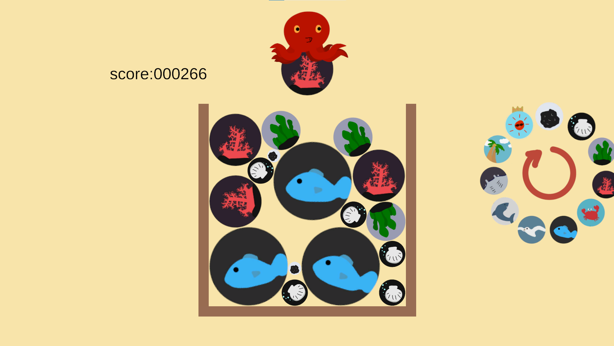
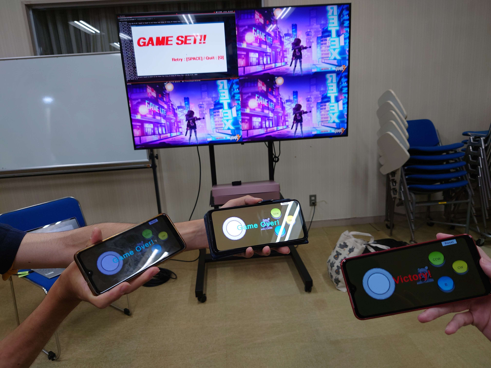
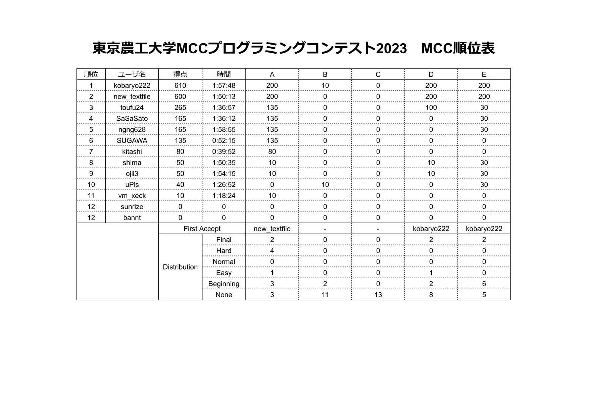

# 概要

サンセットブリーズ保田にて2泊3日の合宿を行いました！
16人が参加し、ハッカソンや競プロ強化演習をしました。

# ハッカソン

ハッカソンでは参加者が4人, 4人, 3人でA, B, C のチームに分かれ、それぞれのテーマに沿って開発を行いました。各チームが制作したものを紹介します。

## Aチーム: ikasu_game

上から玉を落とし、同じサイズの玉が触れると大きくなり得点が入るゲーム。いっぱいになっちゃうとゲームオーバー

## Bチーム: Tetlife

ライフゲームと陣取りゲームを組み合わせたターン制のゲームです

セル上には自分と相手の生命が存在します
空いているセルに自分の生命を置くと数世代進み、自分の生命を一定以上にすると勝利です
数世代先の状態を読むのが難しく、相手の生命と衝突するため戦略と駆け引きが求められます

## Cチーム: PIXEL BATTLE

１画面をみんなで囲むスタイルの、マルチプレイ2Dシューティングゲーム。リモコン操作でピクセルマップを移動します。

チームメンバーの手持ち技術に応じて、ゲーム本体はPyGame(Python)、AndroidリモコンはUnityで作りました。Wi-Fiを介して通信しています。

# 競プロ強化演習

競プロ強化演習では、MCCの競プロ部門が CodinGame などでコード実装力を鍛えるための演習を行いました。また、合宿2日目の夜には部内競プロコンテストを行いました。

コンテストページは[こちら](https://mofecoder.com/contests/mccpc2023)

コンテストの結果は以下の通りです。

