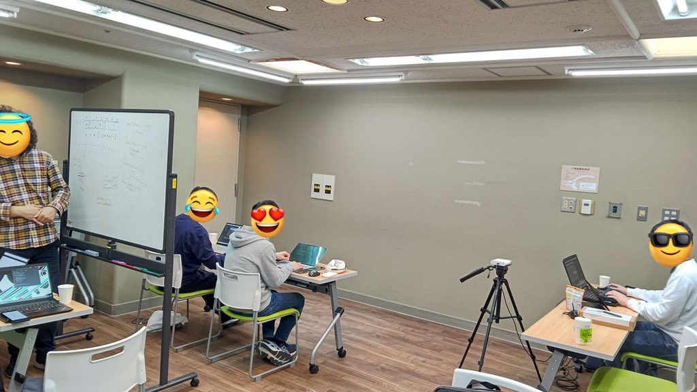
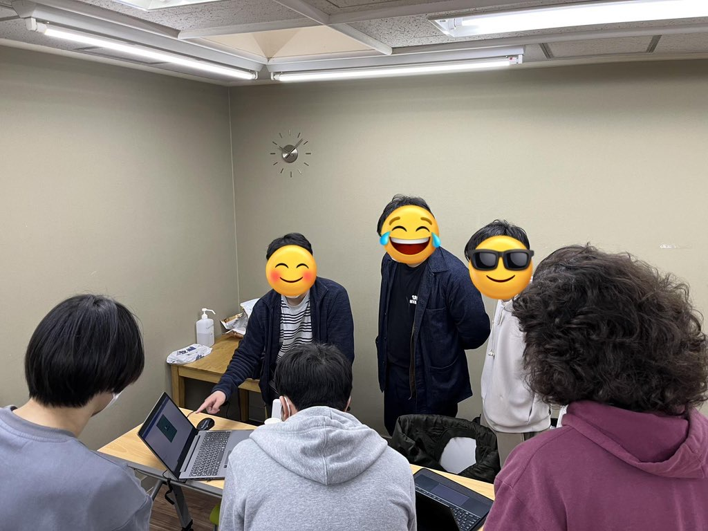
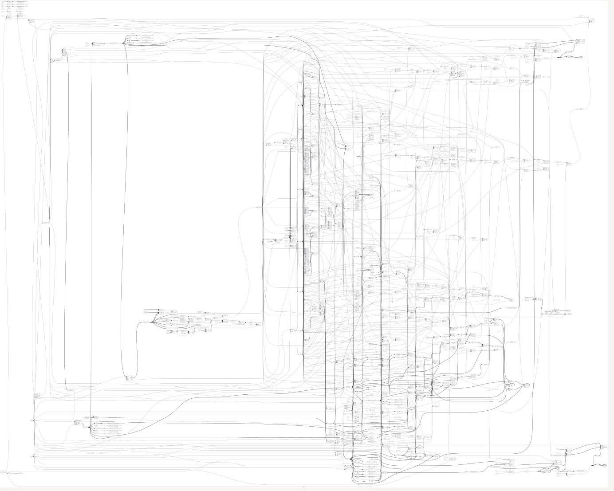
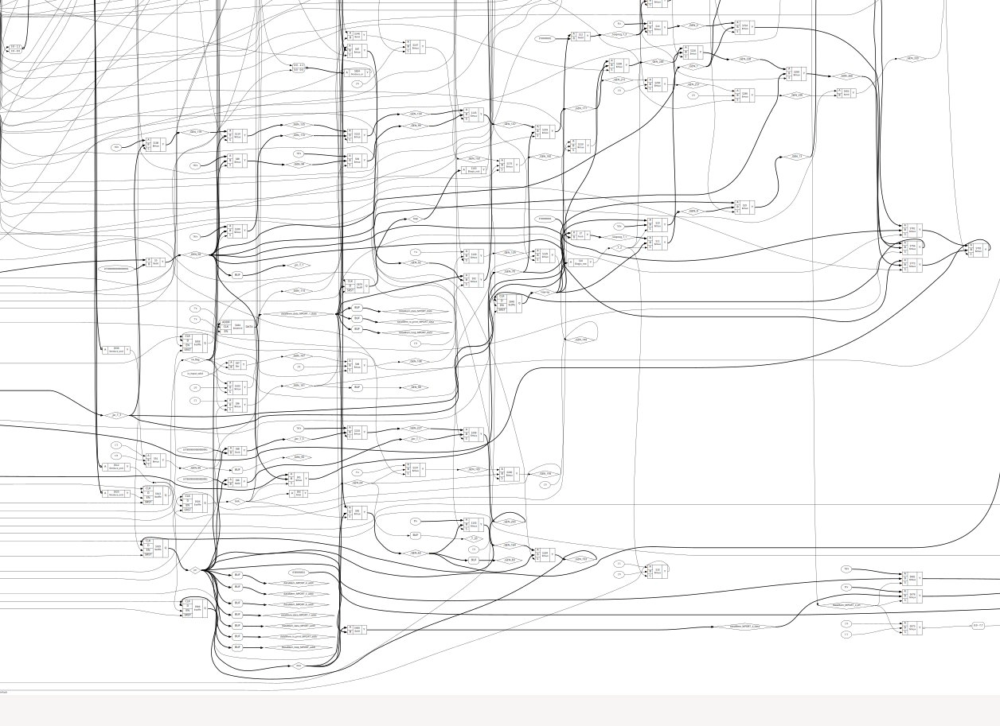
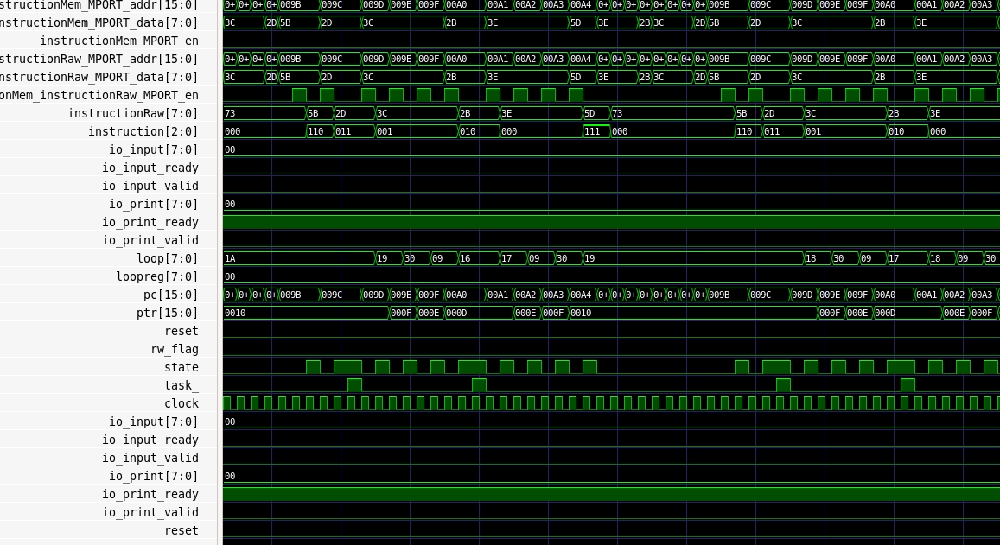
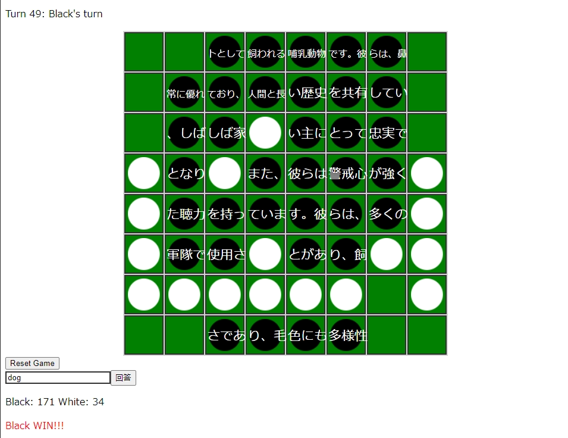
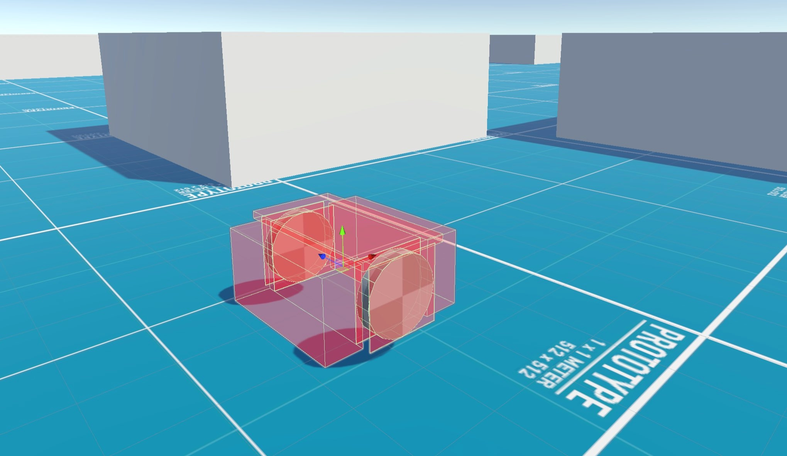

# 概要

上郷・森の家にて2泊3日の合宿を行いました！
9人が参加し、観光🛥️・バーベキュー🍖・ハッカソン💻などをしました。

# ハッカソン

ハッカソンでは参加者が3人ずつの3人チームに分かれ、
それぞれのテーマに沿って開発を行いました。各チームが制作したものを紹介します。

## Aチーム: Brainf\*\*k CPU

Brainf\*\*k のコードをそのまま実行できる CPU

16bit の PC とポインタを備えています。

Chisel 製で、FPGAやシミュレータを用いて動かすことができます。

## Bチーム

制作物: オセロクイズゲーム

オセロを進めてゆくと自分のところにクイズの問題文が現れていくゲームです。

ターンが進んでいくごとにクイズに正解した際の得点の比重が下がるので、
オセロの実力とクイズの実力どちらも必要になっています！

## Cチーム

制作物: ぼくたちのかんがえたさいきょうのろぼっと

現実のタイヤやセンサーの動きを再現したロボット

Unity上の仮想的な距離センサなどの情報をもとに、障害物を避けながら目的地(赤い球)まで移動します。

Azure Kinect を利用し、リアルタイムで現実の地形を仮想空間に取り込むこともできます。

