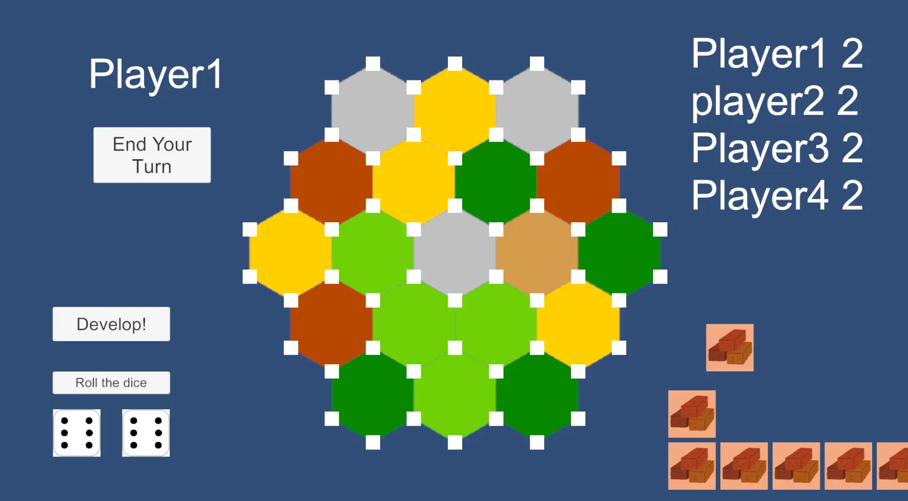
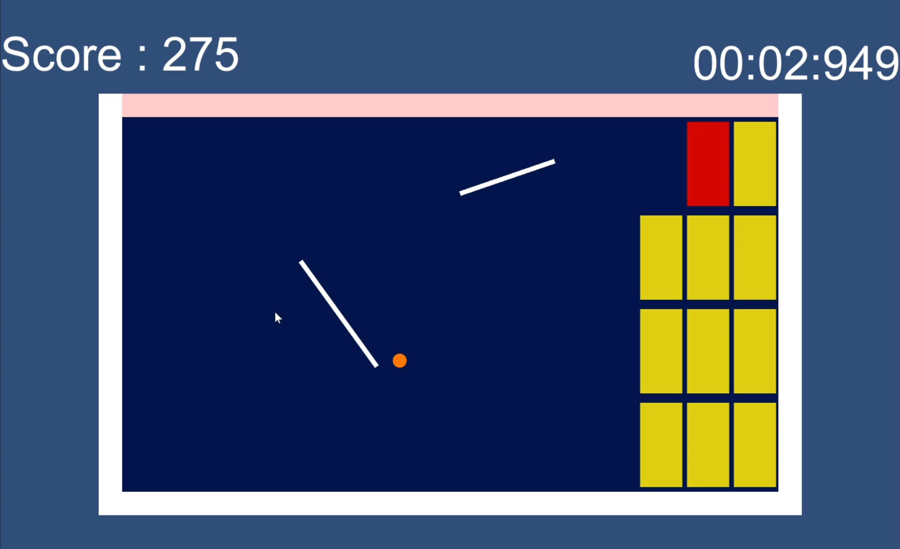
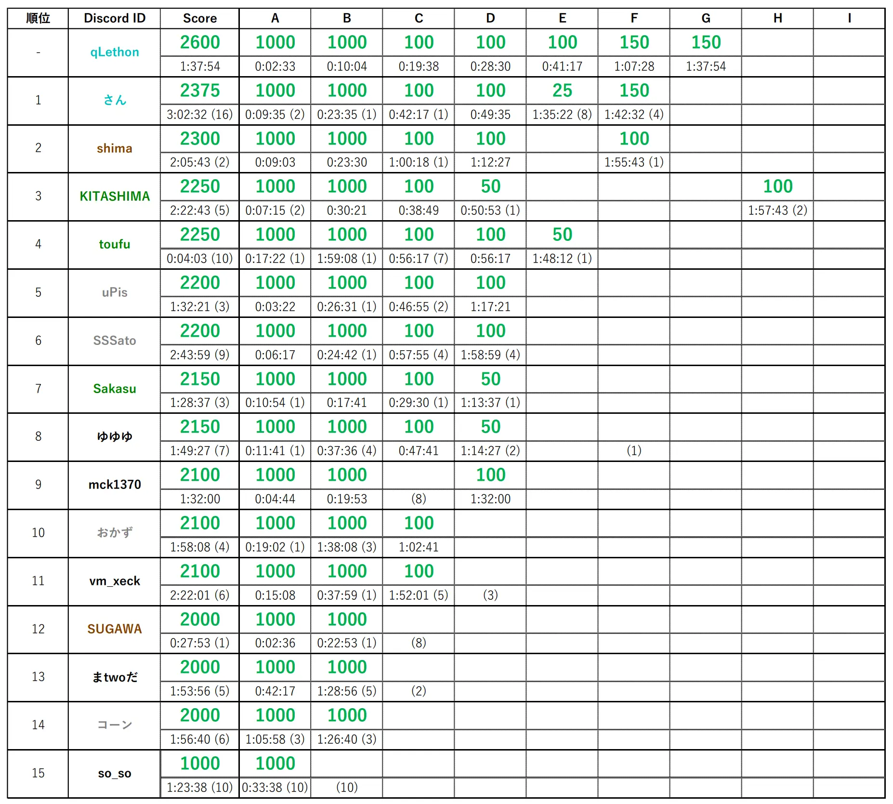

# 2023年度春合宿を行いました

## 概要

MCCでは毎年春休みと夏休みに二泊三日の春合宿を開催しており、今回は本栖湖スポーツセンターにて自主ハッカソン・競プロ強化合宿を行いました!

## ハッカソン

### Digital Catan

ボードゲームのカタンをUnityで再現しようとしました。
2泊3日で完成まで間に合いませんでしたが、見た目は出来上がりました！

### Draw & Break Blocks

ブロック崩しをモチーフにしたゲームを作りました。
自分で線を引いてボールの動きをコントロールし、できるだけ早く多くのブロックを壊すことで高スコアを目指します。

### Intrractive Summoning

Quest3と触覚デバイスを用いて、手をかざした先に3Dアバターを召喚し、実際に触れ合うことができるシステムを作りました。

(ここに画像がほしいけど無い)

### (無題)

脳の神経細胞を模したノードを接続して，入力の時間変化に従って逐次出力を行うようなシステムを作りました．仕上げは間に合いませんでしたがノードエディタとサーバが通信して音声を出力することができました．

(ここに画像がほしいけど無い…)

## 競プロ

競プロ強化演習では、MCCの競プロ部門が CodinGame などでコード実装力を鍛えるための演習を行いました。また、合宿2日目の夜には部内競プロコンテストを行いました。

コンテストページは[こちら](https://mofecoder.com/contests/mccpc2023winter)

コンテストの結果は以下の通りです。

