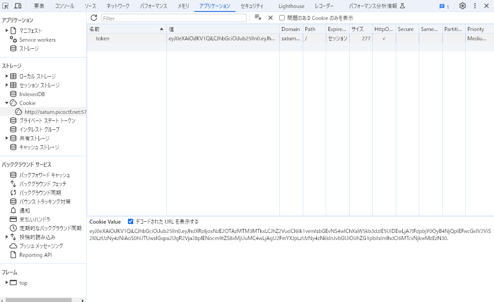
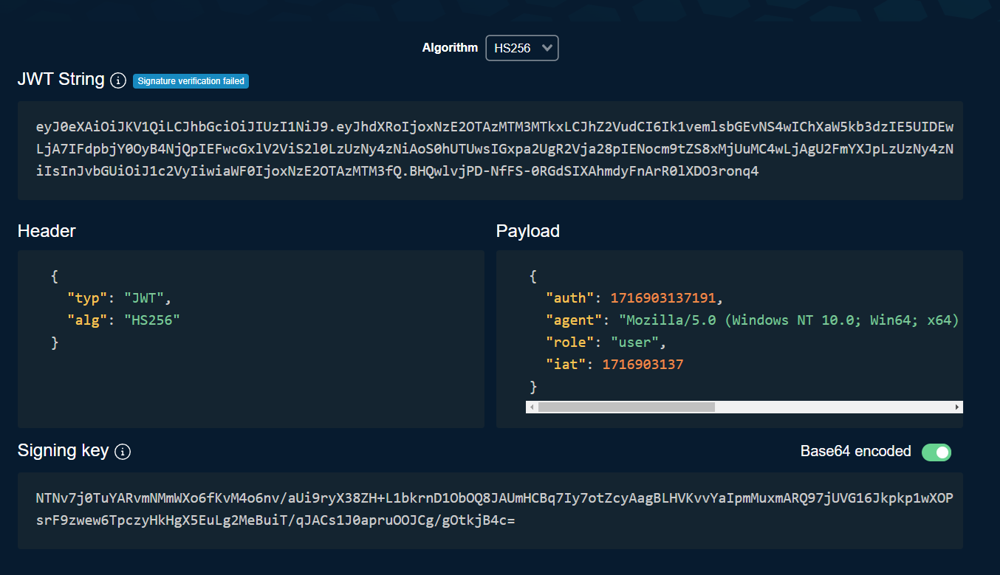

# はじめに

部内 CTF 初心者会用に作った [picoGym Exclusive](https://play.picoctf.org/practice?originalEvent=gym) の Writeup です。

# もくじ

- [はじめに](#はじめに)
- [もくじ](#もくじ)
- [First Find (General Skills)](#first-find-general-skills)
- [Big Zip (General Skills)](#big-zip-general-skills)
- [ASCII FTW (Reverse Engineering)](#ascii-ftw-reverse-engineering)
- [ASCII Numbers (General Skills)](#ascii-numbers-general-skills)
- [Bit-O-Asm-1 (Reverse Engineering)](#bit-o-asm-1-reverse-engineering)
- [Bit-O-Asm-2 (Reverse Engineering)](#bit-o-asm-2-reverse-engineering)
- [Bit-O-Asm-3 (Reverse Engineering)](#bit-o-asm-3-reverse-engineering)
- [Bit-O-Asm-4 (Reverse Engineering)](#bit-o-asm-4-reverse-engineering)
- [GDB baby step 1 (Reverse Engineering)](#gdb-baby-step-1-reverse-engineering)
- [GDB baby step 2 (Reverse Engineering)](#gdb-baby-step-2-reverse-engineering)
- [GDB baby step 3 (Reverse Engineering)](#gdb-baby-step-3-reverse-engineering)
- [GDB baby step 4 (Reverse Engineering)](#gdb-baby-step-4-reverse-engineering)
- [Local Target (Binary Exploitation)](#local-target-binary-exploitation)
- [Picker I (Reverse Engineering)](#picker-i-reverse-engineering)
- [Picker II (Reverse Engineering)](#picker-ii-reverse-engineering)
- [Picker III (Reverse Engineering)](#picker-iii-reverse-engineering)
- [Picker IV (Binary Exploitation)](#picker-iv-binary-exploitation)
- [WPA-ing Out (Forensics)](#wpa-ing-out-forensics)
- [JAuth (Web Exploitation)](#jauth-web-exploitation)

# First Find (General Skills)

`uber-secret.txt` というファイルを探します。 zipファイルを解答したらエクスプローラーなどで、解答したフォルダの中で `uber-secret.txt` を検索してみましょう。

<details>
<summary>フラグ</summary>

```txt
picoCTF{f1nd_15_f457_ab443fd1}
```

</details>

# Big Zip (General Skills)

`big-zip-files.zip` を解答して、 `grep` コマンドを使ってフラグを探します。

```bash
grep -r 'picoCTF{.*}' .
```

`-r` オプションはディレクトリ内のファイルを再帰的に検索するオプションです。`picoCTF{.*}` は正規表現で、`picoCTF{` で始まり、`}` で終わる文字列を検索します。`.` はカレントディレクトリを表します。

<details>
<summary>フラグ</summary>

```txt
picoCTF{gr3p_15_m4g1c_ef8790dc}
```

</details>

# ASCII FTW (Reverse Engineering)

バイナリエディタ使って `asciiftw` を見たら `0x00001188` 付近にフラグがありました。4バイトずつ読んでいくとフラグが見つかります。

バイナリエディタは個人的には `VSCode` の [`Hex Editor`](https://marketplace.visualstudio.com/items?itemName=ms-vscode.hexeditor) 拡張機能がおすすめです。

<details>
<summary>フラグ</summary>

```txt
picoCTF{ASCII_IS_EASY_7BCD971D}
```

</details>

# ASCII Numbers (General Skills)

[ASCIIコード表](/posts/2024-01-26-ascii-table/)を使って文字に直す方法もありますが、 Python のコードを書いて楽にフラグを取得することもできます。

```python
binstr = "0x70 0x69 0x63 0x6f 0x43 0x54 0x46 0x7b 0x34 0x35 0x63 0x31 0x31 0x5f 0x6e 0x30 0x5f 0x71 0x75 0x33 0x35 0x37 0x31 0x30 0x6e 0x35 0x5f 0x31 0x6c 0x6c 0x5f 0x74 0x33 0x31 0x31 0x5f 0x79 0x33 0x5f 0x6e 0x30 0x5f 0x6c 0x31 0x33 0x35 0x5f 0x34 0x34 0x35 0x64 0x34 0x31 0x38 0x30 0x7d".split(" ")
flag = ""
for i in binstr:
 flag += chr(int(i, 16))

print(flag)
```

ubuntu なら、python3 がインストールされているので、`solve.py`というファイルにコードを書いたら、以下のコマンドで実行できます。

```bash
python3 solve.py
```

<details>
<summary>フラグ</summary>

```txt
picoCTF{45c11_n0_qu35710n5_1ll_t311_y3_n0_l135_445d4180}
```

</details>

# Bit-O-Asm-1 (Reverse Engineering)

`eax` はアキュムレータと呼ばれるレジスタです。`mov` はアセンブリ言語で値を代入する命令です。 この問題では `<+15>` で `eax` に `0x30` が代入されてます。 10進数に直すのを忘れないでください。

<details>
<summary>フラグ</summary>

```txt
picoCTF{48}
```

</details>

# Bit-O-Asm-2 (Reverse Engineering)

今度は `<+22>` で `eax` には `DWORD PTR [rbp-0x4]` に格納されている値が代入されています。`DWORD PTR [rbp-0x4]` は `rbp` から `0x4` バイト分離れたアドレスに格納されている値を指します。`rbp` はベースポインタと呼ばれるレジスタです。この問題では `DWORD PTR [rbp-0x4]` には `<+15>` で `0x9fe1a` が代入されています。10進数に直すのを忘れないでください。

<details>
<summary>フラグ</summary>

```txt
picoCTF{654874}
```

</details>

# Bit-O-Asm-3 (Reverse Engineering)

`imul` は掛け算をする命令です。 `add` は足し算をする命令です。 `<+15>`、`<+22>` で `DWORD PTR [rbp-0xc]` には `0x9fe1a`、`DWORD PTR [rbp-0x8]` には `0x4` が格納されています。 `<+29>` で `eax` に `DWORD PTR [rbp-0xc]` を代入し、 `<+32>` で `eax` に `DWORD PTR [rbp-0x8]` を掛けて、 `<+36>` で `eax` に `0x1f5` を足しています。 `<+41>`、`<+44>` では、`DWORD PTR [rbp-0x4]` に `eax` を代入した後、 `eax` に代入しているので、`eax` は値が変わりません。プログラムっぽく書くと以下のようになります。

```txt
*(rbp-0xc) = 0x9fe1a
*(rbp-0x8) = 0x4
eax = *(rbp-0xc)
eax *= *(rbp-0x8)
eax += 0x1f5
```

これらのことを考えると、以下の計算式が成り立ちます。16進数を10進数に直すのを忘れないでください。

```txt
eax = (0x9fe1a * 0x4) + 0x1f5
```

<details>
<summary>フラグ</summary>

```txt
picoCTF{2619997}
```

</details>

# Bit-O-Asm-4 (Reverse Engineering)

`<+22>` の `cmp` 命令は比較する命令です。次の `<+29>` にある `jle` は `cmp` で比較した結果が `<=` の場合に指定されたアドレス(ここでは`<+37>`)にジャンプする命令です。 `jmp` 命令は無条件に指定されたアドレス(ここでは`<+41>`)にジャンプする命令です。このアセンブリをプログラムっぽく書くと以下のようになります。

```txt
*(rbp-0x4) = 0x9fe1a

if (*(rbp-0x4) > 0x2710){
    *(rbp-0x4) -= 0x65
}else{
    *(rbp-0x4) += 0x65
}

eax = *(rbp-0x4)
```

`*(rbp-0x4)` は `0x9fe1a` で `0x2710` より大きいので、`0x65` 引かれます。10進数に直すのを忘れないでください。

<details>
<summary>フラグ</summary>

```txt
picoCTF{654773}
```

</details>

# GDB baby step 1 (Reverse Engineering)

渡されたELFファイルで、`eax` に代入されている値を答えるようです。ちなみに実行したらエラーを吐いてプログラムが終了しました。`gdb` を使うと、ELFファイルのアセンブリを見ることができます。以下のコマンドで `gdb` を起動します。

```bash
gdb ./debugger0_a
```

main 関数のアセンブリを見るには以下のコマンドを実行します。

```txt
disass main
```

ここまでこれれば、`eax` に代入されている値がわかります。16進数を10進数に直すのを忘れないでください。

<details>
<summary>フラグ</summary>

```txt
picoCTF{549698}
```

</details>

# GDB baby step 2 (Reverse Engineering)

先程の問題同様、`gdb` でELFファイルのアセンブリを見ます。以下のコマンドで `gdb` を起動します。

```bash
gdb ./debugger0_b
```

main 関数のアセンブリを見ましょう。

```txt
disass main
```

```txt
0x0000000000401106 <+0>:     endbr64 
0x000000000040110a <+4>:     push   %rbp
0x000000000040110b <+5>:     mov    %rsp,%rbp
0x000000000040110e <+8>:     mov    %edi,-0x14(%rbp)
0x0000000000401111 <+11>:    mov    %rsi,-0x20(%rbp)
0x0000000000401115 <+15>:    movl   $0x1e0da,-0x4(%rbp)
0x000000000040111c <+22>:    movl   $0x25f,-0xc(%rbp)
0x0000000000401123 <+29>:    movl   $0x0,-0x8(%rbp)
0x000000000040112a <+36>:    jmp    0x401136 <main+48>
0x000000000040112c <+38>:    mov    -0x8(%rbp),%eax
0x000000000040112f <+41>:    add    %eax,-0x4(%rbp)
0x0000000000401132 <+44>:    addl   $0x1,-0x8(%rbp)
0x0000000000401136 <+48>:    mov    -0x8(%rbp),%eax
0x0000000000401139 <+51>:    cmp    -0xc(%rbp),%eax
0x000000000040113c <+54>:    jl     0x40112c <main+38>
0x000000000040113e <+56>:    mov    -0x4(%rbp),%eax
0x0000000000401141 <+59>:    pop    %rbp
0x0000000000401142 <+60>:    ret
```

ループしてて計算がめんどいですね。`<main+59>` にブレークポイントを指し、そこでプログラムを一時停止させ、`eax` の値を見れば良さそうです。以下のコマンドで `<main+59>` にブレークポイントを設定します。

```txt
break *0x0000000000401141
```

以下のコマンドでプログラムを実行します。

```txt
run
```

`Breakpoint 1, 0x0000000000401141 in main ()` と表示されたら、以下のコマンドで `eax` の値を見ます。16進数を10進数に直すのを忘れないでください。

```txt
print $eax
```

<details>
<summary>フラグ</summary>

```txt
picoCTF{307019}
```

</details>

# GDB baby step 3 (Reverse Engineering)

`0x2262c96b` をメモリに書き込んだら、メモリの中身を見てみてその並び順を答える問題です。以下のコマンドで `gdb` を起動します。

```bash
gdb ./debugger0_c
```

main 関数のアセンブリを見ます。

```txt
disass main
```

```txt
0x0000000000401106 <+0>:     endbr64 
0x000000000040110a <+4>:     push   %rbp
0x000000000040110b <+5>:     mov    %rsp,%rbp
0x000000000040110e <+8>:     mov    %edi,-0x14(%rbp)
0x0000000000401111 <+11>:    mov    %rsi,-0x20(%rbp)
0x0000000000401115 <+15>:    movl   $0x2262c96b,-0x4(%rbp)
0x000000000040111c <+22>:    mov    -0x4(%rbp),%eax
0x000000000040111f <+25>:    pop    %rbp
0x0000000000401120 <+26>:    ret
```

`<main+15>` で `0x2262c96b` が `-0x4(%rbp)` に代入されています。`<main+22>` にブレークポイントを指し、そこでプログラムを一時停止させ、`-0x4(%rbp)` のメモリダンプを見ます。以下のコマンドで `<main+22>` にブレークポイントを設定します。

```txt
break *0x000000000040111c
```

以下のコマンドでプログラムを実行します。

```txt
run
```

`Breakpoint 1, 0x000000000040111c in main ()` と表示されたら、以下のコマンドで `-0x4(%rbp)` のメモリダンプを4byte分見ます。

```txt
x/4xb $rbp-0x4
```

<details>
<summary>フラグ</summary>

メモリにはリトルエンディアンで書き込まれるので、`0x6b`, `0xc9`, `0x62`, `0x22` の順番でフラグが書き込まれています。逆に、`0x22`, `0x62`, `0xc9`, `0x6b` で書き込まれるのはビッグエンディアンです。

```txt
picoCTF{0x6bc96222}
```

</details>

# GDB baby step 4 (Reverse Engineering)

main 関数で別の関数を呼び出しているようです。`gdb` でその関数のアセンブリを見ます。以下のコマンドで `gdb` を起動します。

```bash
gdb ./debugger0_d
```

main 関数のアセンブリを見ます。

```txt
disass main
```

```txt
0x000000000040111c <+0>:     endbr64 
0x0000000000401120 <+4>:     push   %rbp
0x0000000000401121 <+5>:     mov    %rsp,%rbp
0x0000000000401124 <+8>:     sub    $0x20,%rsp
0x0000000000401128 <+12>:    mov    %edi,-0x14(%rbp)
0x000000000040112b <+15>:    mov    %rsi,-0x20(%rbp)
0x000000000040112f <+19>:    movl   $0x28e,-0x4(%rbp)
0x0000000000401136 <+26>:    movl   $0x0,-0x8(%rbp)
0x000000000040113d <+33>:    mov    -0x4(%rbp),%eax
0x0000000000401140 <+36>:    mov    %eax,%edi
0x0000000000401142 <+38>:    call   0x401106 <func1>
0x0000000000401147 <+43>:    mov    %eax,-0x8(%rbp)
0x000000000040114a <+46>:    mov    -0x4(%rbp),%eax
0x000000000040114d <+49>:    leave  
0x000000000040114e <+50>:    ret
```

`<main+38>` で `func1` が呼び出されています。`func1` のアセンブリを見ます。

```txt
disass func1
```

```txt
0x0000000000401106 <+0>:     endbr64 
0x000000000040110a <+4>:     push   %rbp
0x000000000040110b <+5>:     mov    %rsp,%rbp
0x000000000040110e <+8>:     mov    %edi,-0x4(%rbp)
0x0000000000401111 <+11>:    mov    -0x4(%rbp),%eax
0x0000000000401114 <+14>:    imul   $0x3269,%eax,%eax
0x000000000040111a <+20>:    pop    %rbp
0x000000000040111b <+21>:    ret
```

`<func1+14>` で定数が掛けられています。16進数を10進数に直すのを忘れないでください。

<details>
<summary>フラグ</summary>

```txt
picoCTF{12905}
```

</details>

# Local Target (Binary Exploitation)

`launch instance` を押すとソースコードとバイナリが渡されるので、ソースコードを見ながら実行してみましょう。

任意の文字列を入れたら、変数 `input` に `gets` 関数で代入され、変数 `num` の値が出力されます。プログラムを見ると、 `num` が `65` であれば、`flag.txt` を読み込んでフラグが出力されるようです。

`num` は ソースコードの 11 行目で `64` を代入されてから更新されていまっせん。そのため、`num` に `65` を代入する方法を考えます。

gdb を使えば、簡単に代入できますが、今回はフラグがリモートにあるので、gdb は使えません。そこで、メモリ破壊をします。

文字列 "ABC" を入力したらときのメモリ上のイメージを以下に示します。


`input` の領域には "ABC" が格納されています。`num` の領域には `64` がリトルエンディアンで格納されています。ASCIIコード表は[こちら](/posts/2024-01-26-ascii-table/)にあります。

ここで、`gets` 関数ですが、`gets` 関数は標準入力から文字列を受け取り、ヌル文字を見つけるまで文字列を格納します。つまり、`gets` 関数は文字列の長さをチェックしません。そのため、16 文字列以上入れると `input` の領域を超えて書き込むことが可能です。そのため、ある程度の長さを入れれば、`num` の領域に文字列を書き込めます。とりあえず、'a' を 16 文字入れて、0~9までを2回繰り返す36文字を入力してみます。

```txt
aaaaaaaaaaaaaaaa01234567890123456789
```

出力は以下のようになります。

```txt
Enter a string: aaaaaaaaaaaaaaaa01234567890123456789

num is 825243960
Bye!
```

`num` が `825243960` になりました。`825243960` をリトルエンディアンで表すと `0x38`, `0x39`, `0x30`, `0x31` です。これは ASCII コードで文字列 `8901` です。このことから、メモリ上のイメージ図は以下のようになります。


`num` の領域に文字列 `8901` が格納されています。`num` が `65` になるように、`num` の領域に `A` を書き込めば良さそうです。つまり、以下のようなイメージ図になります。


こうすると、 `num` の領域は `0x40`, `0x00`, `0x00`, `0x00` になります。これはリトルエンディアンで `64` です。以下のようなものを入力すれば良さそうです。

```txt
aaaaaaaaaaaaaaaa01234567A
```

`launch instance` を押してリモートにアクセスしましょう。`ne` コマンドが出るのでコピペして実行します。人によって `00000` の数字が異なります。表示されたコマンドを使ってください。

```txt
nc saturn.picoctf.net 00000
```

<details>
<summary>フラグ</summary>

```txt
picoCTF{l0c4l5_1n_5c0p3_7bd3fee1}
```

</details>

# Picker I (Reverse Engineering)

`launch instance` を押すとソースコードとバイナリが渡されるので、ソースコードを見ながら実行してみましょう。`Try entering "getRandomNumber" without the double quotes` と出てくるので、`getRandomNumber` と入力すると `4` が出てきます。

プログラムは Python のコードが渡されます。入力した文字列は `eval` 関数に `()` をつけて渡されます。Python の `eval` 関数は文字列を Python のコードとして実行します。例えば以下のPythonコードを考えます。

```python
eval("1 + 2")
```

このコードは `1 + 2` を実行して `3` を返します。

`getRandomNumber` 関数では `4` を出力する関数になっています。

```python
def getRandomNumber():
    print(4)
```

そのため、`getRandomNumber` と入力すると `4` が出力されます。

ここで、`win` 関数を見てみましょう。`win` 関数では、 `flag.txt` を読み込んでフラグを出力します。このことから、`win` を入力すれば、 `eval` 関数で `win` 関数が実行され、フラグが出力されそうです。

フラグは 16 進数で表示されるので、以下のようなPythonコードを作ってあげると文字列の形でフラグを取得できます。

```python
flagbin = input("inputflag: ")
flag = ""

for c in flagbin.split():
 flag += chr(int(c, 16))

print(flag)
```

<details>
<summary>フラグ</summary>

```txt
picoCTF{4_d14m0nd_1n_7h3_r0ugh_6e04440d}
```

</details>

# Picker II (Reverse Engineering)

`launch instance` を押すとソースコードとバイナリが渡されるので、ソースコードを見ながら実行してみましょう。`filter` 関数では、入力した文字列に `win` が含まれているかを判定します。そのため、`win` と入力すると、`Illegal input` と出力され、`win` 関数が実行されません。

このことから、`win` の文字列をそのまま入力するのではなく、分割して、`"wi" + "n"` で入力してあげましょう。文字列の足し算を実行させてから、`win` 関数を実行させる必要があるため、入力にも `eval` 関数を使います。よって、入力は以下のようにすれば、フラグが16進数で出てきます。

```txt
eval("wi"+"n()")
```

`'NoneType' object is not callable` と出てきますが、これは、もともとの `eval` 関数で実行する文字列が `"eval("wi"+"n()")()"` となり、`eval("wi"+"n()")` が `None` を返すためです。フラグは出てくるので問題ありません。

<details>
<summary>フラグ</summary>

```txt
picoCTF{f1l73r5_f41l_c0d3_r3f4c70r_m1gh7_5ucc33d_0b5f1131}
```

</details>

# Picker III (Reverse Engineering)

`launch instance` を押すとソースコードとバイナリが渡されるので、ソースコードを見ながら実行してみましょう。

`1`, `2`, `3`, `4` の入力すると、`func_table` に書かれている関数名の関数を実行するそうです。初期では、`1`, `2`, `3`, `4` を入力するとそれぞれ、 `print_table`, `read_variable`, `write_variable`, `getRandomNumber` が実行されます。なんとかして `win` 関数を実行させましょう。

`func_table` に `win` を書き込んで、`1` を入力すれば、 `win` 関数を呼び出せそうです。

`write_variable` では、任意の変数に値を代入できそうです。ちなみに、`func_table` と `win` を入力したら、`global func_table; func_table = win` になって、 `func_table` には、文字列 `win` ではなく、`win` **関数**が代入され、`func_table` が文字列ではなくなって、`TypeError: object of type 'function' has no len()` となり正しく動作しなくなります。

さらに、`call_func` では、`func_table` に書かれている文字数を判定していて、128 文字でないと実行できません。そのため `write_variable` での入力は以下の2つです。`win` を入力するときは、 ダブルクォーテーションで囲み、中に`win` と空白合わせて 128 文字入れます。

```txt
func_table
```

```txt
"win                                                                                                                             "
```

これで、`func_table` に `win` が入るので、 `1` を入力すれば、`win` 関数が実行されます。

<details>
<summary>フラグ</summary>

```txt
picoCTF{7h15_15_wh47_w3_g37_w17h_u53r5_1n_ch4rg3_a186f9ac}
```

</details>

# Picker IV (Binary Exploitation)

`launch instance` を押すとソースコードとバイナリが渡されるので、ソースコードを見ながら実行してみましょう。

`main` 関数の `val` に入ってる数値をアドレスとして、そのアドレスの関数を実行するそうです。`win` 関数のアドレスを確認しましょう。`gdb` を使って確認します。

```bash
gdb ./picker-IV
```

以下のコマンドで `win` 関数のアドレスを確認します。

```txt
info functions
```

```txt
All defined functions:

Non-debugging symbols:
0x0000000000401000  _init
0x00000000004010e0  putchar@plt
0x00000000004010f0  puts@plt
0x0000000000401100  fclose@plt
0x0000000000401110  printf@plt
0x0000000000401120  fgetc@plt
0x0000000000401130  signal@plt
0x0000000000401140  setvbuf@plt
0x0000000000401150  fopen@plt
0x0000000000401160  __isoc99_scanf@plt     
0x0000000000401170  exit@plt
0x0000000000401180  sleep@plt
0x0000000000401190  _start
0x00000000004011c0  _dl_relocate_static_pie
0x00000000004011d0  deregister_tm_clones   
0x0000000000401200  register_tm_clones     
0x0000000000401240  __do_global_dtors_aux  
0x0000000000401270  frame_dummy
0x0000000000401276  print_segf_message
0x000000000040129e  win
0x0000000000401334  main
0x00000000004013d0  __libc_csu_init
0x0000000000401440  __libc_csu_fini
0x0000000000401448  _fini
```

`win` 関数のアドレスは `0x000000000040129e` のようです。この値を `val` に入れてあげましょう。

<details>
<summary>フラグ</summary>

```txt
picoCTF{n3v3r_jump_t0_u53r_5uppl13d_4ddr35535_14bc5444}
```

</details>

# WPA-ing Out (Forensics)

`wpa-ing_out.pcap` を開いてみてください (WiresharkでOKです)。このパケットの中身は WiFi の通信です。`Aircrack-ng` を使ってパスワードを解読します。パスワードを解読する際、`rockyou.txt` というパスワードリストを使って辞書攻撃をします。`rockyou.txt` とは簡単に言えばよく使われるパスワードのリストです(詳しくはぐぐると出てきます)。Google等で `rockyou.txt` と検索するとダウンロードできます。

`Aircrack-ng` をダウンロードしましょう。

```bash
sudo apt-get install aircrack-ng
```

`wpa-ing_out.pcap` と `rockyou.txt` を同じディレクトリに入れ、そのディレクトリで以下のコマンドを実行します。

```bash
aircrack-ng wpa-ing_out.pcap -w rockyou.txt
```

```txt
                               Aircrack-ng 1.6 

      [00:00:05] 92099/10303727 keys tested (17921.19 k/s)

      Time left: 9 minutes, 29 seconds                           0.89%     

                          KEY FOUND! [ mickeymouse ]


      Master Key     : E0 5D 7B 25 3D 9D CA 85 F7 04 CD 58 CD 94 EF 99     
                       70 0A 8C A9 BF 1E 7E E3 25 AC D7 79 43 5F E9 B9     

      Transient Key  : 50 F5 69 BA F9 28 CE 71 AE ED 1F 1E B9 A2 68 10     
                       49 73 A7 28 1A 0B E4 9A 7B C8 21 89 93 2E 28 1B     
                       8C 28 57 98 49 C3 FC FD 03 F4 3E 7A B1 04 F2 34     
                       93 D6 12 FE 2E FB A2 73 29 EC E4 80 3B BA 30 A4     

      EAPOL HMAC     : AB 46 CB 89 1C 89 12 23 21 BF 92 C2 A8 7D CB 58
```

<details>
<summary>フラグ</summary>

🐀

```txt
picoCTF{mickeymouse}
```

</details>

# JAuth (Web Exploitation)

JWTでは署名検証回避をすることができます。

`JWT` とは、`JSON Web Token` の略で、`ヘッダー.ペイロード.署名` の構文で、JSONデータに署名と暗号化を施したものです。くわしくは[wiki](https://ja.wikipedia.org/wiki/JSON_Web_Token)みてね

`launch instance` を押すと開けるサイトを開いてください。サンプルのユーザーとパスワードの `test`, `Test123!` を入力してログインします。ログインすると、テストページが開けます。

テストページを開いたら開発者ツールを開いて、`Application` タブを開きます。そして、 `Storage` の `Cookies` に `token` があります。この `token` をいじって admin 画面を開きましょう。



[token.dev](https://token.dev/) を使うと編集できます。`JWT String` に token を入れてください。



上にある `Algorithm` を `none` にして、`Payload` の `role` を `"user"` から `"admin"` にしてください。そうすると `JWT String` が変わります。変わったら、最後に `.` をつけてください。JWT の構文は `ヘッダー.ペイロード.署名` なので、署名が空文字だと、最後が `.` で終わっている必要があります。この変わった token でブラウザの開発者ツールの `Cookies` の token を上書きしてください。そして再読み込みするとフラグが出てきます。

<details>
<summary>フラグ</summary>

```txt
picoCTF{succ3ss_@u7h3nt1c@710n_72bf8bd5}
```

</details>