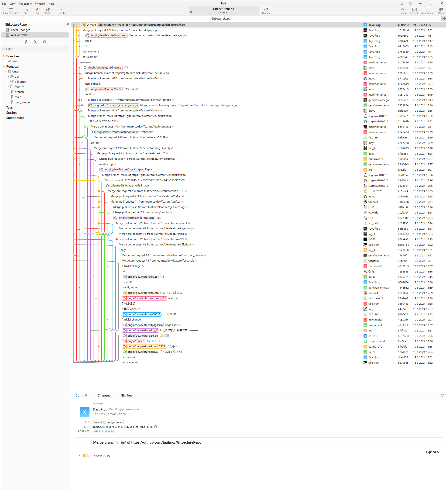
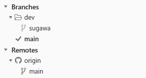
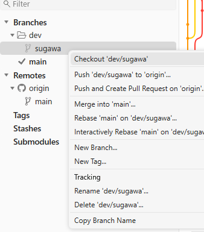
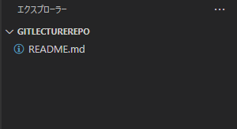

難易度: ★☆☆☆☆ 入門レベル

# 1. はじめに

* この記事は MCC Git 講習会 2025 の資料です.
* MCC でチーム開発をするために必要なレベルまで Git の知識を身につけることを目標とします.
* この回では詳しい概念の説明は省略しています.
* とりあえず編集の足跡をつけて, それをみんなで共有することができれば OK です.

## 1.1. 環境構築

ここでは, GitHub のアカウント作成と, Fork のインストールを行います. すでに済んでる人はスキップして OK です.

1. GitHub アカウントの作成
2. GitHub の MCC のグループに参加
3. Fork のインストール
4. Fork の初期設定

### 1.1.1. GitHub アカウントの作成

アカウントを持っていない人は, 以下の URL からアカウントを作成してください. 持ってればここの項目はスキップして OK です.

[https://github.com/join](https://github.com/join)

メールアドレスは個人用が望ましいです. 大学メアドだと卒業時に使えなくなる可能性があります.

### 1.1.2. GitHub の MCC のグループに参加

GitHub の MCC のグループに参加します. GitHub のアカウントを作った人は部長を呼んでください. 部長が招待します. 参加方法は部長の指示に従ってください.

### 1.1.3. Fork のインストール

Fork という GUI クライアントをインストールします. 以下の URL からお使いの環境にあったインストーラをダウンロードしてインストールしてください. 無料で使えます.

[https://git-fork.com/](https://git-fork.com/)

### 1.1.4. Fork の初期設定

Fork を起動すると以下のような画面が表示されます. ここで Git の設定を行います. `User Name` の項目に GitHub のアカウント名, `Email` の項目に GitHub のダミーメールアドレスを入力します.

* User Name

SUGAWA の GitHub アカウント名は `sugawa197203` です. なので `User Name` の項目は `sugawa197203` に設定します.

* GitHub のダミーメールアドレス

`Email` の項目は GitHub のダミーのメールアドレスに設定します. なぜダミーメールアドレスを使うかは後ほど説明します.

自身の GitHub のダミーメールアドレスは, GitHub の Settings -> Emails から確認できます.

Settings は右上のプロフィールアイコン -> Settings で開けます.


メールアドレスは Settings の左のメニューから Emails を選択すると, `Keep my email addresses private` の部分に `数字+アカウント名@users.noreply.github.com` という形式で表示されます.


SUGAWA の場合は `96975428+sugawa197203@users.noreply.github.com` というメールアドレスが表示されているので, これを `Email` の項目に設定します.


設定が終わったら `Finish` ボタンを押して設定を保存します.

続いて, GitHub のアカウントと Fork を連携させます. 左上の `File` -> `Accounts` を選択します.


左下の `+` ボタンを押して, `GitHub.com` を選択して `Username` に GitHub のアカウント名を入力して `Login` ボタンを押します. ブラウザが起動して GitHub のログイン画面が表示されます.


自分のアカウントが表示されれば OK です.


# 2. Git とは

Git とはバージョン管理システムの一つです.

バージョン管理システムとは, ファイルの変更履歴を管理するシステムのことで, "いつ", "誰が(メールアドレス付き)", "どこを", "何から何に変更したか(差分)" の履歴をコメントを付けて保存しておくことができます. Word や Excel にもバージョン管理機能があります. この機能を使うと, 変更履歴を確認したり, 過去のバージョンに戻したりすることができます. (やらかした人を炙り出せます)

# 3. リポジトリ

リポジトリとは, Git で管理されるプロジェクトの器だと思ってください. プロジェクトのファイルや変更履歴がすべてリポジトリに含まれます. エンジニア(作業者)はリポジトリの中でプログラムを編集したり, 変更履歴を保存したりします.


本講習会用のリポジトリが MCC の GitHub 上に用意しております. Github 上のリポジトリは, 作業者のローカル(自分の PC)に存在せず, サーバー上にあるので, リモートリポジトリと呼ばれます. MCC ではチーム開発をする際, リモートリポジトリを作成してから作業を始めます. 作業者は, リモートリポジトリを自分の PC にコピーしてから作業を始めます. そして, 作業が終わったら, 変更履歴(差分)をリモートリポジトリに反映させます. リモートリポジトリを自分の PC にコピーして, 自分の PC に現れたリポジトリのことをローカルリポジトリと呼びます.


# 4. リポジトリのコピー (クローン)

作業者は, リモートリポジトリを自分の PC にコピーすることをクローンと呼びます.

先ほどの `Acount` の画面の `Repositories` タブを選択します. `tuatmcc` の項目の中の `GitLectureRepo` の右の ↓ ボタンを押して Clone してください.


クローン先 (リモートリポジトリを置くフォルダ) を聞かれるので, 適当な場所を指定して `Clone` ボタンを押します. 特に気にしなければデフォルトで OK です.


以下のように表示されれば OK です.



# 5. 編集履歴と時系列 (コミットとブランチ)

開発者はプロジェクトを編集したら, "いつ", "誰が(メールアドレス付き)", "どこを", "何から何に変更したか(差分)" の履歴をコメントを付けて保存します. これをコミットと呼びます. 以下の図は, コミットのイメージ図です. 変更履歴 (コミット) が時系列に並んでいます. 一番上が最新の変更履歴です.


1 つの時系列にみんながコミットしたら以下のようになります (わかりやすくするために機能ごとに色分けしています). とてもゴチャゴチャしていますね. 以下の図では, 3 人の開発者がそれぞれ 3 つの機能を開発しています. これが数十人になったらとてもじゃないけど管理できません. 更に, `機能C` が完成したとき, `機能B` はまだ完成していません. なので, `機能C` をデバックしたいときに, `機能B` の未完成のコードが混ざっているため, `機能C` のデバックができない可能性もあります.


では, 時系列を分けたらどうでしょうか? 以下の図は, 機能ごとに時系列を分けたイメージ図です. これなら, `機能C` のデバックをしたいときに, `機能B` の未完成のコードが混ざることはありません. 機能が完成したら, メインの時系列に統合 (マージ) します. このように, 時系列は枝分かれして扱うのでブランチと呼びます. メインの時系列は, メインブランチ (main) と呼びます.


# 6. ローカルリポジトリでブランチ作成

このリポジトリには皆さんに作業として, 1人1ファイルに自己紹介を書いてもらいます. はじめに自分の作業用のブランチを作成します. そして, そのブランチで自己紹介を書きます. 自己紹介が終わったら, 変更履歴をコメント付きで保存 (コミット) します. 最後に, 変更履歴をリモートリポジトリに反映させます (プッシュ). そして, 最後に, 皆さんの変更履歴を部長に確認 (レビュー) してもらい, 問題なければメインのブランチに統合 (マージ) します.

* 作業内容

1. 自分の作業用のブランチを作成する
2. 自己紹介を書く
3. 変更履歴をコメント付きで保存 (コミット)
4. 変更履歴をリモートリポジトリに反映させる (プッシュ)
5. 部長に確認 (レビュー) してもらう
6. 問題なければメインのブランチに統合 (マージ)

## 6.1. 自分の作業用のブランチを作成する

現在のローカルリポジトリで開いているブランチを確認します. 画面左の `Branches` の部分でチェックマークが付いているブランチが現在開いているブランチです. おそらく `main` ブランチを開いていると思います. `Branches` の部分はローカルリポジトリのブランチ一覧です. その下の `Remotes` の部分はリモートリポジトリのブランチ一覧です. 今, `main` ブランチはローカルリポジトリとリモートリポジトリの両方に存在しています.


`main` を右クリックして, `New Branch...` を選択します. `Remotes` の `main` ではなく `Branches` の `main` を選択してください.


ブランチ名は `feature/add-自分のDiscordの名前` にしてください. 例えば, sugawa なら `feature/add-sugawa` です. アルファベットと数字だけで, 日本語やスペースは使えません. 入力したら下の `Check out after create` にチェックをつけ、 `Create` ボタンを押します.


以下のように, `Branches` の部分に `feature/add-自分のDiscordの名前` というブランチができます. これでメインの時系列から分岐した新たな時系列が出来上がりました. このブランチは `Remotes` の部分にはまだ存在しません. つまり, このブランチはローカルリポジトリにしか存在しません. このことはよく覚えておいてください.



## 6.2. 自己紹介を書く

作業をするに当たり, 自分の作業用のブランチを開きます. 先程忘れずに `Check out after create` にチェックしていればすでに開いているはずです. チェックマークが `feature/add-自分のDiscordの名前` に移動していれば OK です.

できてない場合, `Branches` の部分で `feature/add-自分のDiscordの名前` を右クリックして, `Checkout "feature/add-自分のDiscordの名前"` を選択します.



リポジトリを VSCode で開きます. VSCode の左上の `File` -> `Open Folder...` を選択して, クローンしたリポジトリのフォルダを選択します.

ファイルツリーには `README.md` だけが表示されていると思います. ここに自己紹介用のファイルを追加します. VSCode のファイルを作成するボタンを押すか, VSCode のファイルツリーの部分で右クリックして `New File` を選択します. ファイル名は `自分のDiscordの名前.md` にしてください. 例えば, sugawa なら `sugawa.md` です. 拡張子は `.md` にしてください. 入力したら Enter キーを押します.


`.md` はマークダウンファイルです. マークダウンでは, 簡易的な書式を付けることができます. マークダウンファイルを書いたら, VSCode のマークダウンファイルのタブの右上にあるプレビューボタンを押すと, いい感じにされて表示されます(プレビューボタンはタブがアクティブになっていないと表示されません). 以下の画像より, `#` は見出し, `##` は小見出し, `-` は箇条書きになるのがわかると思います.


以下に自己紹介のテンプレートを示します. これを参考にして自己紹介を書いてください. 見出しを追加したり, 箇条書きを追加したりしても OK です. 書き終わったら `Ctrl+S` で保存してください.

```markdown
# 自己紹介

## 名前

## 学科

## 学年

## 趣味

- 趣味1
- 趣味2
- 趣味3

```

Markdown に付いて気になる方は, [こちら](https://qiita.com/Qiita/items/c686397e4a0f4f11683d) の Qiiita 記事や, [こちら](https://tuatmcc.com/posts/2023-01-05-adding-articles/) MCC の記事を参考にしてください.

## 6.3. 変更履歴をコメント付きで保存 (コミット)

Fork に戻ります. 左の `Local Changes` を選択してください. すると, 先ほど作成した `自分のDiscordの名前.md` ファイルが表示されていると思います. これは変更のあったファイルの一覧です.


このままでは, 変更履歴を保存 (コミット) できません. 変更履歴を保存 (コミット) するには, 変更のあったファイルをステージングエリアに追加する必要があります. 実際, 先ほど変更したファイルは `Unstaged` の欄にいると思います. `Stage` ボタンを押して, 変更のあったファイルをステージングエリアに追加します. ステージングすると `Staged` の欄に移動します.


ステージングしたら, `Commit subject` の欄に変更内容を説明するコメントを入力します. 以下の画像では `SUGAWA の自己紹介を追加しました` と入力しています. 入力したら, `Commit 1 File` ボタンを押します. これで変更履歴が保存されます.


`Branches` の部分で `feature/add-自分のDiscordの名前` ブランチを右クリックして, 変更の履歴一覧を確認してみましょう. 一番上(最新)のコミットに, 先ほど入力したコメントが表示されていると思います.


## 6.4. 変更履歴をリモートリポジトリに反映させる (プッシュ)

自分のブランチはローカルリポジトリにしか存在しません. なので, 他の人はあなたのブランチを知りません. そこで, 自分のブランチをリモートリポジトリに反映させます. これをプッシュと呼びます. Fork の左上の `Push` ボタンを押します. そしてポップアップが表示されたら `Push` ボタンを押します.


`Remotes` の部分に `feture/add-自分のDiscordの名前` ブランチが表示されれば OK です. これで, 自分のブランチがリモートリポジトリに反映されました.


ブラウザから GitHub のリポジトリを[こちら](https://github.com/tuatmcc/GitLectureRepo)から開いてみましょう. `main` と書かれている部分を押すと, ブランチ一覧が表示されます. その中に `feature/add-自分のDiscordの名前` ブランチが表示されていると思います. これで, 自分のブランチがリモートリポジトリに反映されたことが確認できました. おそらく他の人のブランチも表示されていると思います.


* Push したら世界に公開される

Github のリモートリポジトリは, パブリックリポジトリとプライベートリポジトリの 2 種類があります. パブリックリポジトリは, インターネット上に公開されているリポジトリです. プライベートリポジトリは, 招待された人だけがアクセスできるリポジトリです. OSS とかはリポジトリはしばしパブリックリポジトリが使われます. 先程 Push した講習会用のリポジトリはパブリックリポジトリです. なので, Push したら世界に公開されます. コミットには, "誰が(メールアドレス付き)" の情報も含まれます. なので, Push したらメールアドレスも世界に公開されます. ここで個人のメールアドレスを使うと, 個人のメールアドレスが世界に公開されてしまいます. なので, GitHub のダミーメールアドレスを使うことをお勧めします. これで, 個人のメールアドレスが世界に公開されることはありません.

# 6.5. 部長に確認 (レビュー) してもらう

部長に自分のブランチを確認してもらいます. レビューを依頼するための `プルリクエスト` を作成します. ブラウザで GitHub のリポジトリを開いて, `Compare & pull request` ボタンを押します.


プルリクエストのタイトルとコメントを入力します. 特に気にしなければ, デフォルトのままで OK です. 入力したら `Create pull request` ボタンを押します.


これでレビューをしてもらうためにのプルリクエストが作成されました. このプルリクエストは部長も確認できます. 部長がプルリクエストを確認して, 問題なければメインのブランチに統合 (マージ) します.

# 6.6. 問題なければメインのブランチに統合 (マージ)

`No conflicts with the base branch` と表示されていれば, 問題なくマージできます. `Merge pull request` ボタンを押し, `Confirm merge` ボタンを押してマージしてください. これで, 自分のブランチがメインのブランチに統合されました. もし `No conflicts with the base branch` と表示されていなければ, 部長に相談してください. なんとかしてくれます.


Margeed と表示されれば OK です.


マージが完了したら, ローカルリポジトリにリモートリポジトリの変更を反映させます. 先程のマージはブラウザ上で行われたので, リモートリポジトリには反映されましたが, ローカルリポジトリには反映されていません. なので, ローカルリポジトリにリモートリポジトリの変更を反映させる必要があります. Fork の `Branches` の部分で `main` ブランチを右クリックして, `Checkout "main"` を選択します. チェックマークが `main` ブランチに移動すれば OK です.


ついでですが, このタイミングで VSCode のファイルエクスプローラーを見てみましょう. 先ほど作成した `自分のDiscordの名前.md` ファイルが消えていると思います. これは, ローカルリポジトリの `main` ブランチには, まだ `自分のDiscordの名前.md` ファイルが存在しないためです. 消えたわけではありません.



Fork の左上の `Fetch` ボタンを押します. そしてポップアップが表示されたら `Fetch` ボタンを押します. Fetch とは, リモートリポジトリの変更をローカルリポジトリに取り込むことです. 反映はされません. どんな変更があったかを確認するだけです. これで, リモートリポジトリの変更をローカルリポジトリに取り込みました. しかし, まだローカルリポジトリには反映されていません. 右のコミット履歴では, リモートリポジトリ (`origin/main`) 最新のコミットはマージしたコミットですが, ローカルリポジトリの `main` ブランチは, まだマージする前の位置を示しています.


Fork の左上の `Pull` ボタンを押します. そしてポップアップが表示されたら `Pull` ボタンを押します. Pull とは, リモートリポジトリの変更をローカルリポジトリに取り込んで, 反映させることです. これで, リモートリポジトリの変更がローカルリポジトリに反映されました. `main` ブランチが最新の位置に移動していることがわかります.


VSCode のファイルエクスプローラーを見てみましょう. 先ほど消えた `自分のDiscordの名前.md` ファイルが復活していると思います. これで, ローカルリポジトリの `main` ブランチに, リモートリポジトリの変更が反映されました. 他の人のブランチも同様にマージされているので, 皆さんの自己紹介ファイルも表示されていると思います.


# 7. おわりに

以上で, Git の基本的な使い方の説明を終わります. ここまでできれば, MCC でチーム開発をするために必要なレベルの Git の知識は身についたと思います. あとは, 実際にチーム開発をしながら, わからないことがあれば調べたり, 質問したりして, 少しずつ理解を深めていってください. Git はとても奥が深いです. ここでは説明しきれなかったこともたくさんあります. 気が向いたらちゃんとした Git 講習会を開催しますので, より詳しくちゃんと学びたい人は参加してください.
