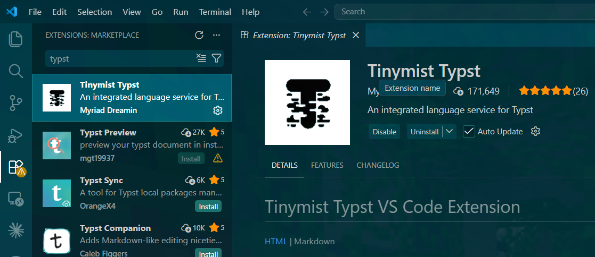
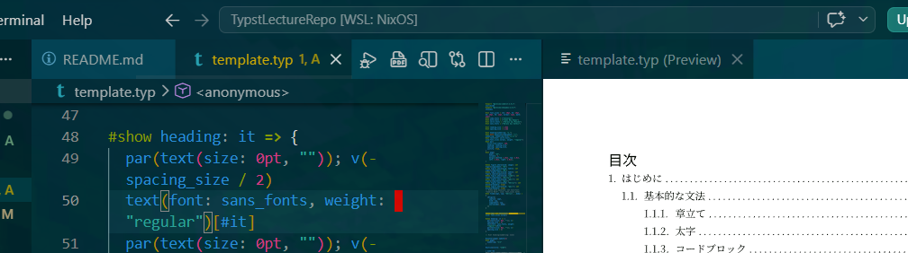
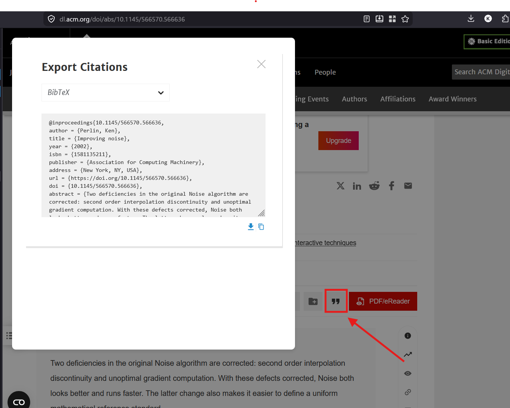
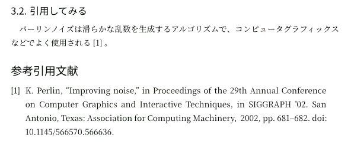
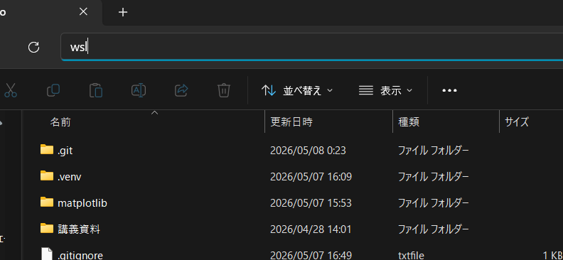
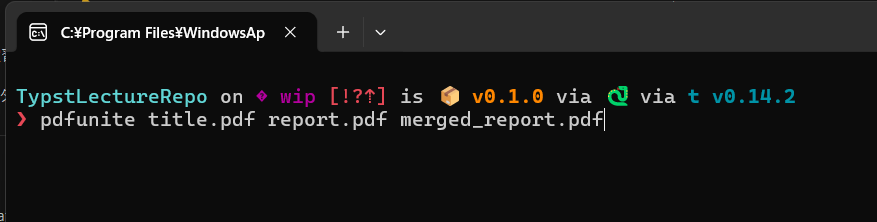
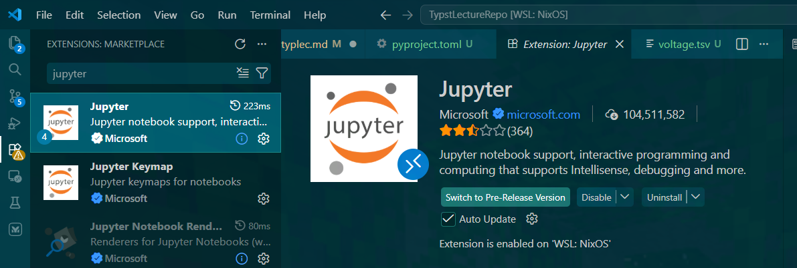
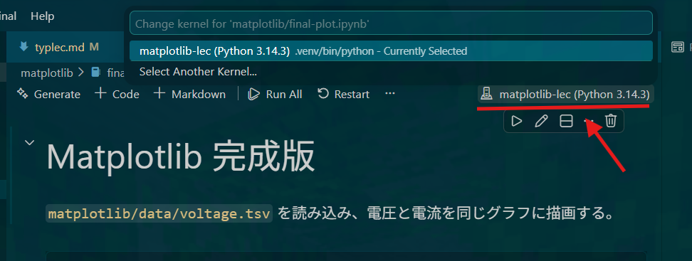
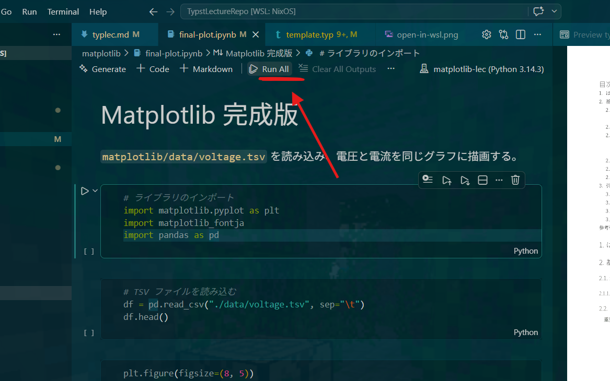

<!-- 
TODO:
たぶんテンプレートのフォントとか私の環境に依存している部分があるので、そこは修正する必要があるかも
  - ある程度どの環境でも対応できるように候補を複数用意しておくとか

- 表紙結合の説明をするための素材準備
  - 表紙のPDFとレポートのPDFを用意しておく
 -->

# はじめに
対象者(論理和)
- レポートを書くのにWordを使っている
- Latexを用いているがTypstに興味がある
- レポートの書き方がわからない

# やること(今回のゴール)
- Typstの概要を知る
- Typstの環境を整える
- Typstでレポートの本文をかけるようになる
- 図や表を挿入できるようになる
- 引用とラベルの使い方を知る
- 表紙をつける方法を知る
# Typstとは
- いわゆる組版エンジン
- 組版エンジン：書籍や雑誌のレイアウトを文字、画像、表含めて構築するソフトウェア。Word,Canva,Adobe inDesign, Texとか 
# なぜTypstを用いるのか
- Wordは構造を意識して書くのが難しい
    - 章を書くときにただ文字サイズを変えて太字にしてない？
    - 図,表に番号をそのまま書いてない？途中で図を挿入し直したときに番号を振り直してない？
- Tex(LaTex)は環境構築に時間がかかり、コンパイルが遅い
    - Tex Liveで一通りインストールするのに数時間かかる(OverleafとかCloudLaTexあるけど…)
    - コンパイルエラーが非常にわかりにくい

## 余談(読まなくていいです)
基本的にTypstとかTexは決められたレイアウト通りに書く用途に向いています。
逆に自由に配置する用途には向かないです。
でもレポートに自由度なんて基本的に必要ないのでこういったツールが便利という話になります。

> <前略>「パワポ不況 - 麻布論壇」という意見もありますから, 道具が押し付けてくる「流儀」に合わせなきゃなんない理由もありません. でも, 書きたいところに自由にものを配置することは, LaTeX をやったときに説明したと思うけど (覚えてないだろうなー), 実際にはとっても手間がかかる作業です. ワープロや LaTeX なんかは, そういう手間を減らして仕事の能率を上げようっていう道具ですよね (OA - オフィスオートメーションって言うくらいだし). そういうものに乗っからずに自分の思うとおりのことを自由に表現したいってのが <後略>

https://marina.sys.wakayama-u.ac.jp/~tokoi/?date=20091231

# そもそもレポートの構造とは
1年生はレポートの書き方の手引き(〜レポートの書き方:プログラミング I 演習を例にして〜)がなされると思いますが、一応ざっくりとここでもおさらいだけしましょう

- はじめに： レポートの目的。例えば「このレポートでは、〇〇の実験を行い、△△の結果が得られたことを示すことを目的とする」といった感じで書くのが一般的
- 実験1
  - 概要：どのようなプログラムを書き検証したのか
  - 設計：アルゴリズムの説明など
  - 結果：プログラムの実行結果。入出力の例などもここに書くと良い
  - 考察：実験結果からわかること、わからないこと
- 実験2
  - 同上
- おわりに：レポートのまとめ。~~はじめにの焼きまし~~
- 参考引用文献：引用した文献を記載する。TypstではBibTeX形式のファイルを用意して、そこに引用情報を記述する方法が一般的

まぁ、この構成はあくまで一例であって、実験の内容や目的によってはもっと柔軟に構成しても良いと思います。

でも大事なのは構成をきれいにまとめてあげないと認知負荷が高くなってしまい、レポートを読む人が内容を理解しづらくなってしまうことです。

Wordで章を書くときに、ただ文字サイズを変えて太字にしているだけだと、構造がわかりづらくなってしまうし、図や表に番号をそのまま書いていると、途中で図を挿入し直したときに番号を振り直す必要が出てきてしまいます。

Typstを用いると、構造を意識して書くことができるようになり、図や表の番号も自動的に振られるようになるので、レポートを書く上での認知負荷を減らすことができます。


# 環境を構築しよう
## VSCodeを入れる
次のURLかインストーラをダウンロード。
Windows環境ならUser Installer x86を入れとけば大体大丈夫。

https://code.visualstudio.com/Download#

インストーラを起動したらインストールウィザードの案内どおりに入れる。「VSCodeで開く」を追加するオプションは入れておいたほうが良い。

## VSCodeにTinymist Typst拡張をいれる
[左側のバー]-> [拡張機能] -> [検索バー]

typstと検索して`Tinymist Typst`拡張機能をインストールする



## Gitをインストール
WindowsならWin+Rで「powershell」と打ち込みPowerShellを起動して
```
 winget install --id Git.Git -e --source winget 
```

Macならターミナルから
```
brew install git
```

Linux(Debian/Ubuntu)ならターミナルから
```
sudo apt-get install git-all
```

NixOSなら一時的に使う分には
```
nix-shell -p git
```

## テンプレートをクローンする
```
git clone https://github.com/tuatmcc/TypstLectureRepo
```
## コンパイルしてみる

タブバーあたりにPreview, PDFのアイコンがある。
Previewをクリックすると右側にプレビューが表示される。
PDFをクリックすると同階層にPDFが生成される。



# 基本的な文法
ここではレポートを書く上で最低限必要な文法を見ていきます。
ここから実際に自分自身で実際に`template.typ`へ記述してみましょう！

`template.typ`に実際に記述してみて、どのように表示されるかを実際に確認していきましょう！
## 章立て
「=」で章立できる。
深さは「=」の数で表される。
```
= header 1
== header 2
=== header 3
...
```

## 太字
```
太字にしたい文字を*このように*囲む
```

## 数式
インライン数式は`$`で囲む。

例えば次のように書くと、インライン数式が表示される。
```
この数式は $E=mc^2$ として表される。
```

ディスプレイ数式は`$$`で囲む。
```
$$
sum_(i=1)^n i = (n(n + 1)) / 2
$$
``` 

入力の仕方がわからない記号などは公式の[Named general symbols.](https://typst.app/docs/reference/symbols/sym/) を参照してみてください。

## コードブロック
````
#figure(
  caption: "コードブロックの例",
  supplement: "コード",
  kind: "コード",
  sourcecode()[
```c
#include <stdio.h>
int main() {
    printf("Hello, World!");
    return 0;
}
```
]
)
````

## 図
```
#figure(
  caption: "Typstのロゴ",
  supplement: "図",
  kind: "image",
  image("dummy.png")
)
```

## 表
```
#figure(
  caption: "表の例",
  supplement: "表",
  kind: "table",
  table(
    columns: 3,
    stroke: none,
    table.hline(),
    table.header([列1], [列2], [列3]),
    table.hline(),
    [1,1], [1,2], [1,3],
    [2,1], [2,2], [2,3],
    table.hline()
  )
)
```
# 引用とラベルのすゝめ
先ほどコードブロックや図、表を挿入する方法を学習しました。これらの要素を文章中で参照する。つまり

> 「図1のように…」「表2のように…」「コードブロック3のように…」

といったことをスマートに行う方法です。
## 図と表にラベルを追加する
先ほど作成した図や表にラベルを追加してみましょう。
`#figure`の後ろに`<fig:example>`のようにラベルを追加することができます。
図であれば`<fig:example>`、表であれば`<tab:example>`、コードブロックであれば`<code:example>`のようにすると区別がついで便利です。
```
#figure(
  caption: "Typstのロゴ",
  supplement: "図",
  kind: "image",
  image("dummy.png")
)<fig:example>
```
## 引用してみる

文章中で先ほど追加したラベルを引用してみましょう。
例えば`<fig:example>`というラベルを追加した図を引用する場合は次のようにします。
```
詳しくは @fig:example を参照。 
```
このようにすることで、図1のように…といった感じで自動的に番号が振られて参照されます。
この方法の利点は、途中で図を追加したり削除したりしても、番号が自動的に振り直されることです。

## 文献の引用

この引用の方法は`#figure`だけでなく、文献の引用にも使うことができます。

基本的にTypstで文献を引用する場合は、BibTeX形式のファイルを用意します。
yaml形式で書く方法も紹介されていますが、なぜか日付がうまく表示されなかったりするので、BibTex形式をおすすめします。

ワークスペースのルートに`ref.bib`というファイルを作成して引用文献の情報を記述していきます。
これは自分で書いても良いのですが、Google Scholarなりで論文だったりを見るとBibTeX形式で引用情報を出力する機能があるので、そちらを利用するのが楽です。

ここでは例としてパーリンノイズの論文 [Improving noise](https://dl.acm.org/doi/abs/10.1145/566570.566636)を引用してみましょう。

URLからExport Citationをクリックして、BibTeXを選択します。
(この辺はサイトによって違うかもしれませんが、基本的にはBibTeX形式で引用情報を出力する機能があるはずです。)


すると次のようなBibTeX形式の引用情報が得られます。
```
@inproceedings{10.1145/566570.566636,
author = {Perlin, Ken},
title = {Improving noise},
year = {2002},
isbn = {1581135211},
publisher = {Association for Computing Machinery},
address = {New York, NY, USA},
url = {https://doi.org/10.1145/566570.566636},
doi = {10.1145/566570.566636},
abstract = {Two deficiencies in the original Noise algorithm are corrected: second order interpolation discontinuity and unoptimal gradient computation. With these defects corrected, Noise both looks better and runs faster. The latter change also makes it easier to define a uniform mathematical reference standard.},
booktitle = {Proceedings of the 29th Annual Conference on Computer Graphics and Interactive Techniques},
pages = {681–682},
numpages = {2},
keywords = {procedural texture},
location = {San Antonio, Texas},
series = {SIGGRAPH '02}
}
```
この情報を`ref.bib`に記述します。
複数の文献を引用する場合は、追記していけば大丈夫です。

引用したい文献にBibTexの引用情報がない場合は、著者、タイトル、出版年、出版社などの情報をもとにLLMにBibTex形式で引用情報を生成してもらうのも良いかもしれません(ただし、LLMが生成した引用情報は正確でない可能性があるので、必ず内容を確認するようにしてください)。

今回のケースでは引用キーが`10.1145/566570.566636`になっていますが、これでもどうにかなるといえばなりますが、`@`での引用ができなくなるので、引用キーを`perlinnoise`というようにわかりやすいものに変更しておくと便利です。


次のこの文献を引用していきましょう。typstファイルの末尾に次のように記述します。
```
#bibliography(title: "参考引用文献", "ref.bib", full: true)
```
これで参考引用文献のセクションができて、先ほど`ref.bib`に記述した文献が表示されるようになります。

レポート中でこの文献を引用する場合は、次のようにします。
```
詳しくは @perlinnoise を参照。
```

最終的には次のような感じで表示されるようになります。


## 表紙をつける
Typstでは表紙を簡単に作成することができる——のですが、
プログラミング演習のレポートでは表紙の形式がWordで配布されています。
この形式に合わせてTypstで表紙を作成するのは結構大変なので、今回は表紙はWordで作成してもらって、これをPDFに変換してから結合する方法を紹介します。

PDFの結合には色々な方法がありますが、今回は`pdfunite`というコマンドを用いて結合してみましょう。
`pdfunite`はLinuxやWSL環境であれば次のコマンドでインストールできます。

Windows環境で作業している場合、今作業しているフォルダをエクスプローラで開いて、アドレスバーに`wsl`と入力してみてください。
WSL環境のターミナルが、現在のフォルダで開かれます。




```sh
sudo apt-get install poppler-utils
```

これで`pdfunite`コマンドが使えるようになります。
次のコマンドで表紙とレポートを結合してみましょう
```sh
pdfunite title.pdf report.pdf merged_report.pdf
```

↑私の環境は多少カスタマイズされているので、見た目は違ってよいです。

macOSをお使いの方はどうやらFinder上で簡単に結合できるそうです。
windowsをお使いの方でWSL環境を使いたくない方は、CubePDFというソフトを用いるなりすると良いかもしれません。

# APPENDIX

ここから先は蛇足的なな内容になります。Typstを用いてレポートを書く上で必須な内容ではないので、興味がある人だけ読んでみてください。(と言いつつMatplotlib, Git/GitHubの内容は頭に入れておいたほうが良いかも)
## Matplotlibでグラフを作成する
レポートを作成する上で、グラフを作成する必要がある場合も多いと思います。
Excelを用いても良いのですが、あまり綺麗なグラフができなかったり、細かい調整が難しかったりします。
PythonのMatplotlibを用いると、綺麗なグラフを作成することができます。

### Astral UVのインストール
Pythonのパッケージマネージャであるuvを用いてmatplotlibをインストールします。
今回は今レポートを書いている環境にインストールして行きますが、プログラミング演習などWSL環境でプログラムを書いている人はそちらでインストールしたほうが良いかも？
Windows環境
```
powershell -ExecutionPolicy ByPass -c "irm https://astral.sh/uv/install.ps1 | iex"
```

macOS/Linux(WSL)環境
```
curl -LsSf https://astral.sh/uv/install.sh | sh
```

### VSCodeにJupyter拡張機能を入れる
VSCodeの拡張機能からJupyterを検索してインストールします。


### Matplotlibをインストールする

自分で環境構築する場合は
```sh
#あくまで参考
uv init
uv add matplotlib
uv add ipykernel
uv add matplotlib-fontja
``` 
のようにして環境を構築します。
今回はすでに`pyproject.toml`が用意されているので、次のコマンドで環境に入ることができます。
```sh
uv sync
```

これで環境の構築が完了しました。
`matplotlib/final-plot.ipynb`を開き、コードを実行してみましょう。
まず、カーネルを選択します。`Python Environment`のところをクリックして、`matplotlib-lec`を選択してください。




## Git/GitHubでレポートを管理する
レポートの管理にGit/GitHubを用いると、バージョン管理ができたり、複数人での共同編集がしやすくなったりします。

参考までに、次のようにレポートの構成を管理すると便利かも。
基本的にレポートは実験をしているフォルダに簡単にアクセスできるようにしておくとあとが楽かも

```sh
git init
git add .
git commit -m "どのような変更を加えたのかの説明/適当なコメント"
git push
```
この辺のコマンドが使えれば大体のことはできると思います。
~~わからなかったらLLMに聞いてみよう~~


```
TUAT/
├── ex2a
│   ├── 01
│   │   ├── source: 作成したコード
│   │   ├── materials: 配布された資料
│   │   ├── report
│   │   │   ├── report.typ: レポートのTypstファイル
│   │   │   ├── imgs: レポートに使用する画像
│   │   │   │   ├── fig_max_open_list_size.png
│   │   │   │   └── fig_next_calls.png
│   │   │   └── ref.bib
│   │   └── results: コードの実行結果
│   │       ├── inputs: 入力データ
│   │       ├── outputs: 出力データ
│   │       └── summary: 要約
│   ├── pyproject.toml
└── ex1a
    └── ...
```

筆者は最近はこのような構成でレポートを管理しています。
この辺は好みもあると思うので、自分に合った管理方法を見つけてみてください。
## NixOS/NixOS-WSLでレポート環境を構築する
基本的にプログラムを書くのはWSL環境なのでレポートもWSL環境で書くのが楽なのですが(macOSは知りません)、フォントをインストールしたりするのが面倒だったりします。

経験上WSL環境というのは比較的簡単に破壊されるので、そのへん楽にしていきたいということで、

宣言的に環境を構築できるNixOS/NixOS-WSLでレポート環境を構築する方法も紹介します。
これは筆者も使っているオススメの方法です。

でもここで懇切丁寧に説明するには余白が足りないのでとりあえず私のdotfilesのリンクだけ貼っておきます。

気になる方はこれをAIに説明させるなり、部室なりにきて質問するなりしてみてください。

https://github.com/ru322/dotfiles

## コーディングエージェントでレポートを…
大人の事情により割愛