難易度: ★☆☆☆☆ 入門レベル

# 1. はじめに

* この記事は Unity 講習会 2025 の資料です.
* Unity やってみたいけど何をすればいいのかわからない人を0を1にするための講習会です.
* 2024年度版とほぼほぼ一緒です. Unity6用に書き換えちょっと修正した感じです.
* できる限りコピペではなく写経することをおすすめします.

## 1.1. 前提条件, 注意事項

* Unity Hub と Unity と任意の IDE (Visual studio, Rider など) をインストール済みであることを前提です.
* 本資料では Unity 6.0(6000.0.51f1) を使用します.
* Mac の人は Visual Studio は使えないことに注意してください.
* 任意のIDEが無い方は[こちら](https://tuatmcc.com/blog/UnityLec2024Step0/)の記事を読んでください.
* プログラミングは, A科の1年生が6月ぐらいまでの授業で習ったことを前提に解説が書いてあります.
* この記事では, WindowsでコードエディタにRiderを使う前提に書いています. Mac, Linuxの人, Visual Studioの人は適宜読み替えてください.

## 1.2. やる内容と学ぶ内容

玉転がしゲームを作りながら, Unityでゲームを作るための基本的な操作を学びます. ゲームを作るための思想や設計方法については触れません.

# 2. Unityのプロジェクトを作る

ここでは, Unityのプロジェクトを作成します.

## 2.1. Unity Hub

Unity Hubを起動します. Unity HubはUnityのプロジェクトを管理するためのツールです. Unity Hubを起動すると, プロジェクトの一覧が表示されます. 以下の写真では, 何もプロジェクトがない状態です.


左にある `Install` を開くとパソコンにインストール済みのUnity Editor本体の一覧を見ることができます.


Unity のプロジェクトを作ります. 左の `Projects` をクリックして, プロジェクト一覧に戻ってください. そして, 右上の `New Project` ボタンをクリックします.


プロジェクトの初期化画面が表示されます. 以下のように設定してください.

* 真ん中の項目はテンプレートです. `Universal 3D` を選択してください. デフォルトになっているはずです.
* 右側の `Project name` はプロジェクト名をきめる場所です. プロジェクト名は `RollingBall` としてください.
* `Location` はプロジェクトの保存場所です. デフォルトのままで大丈夫です. お好みで変更しても構いません.
* `Connect to Unity` はチェックを外してください.

設定が終わったら, 右下の `Create Project` ボタンをクリックしてください.


しばらくすると, Unityのエディタが起動します. これでプロジェクトの作成は完了です. 以下の様な画面が表示されるはずです.


## 2.2. Unity Editor のタブとレイアウト

デフォルトのレイアウトでは, 以下のタブが見えています.

|タブの名前|説明|
|---|---|
|Scene|シーンを編集する (神視点)|
|Game|レンダリングされたゲーム画面|
|Hierarchy|シーンに配置されたオブジェクトのリスト|
|Project|プロジェクトのファイル一覧 (Explorer や Finder のようなもの)|
|Inspector|選択したオブジェクトのプロパティ|
|Console|ログの表示|


重なってるタブの切り替えは, タブの右上のタブの名前の部分をクリックすることで切り替えることができます.

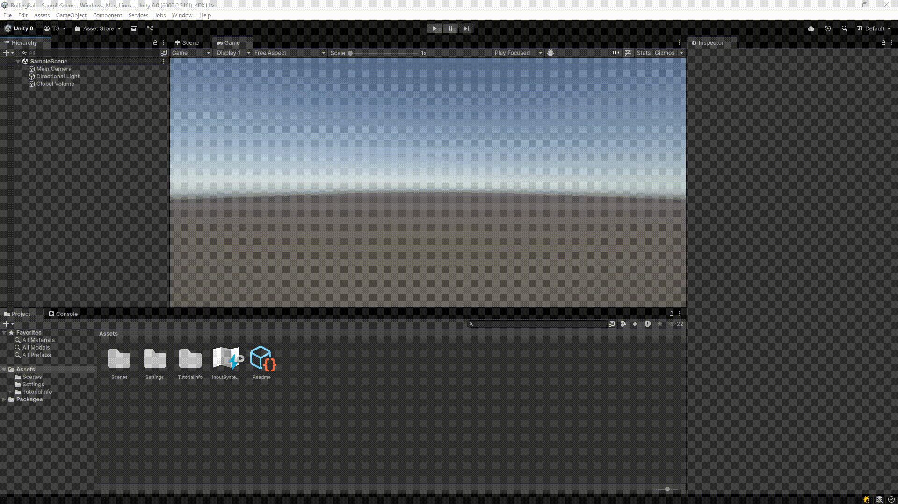

それぞれのタブの詳しい説明は, 実際にゲームを作りながら説明していきます.

# 3. オブジェクトを配置する

ここでは, シーンにオブジェクトを配置します. 現在, `SampleScene` という名前のシーンが開いています. `Hierarchy` タブに `SampleScene` と書かれた項目があるはずです. これが現在開いているシーンです. シーンとは, ゲームの1つの画面を表すものです. Unityでは, シーンごとにゲームの場面を管理します.

タイトルシーンや, バトルシーン, マップシーンなど, ゲームの場面ごとにシーンを分けて管理することができます.

`SampleScene` となってる名前を `MainScene` に変更しましょう. `Project` タブの `Assets` から `Scenes` フォルダを開き, `SampleScene` を右クリックして, `Rename` を選択します. そして, `MainScene` と入力してください.

<!-- 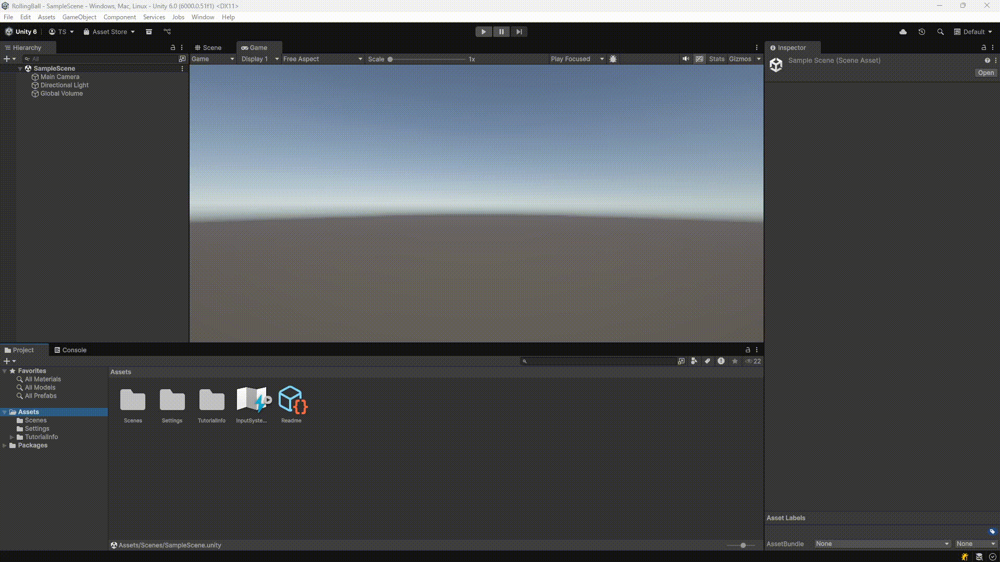 -->

これで, `Hierarchy` タブにあるシーンの名前が `MainScene` に変更されました.


## 3.1. 板を配置する

シーンに板を配置します. まず, `Hierarchy` タブ上で右クリックして, `3D Object` → `Plane` を選択します(名前は `Plane` のままでOKです). すると, シーンに板が配置されます.

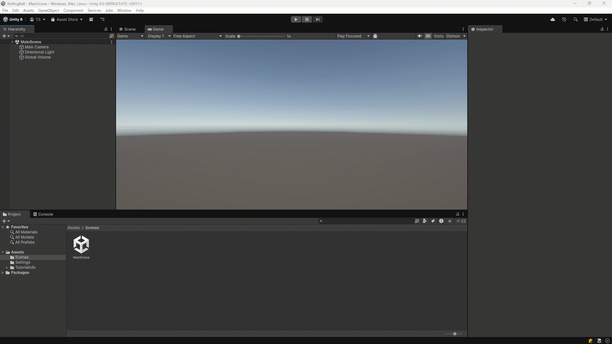

シーン名に `*` がついているのは, シーンが保存されていないことを示しています. `ctrl + S` でシーンを保存してください.

Hierarchyで `Plane` を選択すると, 右側の `Inspector` タブに `Plane` のプロパティが表示されます.

`Plane`には`Trasform`, `Mesh Filter`, `Mesh Renderer`, `Mesh Collider`の要素(Component)がついています. それぞれの役割は以下の通りです.

* `Transform`
  * 座標や傾きといった3D空間の位置情報プロパティ

* `Mesh Filter`, `Mesh Renderer`
  * レンダリングに関するプロパティ

* `Collider` (`Mesh Collider`)
  * 3Dモデルに当たり判定をつけるプロパティ

* (`Material`)
  * マテリアルを設定するプロパティ


## 3.2. ボールを作る

`Hierarchy` タブで右クリック → `3D Object` → `Sphere` を選択(名前は `Sphere` のままでOK)


このままでは地面にめり込んでいるので, `Sphere` の `Trasform` の `Position` の `Y` を `5` に変更します.


いい感じの位置になりました！


`Ctrl + S` で定期的に保存することを忘れないでください.

# 4. ボールを重力で落下させる

ここでは, ボールを重力で落下させます.

エディターの上の方にある再生ボタン ▶ を押すと, ゲームが実行されます. 押してみましょう．停止ボタン ■ を押すと, ゲームが停止します.


何も起こりません！

先ほど作成した `Sphere` には,物理演算を行う要素(コンポーネント)がついていません. そのため,ボールが重力で落下することはありません. `Sphere` に物理演算を行う要素を追加しましょう.

## 4.1. Rigidbody を追加する

`Hierarchy` タブで `Sphere` を選択し, `Inspector` タブで下の方にある `Add Component` → `Physics` → `Rigidbody` をクリック

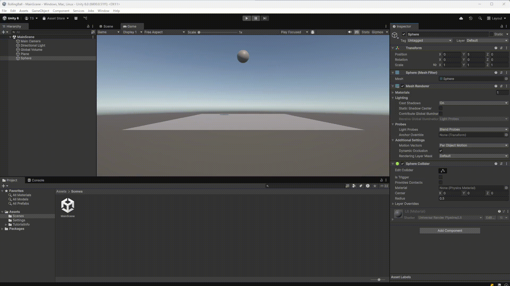

`Sphere` に `Rigidbody` が追加されました！


上の方にある再生ボタン▶を押してみてください. ボールが落下します.

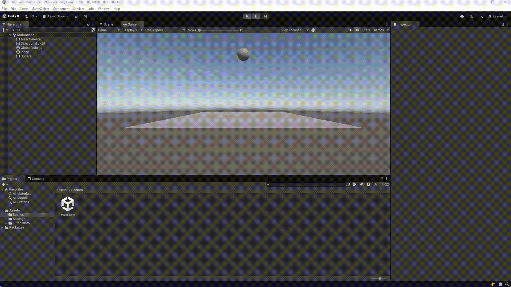

ボールが自由落下するのを確認できたら, 必ず停止ボタン ■ を押して再生を停止してください.

また, こまめに `Ctrl + S` で保存することを忘れないでください.

# 5. ボールを操作する

ここでは, ボールを操作するためのスクリプトを作成します.

## 5.1. スクリプトを作成する

`Project` タブで `Assets` フォルダー上で右クリック → `Create` → `MonoBehaviour Script` を選択してください. このとき, ファイル名を `BallController` にしてください.

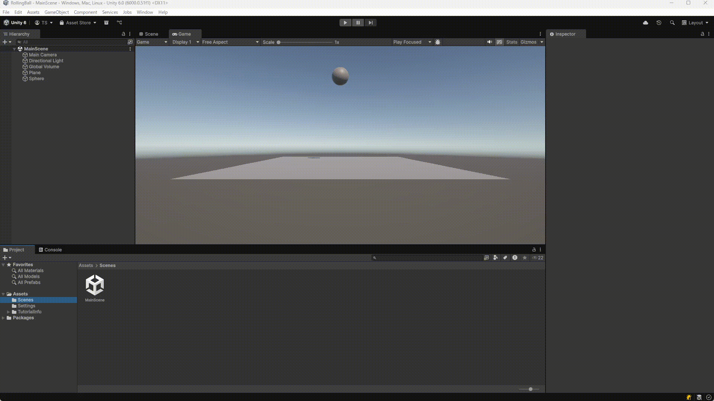

作成時に名前を `BallController` にし忘れた場合は `BallController` を右クリックして `Rename` を選べばファイル名を変更できます. 違う名前でスクリプトを作成してしまった場合は、ファイル名だけでなく、クラス名も修正する必要があります。


`BallController`　をダブルクリックして開くと, Rider が起動します. (※このとき, visual studio が起動しても OK です. Visual Studio Code が開いた場合はなにか設定が間違っている可能性があります. )


`BallController.cs` が開かれていることを確認してください. `.cs` は C# の拡張子です. (C言語だと `.c`, C++だと `.cpp`, pythonだと`.py`)

## 5.2. スクリプトを書き換える

以下のようにスクリプトを書き換えてください. プログラムの説明は後で行います.

```diff lang="csharp" title="BallController.cs" showLineNumbers
using UnityEngine;

public class BallController : MonoBehaviour
{
+   private Rigidbody _rb;

    // Start is called before the first frame update
    void Start()
    {
        _rb = GetComponent<Rigidbody>();
    }

    // Update is called once per frame
    void Update()
    {
+       if(Input.GetKey(KeyCode.W))
+       {
+           _rb.AddForce(new Vector3(0, 0, 1));
+       }
+       if(Input.GetKey(KeyCode.S))
+       {
+           _rb.AddForce(new Vector3(0, 0, -1));
+       }
+       if(Input.GetKey(KeyCode.A))
+       {
+           _rb.AddForce(new Vector3(-1, 0, 0));
+       }
+       if(Input.GetKey(KeyCode.D))
+       {
+           _rb.AddForce(new Vector3(1, 0, 0));
+       }
    }
}
```

3行目の `public class BallController : MonoBehaviour` の部分で,  `class` の後が `BallController` になっていることを確認してください. 大文字小文字, 全角半角の違いにも注意してください.

<details>
 <summary>コピペ用 (初めての人はコピペせずに写経したほうがいいかも)</summary>
 
```csharp title="BallController.cs" showLineNumbers
using UnityEngine;

public class BallController : MonoBehaviour
{
    private Rigidbody _rb;

    // Start is called before the first frame update
    void Start()
    {
        _rb = GetComponent<Rigidbody>();
    }

    // Update is called once per frame
    void Update()
    {
        if(Input.GetKey(KeyCode.W))
        {
            _rb.AddForce(new Vector3(0, 0, 1));
        }
        if(Input.GetKey(KeyCode.S))
        {
            _rb.AddForce(new Vector3(0, 0, -1));
        }
        if(Input.GetKey(KeyCode.A))
        {
            _rb.AddForce(new Vector3(-1, 0, 0));
        }
        if(Input.GetKey(KeyCode.D))
        {
            _rb.AddForce(new Vector3(1, 0, 0));
        }
    }
}
```
</details>

## 5.3. スクリプトを Sphere にアタッチする

`Project` タブにある `BallController` を `Sphere` にドラッグアンドドロップしてください.

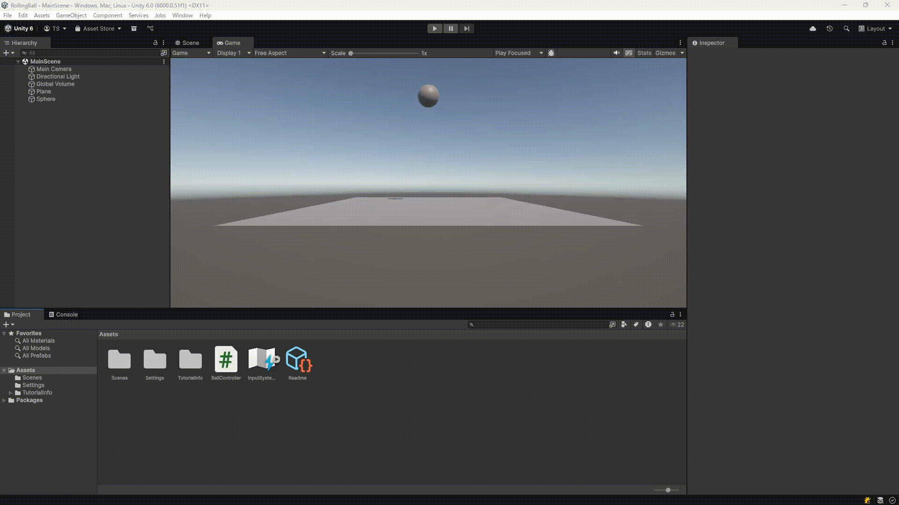

`Sphere` の Inspector に `BallController` がコンポーネントとして追加されるのがわかります. これで, スクリプトをゲームオブジェクトにアタッチできました.


Unityでは, スクリプトを書いてコンポーネント(要素)を作ります. そしてそのコンポーネントをゲームオブジェクトにアタッチすることで, ゲームオブジェクトに要素を追加します.

## 5.4. ゲームを再生してみる

再生ボタン ▶ を押してみてください. `W`, `A`, `S`, `D` キーを押すと, ボールが前後左右に動くことがわかります. (周りに壁とか無いから落ちるけど...)

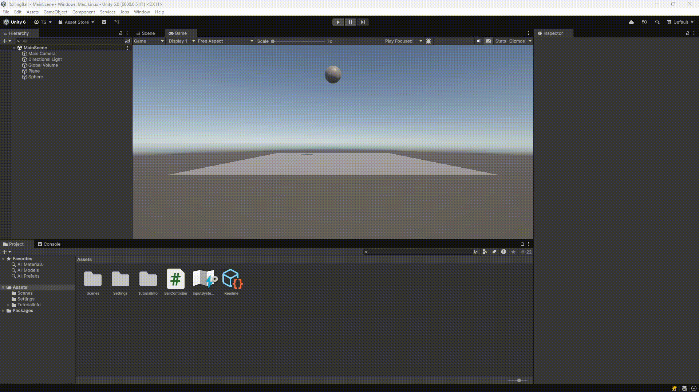

確認ができたら, 停止ボタン ■ を押して再生を停止してください. 再生を停止すると, ゲームの状態がリセットされ, ボールが元の位置に戻ります.

# 5.5. プログラムの説明

`BallController` をダブルクリックして開いてください.


1行目の `using UnityEngine;` は, Unity の機能を使うための宣言です. C言語の `#include` のようなものです. Unity の機能を使うためには, この呪文が必要です

3行目の `public class BallController : MonoBehaviour` は, `BallController` という**クラス**を定義しています. クラスはC#のオブジェクトというものの設計図です.コンポーネントはC#のオブジェクトとして存在してます.


変数 `rb` は `Rigidbody` 型の変数です. 任意のゲームオブジェクトに付いている `Rigidbody` コンポーネントを取得して代入することで, その `Rigidbody` を**参照**できます.

`Start` 関数は, 再生ボタンを押したら最初に一度だけ実行される関数です.  Unity が呼び出してくれます. ここでは, Start 関数の中で, そのスクリプトがアタッチしている `Rigidbody` コンポーネントを `GetComponent` 関数で取得しています. `GetComponent` 関数は, アタッチしているゲームオブジェクトの指定したコンポーネントを取得する関数です. ここでは, `Rigidbody` コンポーネントを指定しています.

`Update` 関数は, 再生ボタンを押したら毎フレーム実行される関数です.  Unity が呼び出してくれます. ここでは,  `Input.GetKey` 関数を使って, 引数で指定されたキーボードのキーが入力されたかをif文で判定しています.

キーが入力されたら `Rigidbody` の `AddForce` 関数を使って, 玉に力を加えています.  `Input.GetKey` 関数では, 引数で指定されたキーボードのキーが押されている間, true を返します. そうでなければ, false を返します.  `AddForce` 関数は, 引数で指定されたベクトルの力を加えます. `w` キーが押されたらZ軸方向に `+1` の力, `s` キーが押されたらZ軸方向に `-1` の力, `a` キーが押されたらX軸方向に `-1` の力, `d` キーが押されたらX軸方向に `+1` の力を加えます.  `new Vector3` で Unity のベクトル情報を生成し, `AddForce` 関数の引数に渡しています.

# 6. 得点を生成させる

ここでは, ステージ上に得点をランダムな場所に生成させます.

## 6.1. 得点となるゲームオブジェクトのPrefabを作成する

`Hierarchy` タブで右クリック → `3D Object` → `Cube` を選択

オブジェクト名は `Score` に変更してください. 作成時に名前を変更し忘れた際は, ゲームオブジェクトを右クリックして `Rename` を選択するか, 選択してF2キーを押して名前を変更できます.

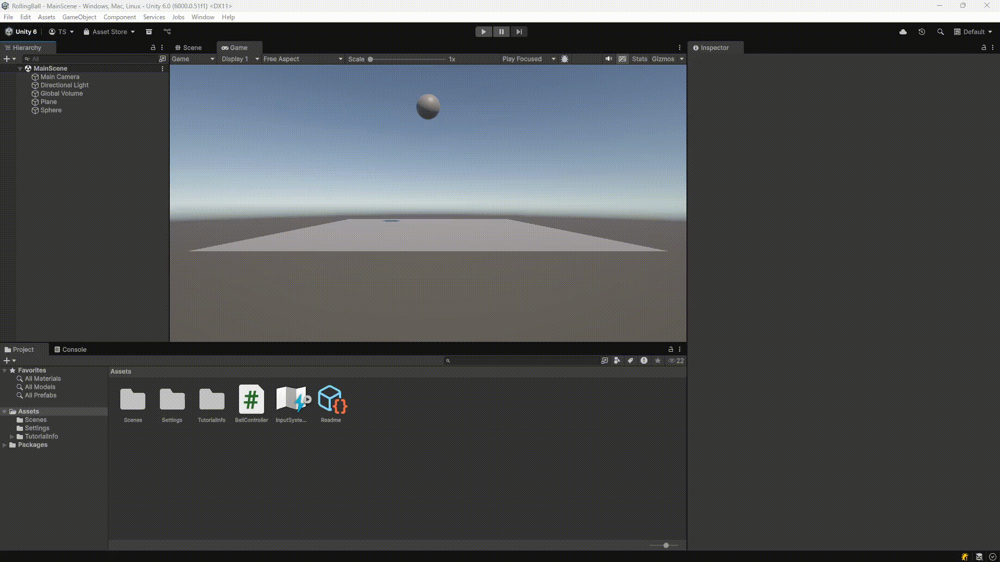

`Ctrl + S` でこまめに保存することを忘れないでください.

`Score` を `Project` タブにドラッグアンドドロップしてください. Prefab として保存されます. `Project` タブの `Assets` フォルダに `Score` という, 水色の四角いアイコンのファイルが作成されます.

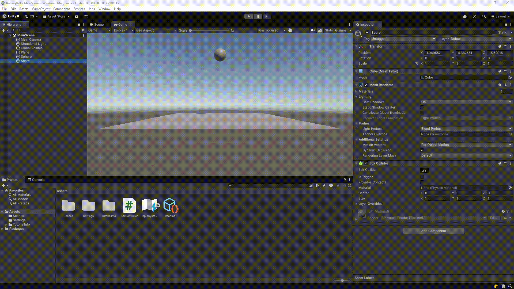

Prefab とは, ゲームオブジェクトの**設計図**のようなものです. ゲームオブジェクトそのものではありません(C#のクラスみたいですね！). 今回はこの `Score` の Prefab を元に, スコアのゲームオブジェクトを生成します.

`Score` の Prefab が作成できたら,  Hierarchy にある `Score` を削除してください. 削除は, ゲームオブジェクトを選択して右クリックして `Delete` を選択するか, Delete キーを押して削除できます.

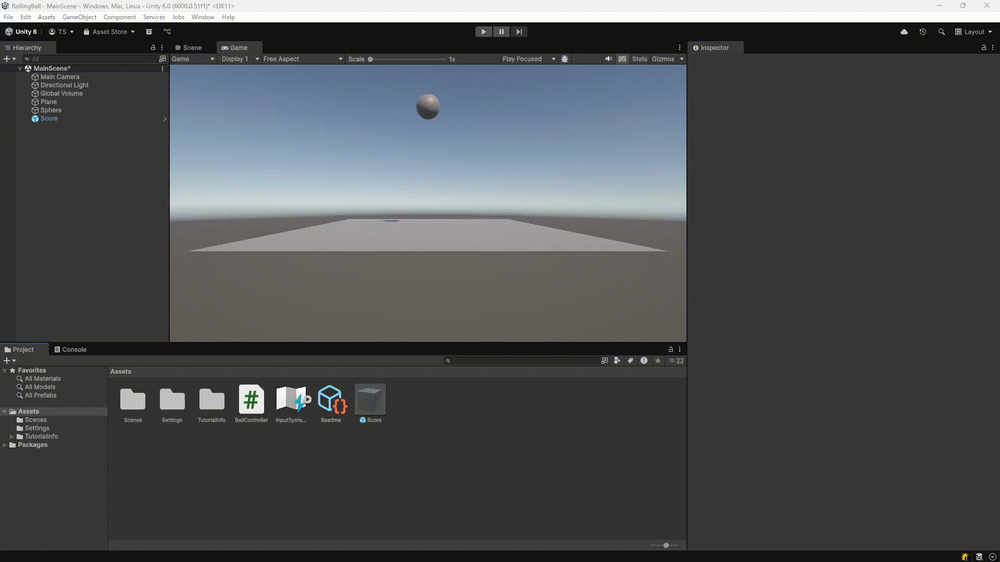

## 6.2. ScoreManager を作成する

得点のオブジェクトを生成するスクリプトを作成します.

`Project`タブで `Assets` フォルダー上で右クリック → `Create` → `MonoBehaviour Script` を選択してください.

スクリプトの名前を `ScoreManager` にしてください.


`ScoreManager` をダブルクリックして開いてください.

以下のようにスクリプトを書き換えてください. プログラムの説明は後で行います.

```diff lang="csharp" title="ScoreManager.cs" showLineNumbers
using UnityEngine;

public class ScoreManager : MonoBehaviour
{
+   [SerializeField] private GameObject scoreObject;
+   [SerializeField] private int scoreAmount = 10;

    // Start is called before the first frame update
    void Start()
    {
+       for (int i = 0; i < scoreAmount; i++)
+       {
+           float x = Random.Range(-10.0f, 10.0f);
+           float z = Random.Range(-10.0f, 10.0f);
+
+           Instantiate(scoreObject, new Vector3(x, 0.5f, z), Quaternion.identity);
+       }
    }

    // Update is called once per frame
    void Update()
    {
        
    }
}
```

<details>
 <summary>コピペ用</summary>

```csharp title="ScoreManager.cs" showLineNumbers
using UnityEngine;

public class ScoreManager : MonoBehaviour
{
    [SerializeField] private GameObject scoreObject;
    [SerializeField] private int scoreAmount = 10;

    // Start is called before the first frame update
    void Start()
    {
        for (int i = 0; i < scoreAmount; i++)
        {
            float x = Random.Range(-10.0f, 10.0f);
            float z = Random.Range(-10.0f, 10.0f);
 
            Instantiate(scoreObject, new Vector3(x, 0.5f, z), Quaternion.identity);
       }
    }

    // Update is called once per frame
    void Update()
    {
        
    }
}
```
</details>

スコアを管理するゲームオブジェクトを作成します.

`Hierarchy` タブで右クリック → `Create Empty` を選択

ゲームオブジェクト名を `ScoreManager` にしてください.


EmptyObject は, コンポーネントが何もついていないゲームオブジェクトです(座標の概念はあります). Inspector を開くと, 何も表示されていないことがわかります.


このゲームオブジェクトに `ScoreManager` をアタッチします. `ScoreManager` スクリプトを `Project` タブから `ScoreManager` ゲームオブジェクトにドラッグアンドドロップしてください.

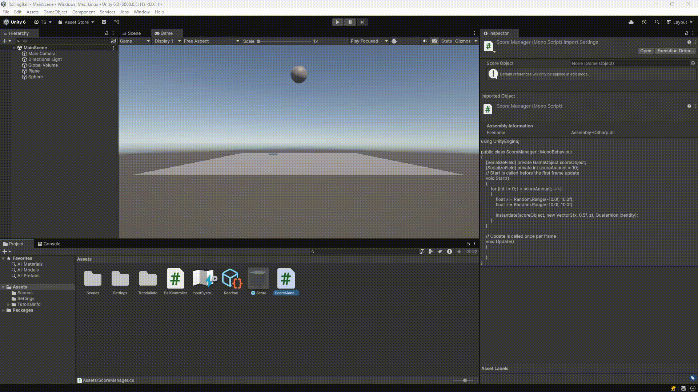

Inspector に `ScoreManager` がコンポーネントとして追加されていることがわかります.

次に, `ScoreManager` ゲームオブジェクトの Inspector にある `ScoreManager` コンポーネントの `Score Object` の欄に `Score` Prefab をドラッグアンドドロップしてください.

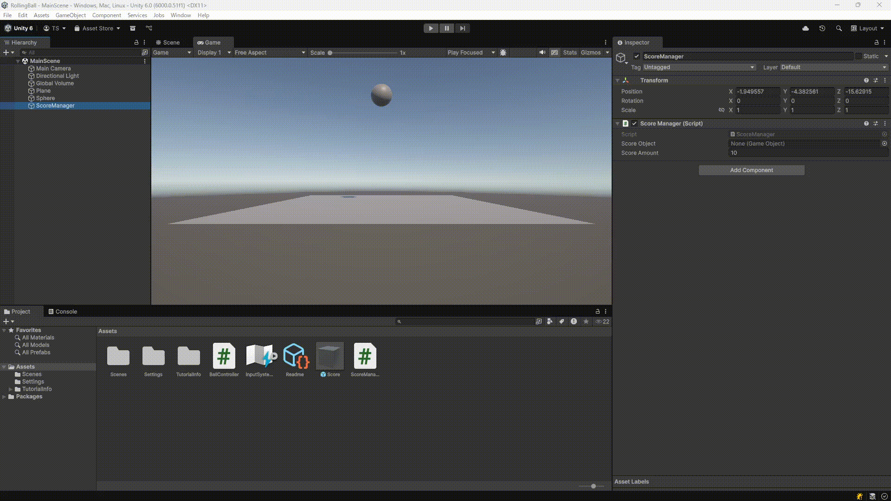

再生ボタン ▶ を押してみてください. ステージ上にランダムな位置に `Score` が生成されることがわかります. 停止ボタン ■ を押して再び再生をすると, さっきと違う位置に `Score` が生成されます.


確認ができたら, 停止ボタン■を押して再生を停止してください. また, こまめに `Ctrl + S` で保存することを忘れないでください.

## 6.3. プログラムの説明

`ScoreManager` をダブルクリックして開いてください.


変数 `scoreObject` は `GameObject` 型の変数です. 今回は `Score` の Prefab を代入することで, その Prefab を**参照**しています.

変数 `scoreAmount` は `int` 型の変数です. `Score` の Prefab を元に, Score オブジェクトを生成する回数を指定しています.

この2つの変数は, `[SerializeField]` という**属性**というものをつけています. これを変数につけることで, Unity Editor の Inspector から変数を代入できるようにしています. こうすれば, 必要なパラメーターを Inspector から設定できるので, スクリプトを変更する必要がなくなります.  `BallController` の `_rb` には `[SerializeField]` をつけていないので, `Sphere` の Inspector を見ても `BallController` コンポーネントに `_rb` が表示されていないのがわかります.


`Random.Range` 関数は, 引数で指定された範囲のランダムな値を返します. ここでは, `-10` から `10` の範囲のランダムな少数値を `x` と `z` に代入しています.

`Instantiate` 関数は, 第1引数で指定されたゲームオブジェクトを元に, 第2引数指定された位置に, 第3引数で指定した角度でゲームオブジェクトを生成します. ここでは, `scoreObject` を `new Vector3(x, 0.5f, z)` の位置に生成しています. 角度は `Quaternion.identity` で指定しています. `Quaternion.identity` は, 回転がないことを表します(元のPrefabと同じ傾きって意味).

Prefab はゲームオブジェクトの設計図なので, Prefabで設定したパラメータは, 生成されたゲームオブジェクトにも適用されます. `Project` タブで `Score` Prefab をクリックし, `Inspector` タブで `Scale` を `(0.3, 0.3, 0.3)` に変更して見ましょう.

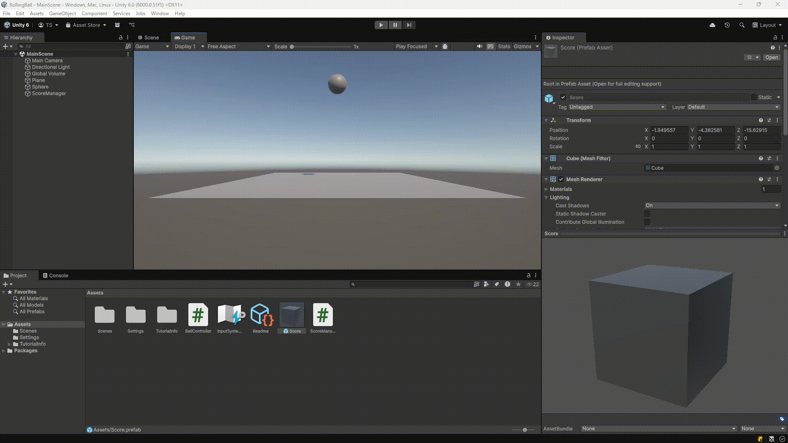

これで再生すれば,生成された `Score` の大きさが小さくなっていることがわかります.


## 6.4. カメラをボールに追従させる

ここでは, カメラをボールに追従させます.

`Project` タブで `Assets` フォルダー上で右クリック → `Create` → `MonoBehaviour Script`を選択して `CameraController` という名前のスクリプトを作成して, 以下のように書き換えてください.

```diff lang="" title="CameraController.cs" showLineNumbers
using UnityEngine;

public class CameraController : MonoBehaviour
{
    // Start is called before the first frame update

+   [SerializeField] private Transform playerObject;
+   [SerializeField] private Vector3 offset;

    void Start()
    {
        
    }

    // Update is called once per frame
    void Update()
    {
+       transform.position = playerObject.position + offset;
    }
}
```

<details>
 <summary>コピペ用</summary>
 
```csharp title="CameraController.cs" showLineNumbers
using UnityEngine;

public class CameraController : MonoBehaviour
{
    // Start is called before the first frame update

    [SerializeField] private Transform playerObject;
    [SerializeField] private Vector3 offset;

    void Start()
    {
        
    }

    // Update is called once per frame
    void Update()
    {
        transform.position = playerObject.position + offset;
    }
}
```
</details>

`CameraController` をドラッグアンドドロップで `Main Camera` にアタッチしてください.

そして, `Main Camera` の Inspector にある `CameraController` コンポーネントの `Player Object` に `Hierarchy` タブの `Sphere` をドラッグアンドドロップしてください. そして `Main Camera` の Inspector にある `CameraController` コンポーネントの `Offset` を `(0, 5, -10)` に変更してください. また,  `Main Camera` の `Transform` コンポーネントの `Position` を `(0, 10, -10)`, `Rotation` を `(30, 0, 0)` に変更してください.

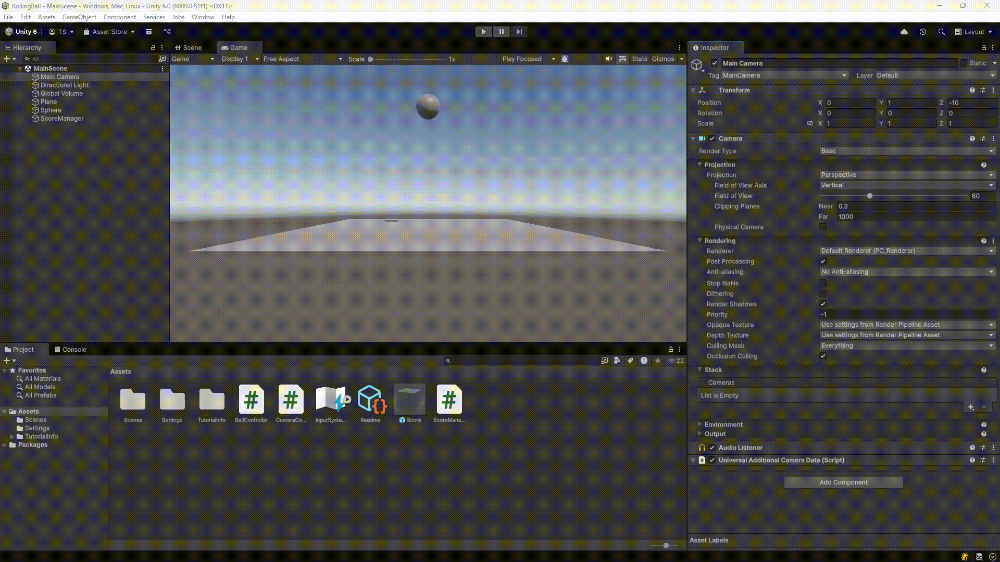

再生ボタン ▶ を押してみてください. `WASD` でボールを操作すると,カメラが追従してきます.

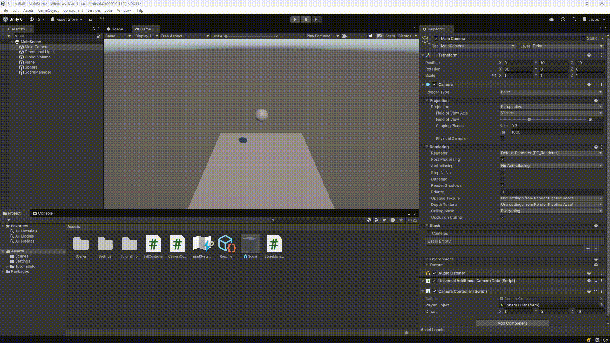

## 6.5. スクリプトの説明

`CameraController` をダブルクリックして開いてください.

変数 `playerObject` は `Transform` 型の変数です. `Sphere` の `Transform` コンポーネントを代入することで, `Sphere` の `Transform` を**参照**できます.

変数 `offset` は `Vector3` 型の変数です. カメラの位置を調整するための変数です. `playerObject` の座標に `offset` を加えた座標にカメラを移動させます.

`transform.position` は, そのスクリプトをアタッチしたゲームオブジェクトの座標を表します. `transform` という `Transform` 型の変数の中に `position` という `Vector3` 型の変数が入っています(C言語の構造体みたいですね！). `CameraController` は `Main Camera` ゲームオブジェクトにアタッチしてるので, `playerObject` (`Sphere`) の座標 (`playerObject.position`) に `offset` を加えた座標にカメラを移動させています. `Transform` コンポーネントは, `GetComponent` 関数を使わなくても**参照**することができます. `playerObject.position` と `offset` は `+` 演算子で加算できます. `Vector3` 型の変数同士は, `+` 演算子が, 各要素の加算をするように定義されています. なので,`new Vector3(playerObject.position.x + offset.x, playerObject.position.y + offset.y, playerObject.position.z + offset.z)` のように書く必要はありません (便利ですね！) .

# 7. 得点を回収する

ここでは, ボールが得点に触れたら得点を回収する処理を追加します.

## 7.1. `BallController` が得点を回収するできるようにする

`BallController` を以下のように書き換えてください.

```diff lang="csharp" title="BallController.cs" showLineNumbers
using UnityEngine;

public class BallController : MonoBehaviour
{
    private Rigidbody _rb;
+   private int _score = 0;

    // Start is called before the first frame update
    void Start()
    {
        _rb = GetComponent<Rigidbody>();
    }

    // Update is called once per frame
    void Update()
    {
        if(Input.GetKey(KeyCode.W))
        {
            _rb.AddForce(new Vector3(0, 0, 1));
        }

        if(Input.GetKey(KeyCode.S))
        {
            _rb.AddForce(new Vector3(0, 0, -1));
        }

        if(Input.GetKey(KeyCode.A))
        {
            _rb.AddForce(new Vector3(-1, 0, 0));
        }

        if(Input.GetKey(KeyCode.D))
        {
            _rb.AddForce(new Vector3(1, 0, 0));
        }
    }

+   private void OnCollisionEnter(Collision collision)
+   {
+       if(collision.gameObject.name == "Score(Clone)")
+       {
+           _score++;
+           Debug.Log("Score: " + _score);
+           Destroy(collision.gameObject);
+       }
+   }
}
```

<details>
 <summary>コピペ用</summary>

```csharp title="BallController.cs" showLineNumbers
using UnityEngine;

public class BallController : MonoBehaviour
{
    private Rigidbody _rb;
    private int _score = 0;

    // Start is called before the first frame update
    void Start()
    {
        _rb = GetComponent<Rigidbody>();
    }

    // Update is called once per frame
    void Update()
    {
        if(Input.GetKey(KeyCode.W))
        {
            _rb.AddForce(new Vector3(0, 0, 1));
        }

        if(Input.GetKey(KeyCode.S))
        {
            _rb.AddForce(new Vector3(0, 0, -1));
        }

        if(Input.GetKey(KeyCode.A))
        {
            _rb.AddForce(new Vector3(-1, 0, 0));
        }

        if(Input.GetKey(KeyCode.D))
        {
            _rb.AddForce(new Vector3(1, 0, 0));
        }
    }

    private void OnCollisionEnter(Collision collision)
    {
        if(collision.gameObject.name == "Score(Clone)")
        {
            _score++;
            Debug.Log("Score: " + _score);
            Destroy(collision.gameObject);
        }
    }
}
```
</details>

実行して, ボールが得点に触れると, 得点が回収されることを確認してください.

下の方のコンソールタブを見てください. 得点を取ると, コンソールに現在のスコアが表示されます. また, 得点を取ると,  `Hierarchy` タブにある `Score` が消えることがわかります.

確認ができたら, 再生ボタンを押して再生を停止してください.

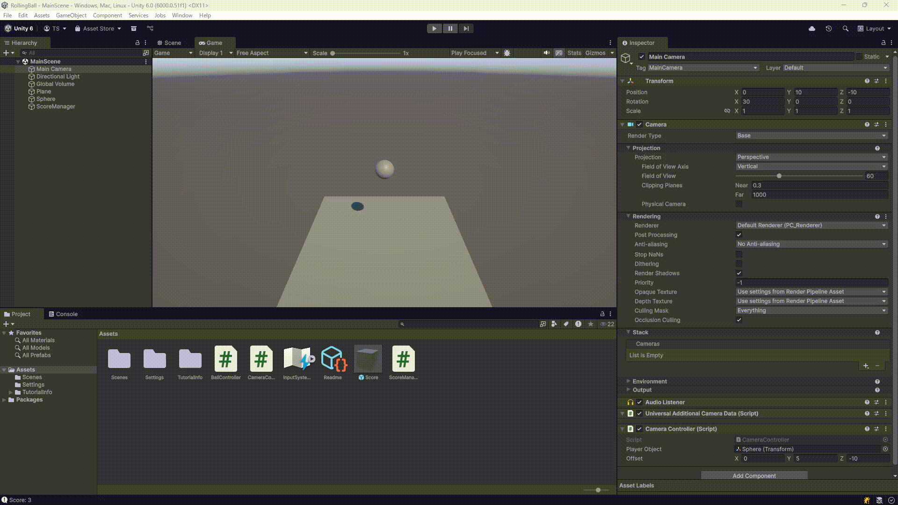


## 7.2. スクリプトの説明

`BallController` をダブルクリックして開いてください.

変数 `_score` は `int` 型の変数です. 得点を保持します.

`OnCollisionEnter` 関数は, ゲームオブジェクトが他のゲームオブジェクトに衝突(Collision)したときに呼び出される関数です. Unity が自動的に呼び出してくれます.

`OnCollisionEnter` 関数の引数で渡された `Collision` 型の変数 `collision` に衝突したゲームオブジェクトの情報が入っています. `collision.gameObject.name` で衝突したゲームオブジェクトの名前を取得できます. ここでは, `collision.gameObject.name` が `Score(Clone)` と文字列が同じなら得点を加算し, コンソールに現在のスコアを表示し, 衝突したゲームオブジェクトを削除しています. C#では,文字列同士を比較する場合は `==` 演算子を使います(C言語ではできないよ！).

`Debug.Log` 関数は, コンソールにログを表示する関数です. C#では便利なことに, 文字列型と数値型を足すと, 数値が文字列に変換され,自動的に文字列連結になります. `Destroy` 関数は, 引数で指定されたゲームオブジェクトを削除します. ここでは, 衝突したゲームオブジェクト (`Score`) を削除しています.

# 8. ステージの調整

ここでは, ステージを調整します.

`Hierarchy` タブで `Plane` を選択し, `Scale` を `(5, 1, 5)` に変更してください.


ステージの壁も作りましょう. `Hierarchy`で右クリック → `3D Object` → `Cube` を選択. 名前は `Wall` に変更してください. そして 4 方向分作るので, `Wall` を選択したまま `Ctrl + D` で複製してください. 以下の画像のようになります.


4 つの `Wall` の `Position` と `Scale` をそれぞれ以下のように変更してください. (写真は1つ目)

* Position: `(0, 2, 20)`, Scale `(40, 4, 1)`
* Position: `(0, 2, -20)`, Scale `(40, 4, 1)`
* Position: `(20, 2, 0)`, Scale `(1, 4, 40)`
* Position: `(-20, 2, 0)`, Scale `(1, 4, 40)`


また, 今のままでは, スコアにふれると一瞬ボールの動きが止まってしまいます. これは物理演算をするための当たり判定があるためです. このゲームでは, スコアの当たり判定は物理演算の当たり判定は必要なく, スコアに触れたかどうかを判定するだけで十分です. そこで, `Project` タブにある `Score` Prefab の `Box Collider` の `Is Trigger` にチェックを入れてください.


そして, `BallController` の `OnCollisionEnter` 関数を `OnTriggerEnter` 関数に変更してください (引数の型も変わっているので注意してください).

```diff lang="csharp" title="BallController.cs" showLineNumbers
using UnityEngine;

public class BallController : MonoBehaviour
{
    private Rigidbody _rb;
    private int _score = 0;

    // Start is called before the first frame update
    void Start()
    {
        _rb = GetComponent<Rigidbody>();
    }

    // Update is called once per frame
    void Update()
    {
        if(Input.GetKey(KeyCode.W))
        {
            _rb.AddForce(new Vector3(0, 0, 1));
        }

        if(Input.GetKey(KeyCode.S))
        {
            _rb.AddForce(new Vector3(0, 0, -1));
        }

        if(Input.GetKey(KeyCode.A))
        {
            _rb.AddForce(new Vector3(-1, 0, 0));
        }

        if(Input.GetKey(KeyCode.D))
        {
            _rb.AddForce(new Vector3(1, 0, 0));
        }
    }

-   private void OnCollisionEnter(Collision collision)
+   private void OnTriggerEnter(Collider collision)
    {
        if(collision.gameObject.name == "Score(Clone)")
        {
            score++;
            Debug.Log("Score: " + score);
            Destroy(collision.gameObject);
        }
    }
}
```

再生ボタンを押してみてください. スコアにふれてもボールの動きが止まらなくなりました.


## 8.1. スクリプトの説明

ただの当たり判定は, 物理演算に影響を与えます.しかし, 今回のように触れたら回収するアイテムといったものや, 特定のエリアへの侵入検知などは, 物理演算に影響を与えない当たり判定が必要です. そこで, `Collider` コンポーネントの `Is Trigger` を有効にします. これにより, 当たり判定はあるけど物理演算には影響を与えない状態になります. `Is Trigger` を有効にした `Collider` コンポーネントは, `OnTriggerEnter` 関数を使って当たり判定を検知します.

# 9. スコアをテキストで表示する

ここでは, スコアを表示する UI を作成します.

## 9.1. 画面比の設定

まず, 画面比を設定します. `Game` タブの上にある `Free Aspect` を `Full HD (1920x1080)` に変更してください.

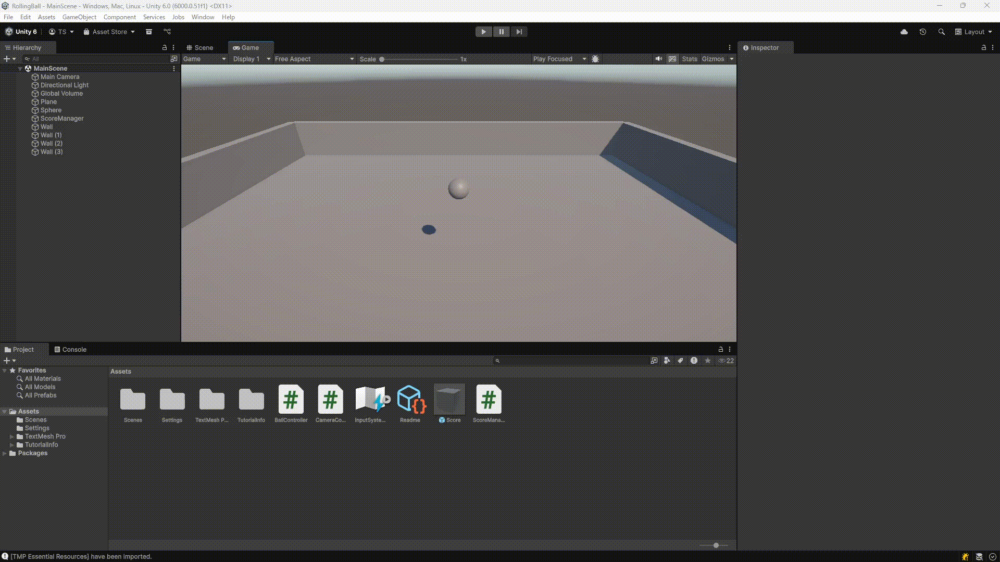

これでゲーム画面の比率が 16:9 で Full HD の解像度になります.

## 9.2. テキストの追加

`Hierarchy`で右クリック → `UI` → `Text - TextMeshPro` を選択


TMP Importer が表示されるので, `Import TMP Essentials` をクリックしてください.


Canvas の子要素として `Text` が追加されました. `Game` タブをみると, `New Text` というテキストが表示されているのがわかります.


Canvas とは,  Unity で UI を使うときに必要なゲームオブジェクトです. UI を表示するためのゲームオブジェクトを Canvas の子要素として追加することで, 画面に UI を表示できます. UI は, ゲーム画面の上に重ねて表示されます.

## 9.3. テキストの調整

`Text` の `(PosX, PosY, PosZ)` を `(-660, 440, 0)`, `(Width, Height)` を `(500, 100)` に変更してください. また, `Text` を `Score: 0`, `Font Size` を `80` に変更してください.  `Vertex Color` では好きな色に設定してください.

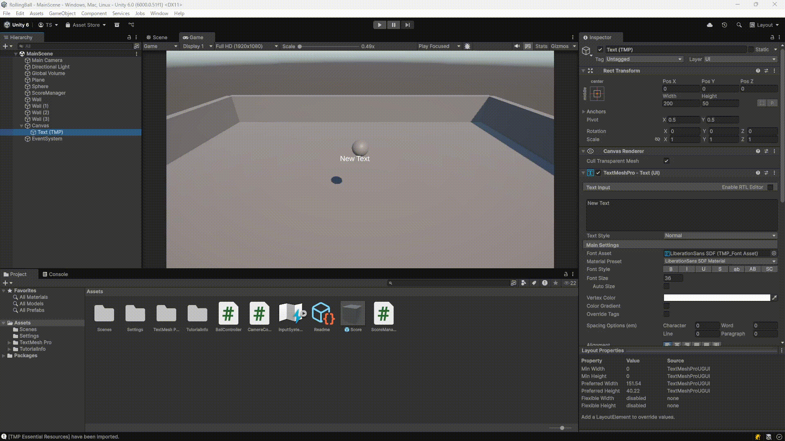

これで, 左上の方にスコアが表示されるようになりました.


## 9.3. スコアを表示するスクリプトを作成する

`BallController` にスコアを表示するスクリプトを追加します.  `BallController` をダブルクリックして開いてください.

```diff lang="csharp" title="BallController.cs" showLineNumbers
using UnityEngine;
+ using TMPro;

public class BallController : MonoBehaviour
{
    private Rigidbody _rb;
    private int _score = 0;
+   [SerializeField] private TextMeshProUGUI scoreText;

    // Start is called before the first frame update
    void Start()
    {
        _rb = GetComponent<Rigidbody>();
    }

    // Update is called once per frame
    void Update()
    {
        if (Input.GetKey(KeyCode.W))
        {
            _rb.AddForce(new Vector3(0, 0, 1));
        }

        if (Input.GetKey(KeyCode.S))
        {
            _rb.AddForce(new Vector3(0, 0, -1));
        }

        if (Input.GetKey(KeyCode.A))
        {
            _rb.AddForce(new Vector3(-1, 0, 0));
        }

        if (Input.GetKey(KeyCode.D))
        {
            _rb.AddForce(new Vector3(1, 0, 0));
        }
    }

    private void OnTriggerEnter(Collider collision)
    {
        if (collision.gameObject.name == "Score(Clone)")
        {
            _score++;
            Debug.Log("Score: " + _score);
            Destroy(collision.gameObject);
+           scoreText.text = "Score: " + _score;
        }
    }
}
```

`Hierarchy` タブにある `Sphere` を選択し, `BallController` の Inspector にある `Score Text` に先ほど作成した `Text` をドラッグアンドドロップしてください.


再生ボタン ▶ を押してみてください. スコアが表示されることを確認してください. 取るたびにスコアが増えていくことがわかります.

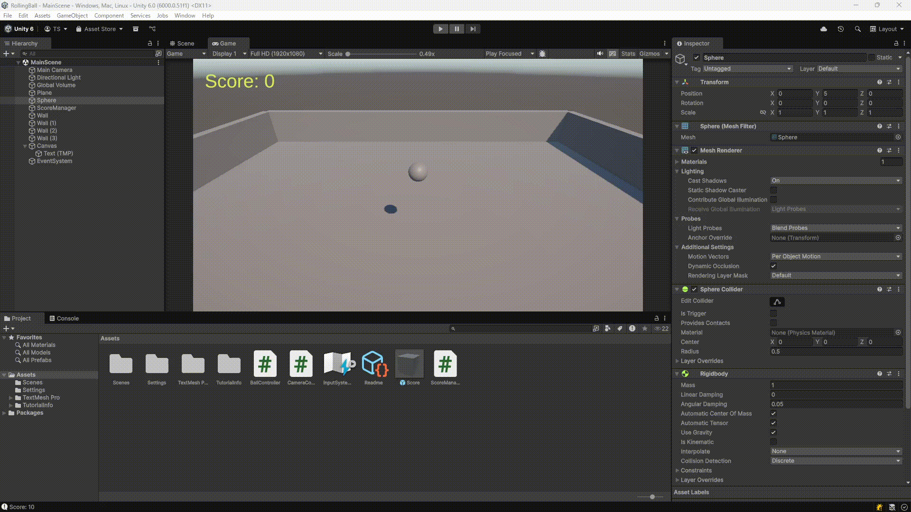

確認ができたら, 停止ボタン ■ を押して再生を停止してください.

また,こまめに `Ctrl + S` で保存することを忘れないでください.

## 9.4. スクリプトの説明

`BallController` をダブルクリックして開いてください.

`using TMPro;` unity でテキストを扱う `TextMeshProUGUI` を使うためのおまじないです.

変数 `scoreText` は `TextMeshProUGUI` 型の変数です. `TextMeshPro` コンポーネントを代入することで, その `TextMeshPro` を**参照**できます. Canvas の子要素として追加した `Text` は, `TextMeshProUGUI` コンポーネントを持っています. `TextMeshProUGUI` 型の変数に `TextMeshPro` コンポーネントを持ったゲームオブジェクトを代入することで, その `TextMeshPro` を**参照**できます.

`scoreText.text` は, `TextMeshPro` コンポーネントの `text` プロパティを表し, この変数に文字列を代入すると, その文字列にテキストが更新されます. ここでは, `Score: [現在のスコア]` を代入しています.

`scoreText.text` に `"Score: " + _score` を代入することで, スコアが更新され, スコアが表示されます.

# 10. ゲームタイトルシーンを作成する

ここでは, ゲームのタイトルシーンを作成します.

Scene とは,  Unity でゲームを作るときに必要なゲームオブジェクトや設定を保存するためのファイルです.  Scene は, ゲームのステージやメニュー画面など, ゲームの場面を表します. 今まで作成したステージは, `MainScene` という名前の Scene に保存されています. `Project` タブの `Assets/Scences` の中に `MainScene` という名前の Scene があるのがわかります. これに加え, ゲームのタイトルシーンを作成します.

## 10.1. ゲームタイトルシーンを作成する

Project → `Assets/Scenes` で右クリック → `Create` → `Scene` → `Scene` を選択してください.名前は `TitleScene` にしてください.

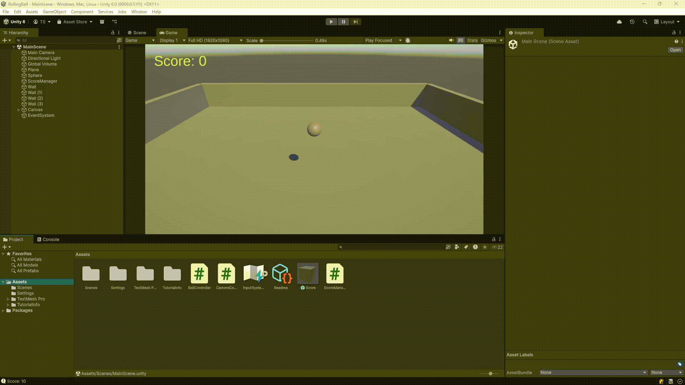

`TitleScene` 作成したらダブルクリックして開いてください.

Unity では, シーンを作成したら `Build Profiles` に追加する必要があります. 左上の `File` → `Build Profiles` を選択して, Scene List の `Add Open Scenes` をクリックしてください. これで `TitleScene` が Build Profiles に追加されます. `MainScene` ははじめから追加されています.

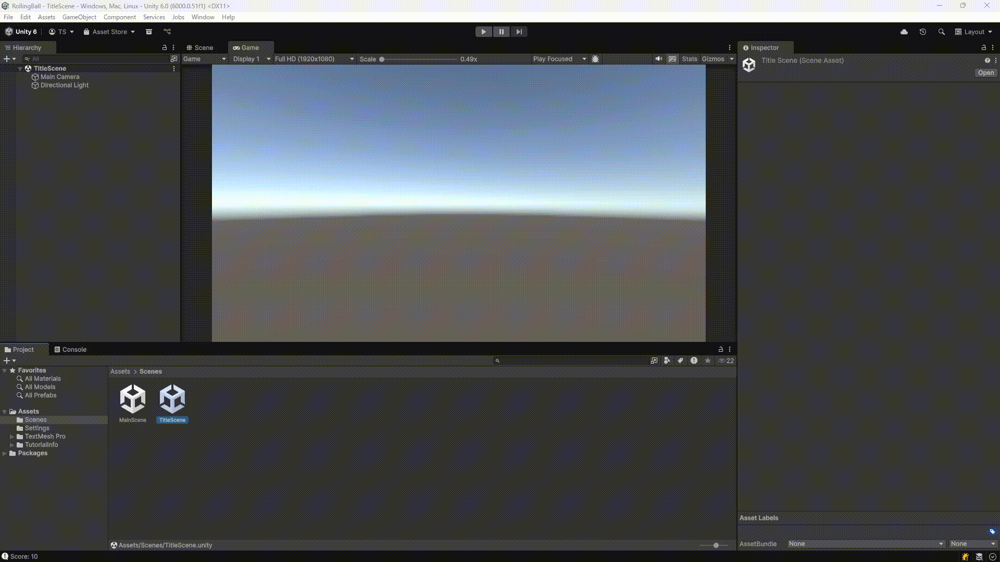

## 10.2. タイトルのテキスト

`Hierarchy` タブで右クリック → `UI` → `Text - TextMeshPro` を選択

オブジェクト名は `Title` に変更してください. そして, `Title` の `(PosX, PosY, PosZ)` を `(0, 0, 0)`, `(Width, Height)` を `(700, 100)` に変更してください. また, `Title` の Text を `RollingBall` , `Font Size` を `100` に変更してください. テキストの色は好きな色で構いませんが, 見やすい色にしてください. `Alignment` で文字を中央揃えにしたり, 左揃えにしたりできます. ここでは上下左右ともに中央揃えにします.

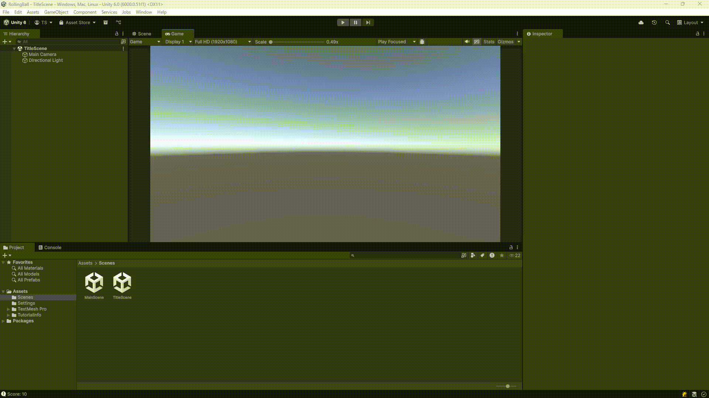

## 10.3. スタートボタン

`Hierarchy` で右クリック → `UI` → `Button - TextMeshPro` を選択

オブジェクト名は `StartButton` に変更してください. そして, `StartButton` の `(PosX, PosY, PosZ)` を `(0, -200, 0)`, `(Width, Height)` を `(500, 100)` に変更してください. `Hierarchy` タブの `StartButton` の左側にある ▶ をクリックすると ▼ になり, `StartButton` ゲームオブジェクトの子オブジェクトであるボタンのテキストのオブジェクトが表示されます. この子オブジェクトの `Text` を `Click Start` に変更して, `Font Size` を `60` に変更してください.

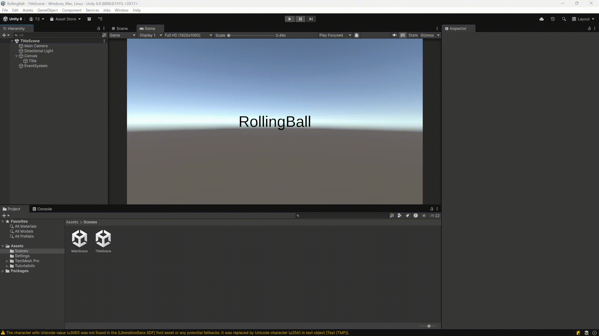

## 10.4. シーン遷移

`Project` タブで `Assets` フォルダー上で右クリック → `Create` → `MonoBehaviour Script`を選択して `TitleManager` という名前のスクリプトを作成して, 以下のように書き換えてください.

```diff lang="csharp" title="TitleManager.cs" showLineNumbers
using UnityEngine;
+ using UnityEngine.SceneManagement;

public class TitleManager : MonoBehaviour
{
    // Start is called once before the first execution of Update after the MonoBehaviour is created
    void Start()
    {

    }

    // Update is called once per frame
    void Update()
    {

    }


+    public void OnButtonClicked()
+    {
+        SceneManager.LoadScene("MainScene");
+    }
}

```

Hierarchy で右クリック → `Create Empty` を選択

オブジェクト名は `TitleManager` に変更してください. そして, 今作った `TitleManager` オブジェクトに `TitleManager` スクリプトをアタッチしてください.


Hierarchy の `StartButton` を選択し, `Inspector` で `Button` コンポーネントの `On Click()` の右下の方にある `+` をクリック. 左下には Hierarchy の `TitleManager` ゲームオブジェクトをドラッグアンドドロップ. そして `NoFunction` をクリックしての `TitleManager → OnButtonClicked` を選択してください.


再生ボタン ▶ を押してみてください. タイトル画面が表示され, `Start` ボタンを押すと, ゲーム画面に遷移します.


確認ができたら, 再生ボタンを押して再生を停止してください.

`TitleScene` から `MainScene` に遷移することができました.

# 10.5. スクリプトの説明

`TitleManager` をダブルクリックして開いてください.

`using UnityEngine.SceneManagement;` は, シーンに関することを使うためのおまじないです.

`SceneManager.LoadScene` 関数は, 引数で指定されたシーンに遷移します. ここでは, `MainScene` に遷移しています.

`public void OnButtonClicked()` は, `StartButton` がクリックされたときにUnityによって呼び出される関数です. これは, `StartButton` の `Button` コンポーネントの `On Click()` に設定したためです. よって, `StartButton` がクリックされたときに, `SceneManager.LoadScene` 関数を呼び出して, `MainScene` に遷移します. 画面上でボタンのゲームオブジェクトがクリックされたという判定はUnityが自動的に行ってくれます.

# 11. ゲームクリアを作成する

ここでは, ゲームクリアのシーンを作成します.

## 11.1. ゲームクリアシーンを作成する

Project → `Assets/Scenes` で右クリック → `Create` → `Scene` → `Scene` を選択

Scene の名前を `GameClear` に変更してください. そして, `GameClear` をダブルクリックして開いてください.

そして, 左上の `File` → `Build Profiles` を選択して, Scene List の `Add Open Scenes` をクリックしてください. これで `GameClear` が Build Profiles に追加されます.

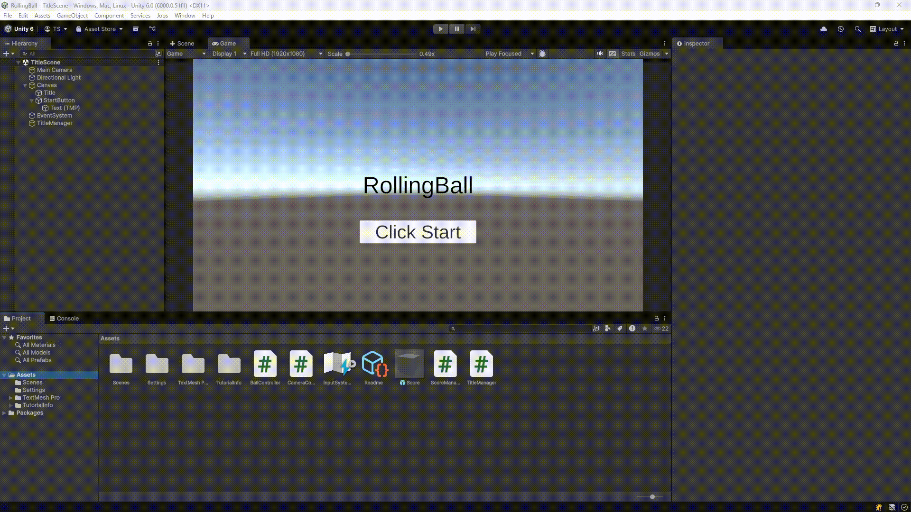

ゲームクリアのテキストを作成します.

`Hierarchy` で右クリック → `UI` → `Text - TextMeshPro` を選択

`(PosX, PosY, PosZ)` を `(0, 0, 0)`, `(Width, Height)` を `(700, 100)` に変更してください. また, `Text` を `Game Clear` , `Font Size` を `100` に変更してください. テキストの色は好きな色で構いませんが,見やすい色にしてください. `Alignment` は文字の中央揃えにします.


## 11.2. シーン遷移

クリアシーンでクリックするとタイトルシーンに遷移するようにします.

`Project` タブで `Assets` フォルダー上で右クリック → `Create` → `MonoBehaviour Script`を選択して `GameClearManager` という名前のスクリプトを作成して, 以下のように書き換えてください.

```diff lang="csharp" title="GameClearManager.cs" showLineNumbers
using UnityEngine;
+ using UnityEngine.SceneManagement;

public class GameClearManager : MonoBehaviour
{
    // Start is called once before the first execution of Update after the MonoBehaviour is created
    void Start()
    {

    }

    // Update is called once per frame
    void Update()
    {

    }

+    public void OnButtonClicked()
+    {
+        SceneManager.LoadScene("TitleScene");
+    }
}
```

タイトルシーンと同じようにボタンを作成し, `(PosX, PosY, PosZ)` を `(0, -200, 0)`, `(Width, Height)` を `(500, 100)` に変更してください. ヒエラルキーの ボタンのオブジェクトの▶をクリックして子オブジェクトであるボタンのテキストのオブジェクトの `Text` を `Back to Title` に変更して, `Font Size` を `60` に変更してください.

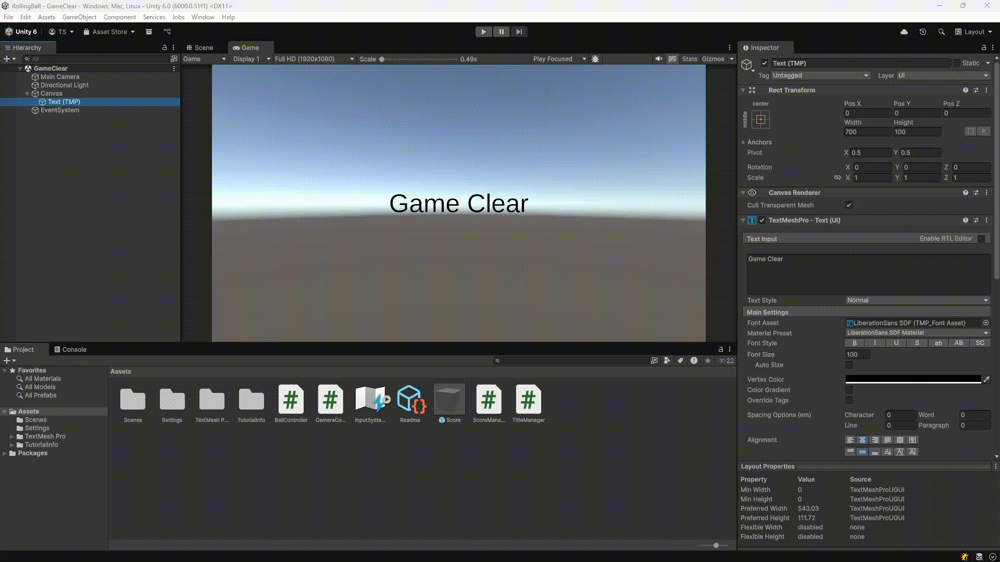

`Hierarchy` で右クリック → `Create Empty` を選択して `GameClearManager` を作成してください. そして, 今作った `GameClearManager` オブジェクトに `GameClearManager` スクリプトをアタッチしてください. そしてタイトルシーンと同じように, `GameClearManager` の `On Click()` に `GameClearManager → OnButtonClicked` を設定してください.

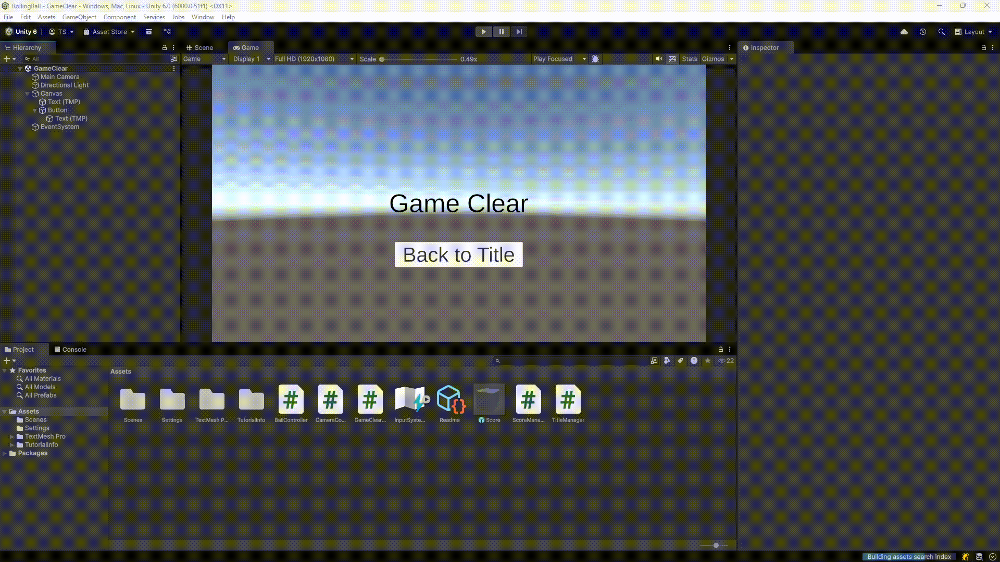

再生ボタン ▶ を押してみてください. ゲームクリア画面が表示され, `Back to Title` ボタンを押すと, タイトル画面に遷移します.

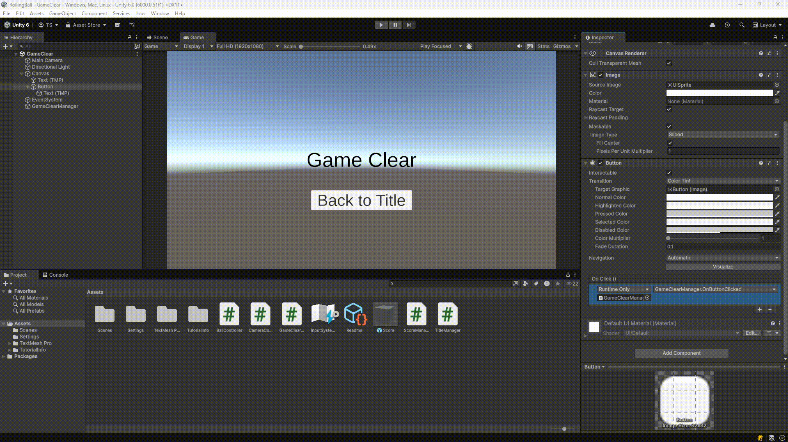

確認ができたら, 停止ボタン ■ を押して再生を停止してください.

GameClear シーンから Title シーンに遷移することができました.

# 11.3. スコアをすべて取ったらゲームクリアにする

`BallController` にゲームクリアの処理を追加します.

```diff lang="csharp" title="BallController.cs" showLineNumbers
using UnityEngine;
using TMPro;
+ using UnityEngine.SceneManagement;

public class BallController : MonoBehaviour
{
    private Rigidbody _rb;
    private int _score = 0;
    [SerializeField] private TextMeshProUGUI scoreText;

    // Start is called before the first frame update
    void Start()
    {
        _rb = GetComponent<Rigidbody>();
    }

    // Update is called once per frame
    void Update()
    {
        if (Input.GetKey(KeyCode.W))
        {
            _rb.AddForce(new Vector3(0, 0, 1));
        }

        if (Input.GetKey(KeyCode.S))
        {
            _rb.AddForce(new Vector3(0, 0, -1));
        }

        if (Input.GetKey(KeyCode.A))
        {
            _rb.AddForce(new Vector3(-1, 0, 0));
        }

        if (Input.GetKey(KeyCode.D))
        {
            _rb.AddForce(new Vector3(1, 0, 0));
        }
    }

    private void OnTriggerEnter(Collider collision)
    {
        if (collision.gameObject.name == "Score(Clone)")
        {
            _score++;
            Debug.Log("Score: " + _score);
            Destroy(collision.gameObject);
            scoreText.text = "Score: " + _score;
+           if(_score == 10)
+           {
+               SceneManager.LoadScene("GameClear");
+           }
        }
    }
}
```

`MainScene` をダブルクリックして開き, 再生ボタン ▶ を押してみてください. スコアが 10 になると, ゲームクリア画面に遷移します.


確認ができたら, 停止ボタン■を押して再生を停止してください.

これで, ゲームの一連の流れが完成しました.

# 12. マテリアルで見た目

ここでは, マテリアルを使ってゲームオブジェクトにテクスチャを貼ったりして見た目を変更します.

## 12.1. スコアの見た目を変更する

Project で右クリック → `Create` → `Material` を選択

マテリアルの名前を `ScoreMaterial` に変更してください.


`ScoreMaterial` を選択し, `Inspector` で `Base Map` の色を好きな色に変更してください. (例では黄緑っぽい色にしてみました)


`Score` プレバブに `ScoreMaterial` をドラッグアンドドロップしてください. そして再生ボタン ▶ を押してみてください. スコアゲームオブジェクトの色が変わっていることがわかります.

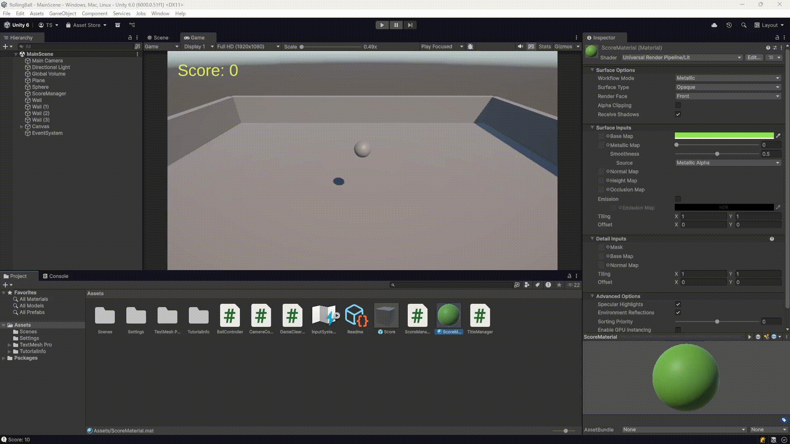

確認ができたら, 停止ボタン ■ を押して再生を停止してください.

## 12.2. ボールの見た目を変更する

以下のテクスチャをボールに貼り付けてみようと思います.

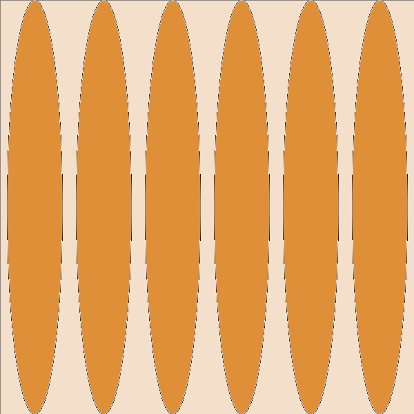

[ここをクリックでダウンロード](./BallTexture.png)

ダウンロードしたら, `Assets` にドラッグアンドドロップしてください.

Assets で右クリック → `Create` → `Material` を選択

マテリアルの名前を `BallMaterial` に変更してください.

`BallMaterial` を選択し, `Inspector` で `Base Map` の `Texture` に `BallTexture` をドラッグアンドドロップしてください. そして, `BallMaterial` を `Hierarchy` の `Sphere` にドラッグアンドドロップしてください.

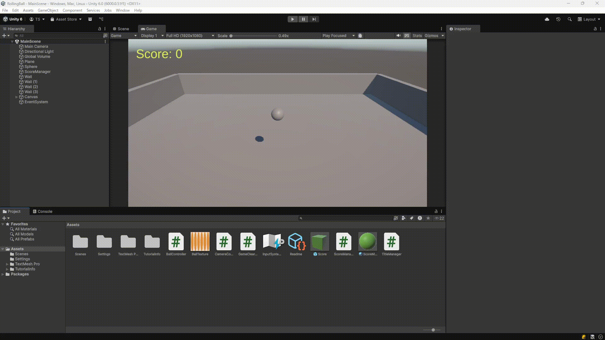

ボールの見た目が変わっていることがわかります.

再生ボタンを押してみてください.


# 13. 音を鳴らす

ここでは, ボールが得点に触れたときに音を鳴らしたり, BGMを鳴らす処理を追加します.

今回は, ボールを取ったときの音に効果音ラボの音, BGMにはNCSの音を使います. いずれも無料で商用利用可能な音源です.

[効果音ラボ](https://soundeffect-lab.info/sound/button/)

[NCS](https://ncs.io/)

この中から, 好きな音をダウンロードしてください. 例では効果音ラボから `成功音`, NCS から [On & On](https://ncs.io/onandon) [Invincible](https://ncs.io/Invincible) [Blank](https://ncs.io/Blank) をダウンロードしました.

ダウンロードしたら, `Assets` にドラッグアンドドロップしてください.

## 13.1. 得点を取ったときの効果音を鳴らす

`BallController` を開いて以下を追加してください.

```diff lang="csharp" title="BallController.cs" showLineNumbers
using UnityEngine;
using TMPro;
using UnityEngine.SceneManagement;

public class BallController : MonoBehaviour
{
    private Rigidbody _rb;
    private int _score = 0;
+   private AudioSource audioSource;
    [SerializeField] private TextMeshProUGUI scoreText;
+   [SerializeField] private AudioClip ScoreSound;

    // Start is called before the first frame update
    void Start()
    {
        _rb = GetComponent<Rigidbody>();
+       audioSource = GetComponent<AudioSource>();
    }

    // Update is called once per frame
    void Update()
    {
        if (Input.GetKey(KeyCode.W))
        {
            _rb.AddForce(new Vector3(0, 0, 1));
        }

        if (Input.GetKey(KeyCode.S))
        {
            _rb.AddForce(new Vector3(0, 0, -1));
        }

        if (Input.GetKey(KeyCode.A))
        {
            _rb.AddForce(new Vector3(-1, 0, 0));
        }

        if (Input.GetKey(KeyCode.D))
        {
            _rb.AddForce(new Vector3(1, 0, 0));
        }
    }

    private void OnTriggerEnter(Collider collision)
    {
        if (collision.gameObject.name == "Score(Clone)")
        {
            _score++;
            Debug.Log("Score: " + _score);
            Destroy(collision.gameObject);
            scoreText.text = "Score: " + _score;
+           audioSource.PlayOneShot(ScoreSound);
            if (_score == 10)
            {
                SceneManager.LoadScene("GameClear");
            }
        }
    }
}
```

Hierarchy で `Sphere` を選択し, `Inspector` で `Add Component` をクリック → `Audio` → `Audio Source` を選択

`Sphere` の `BallController` の Inspector にある `Score Sound` に `成功音` をドラッグアンドドロップしてください.

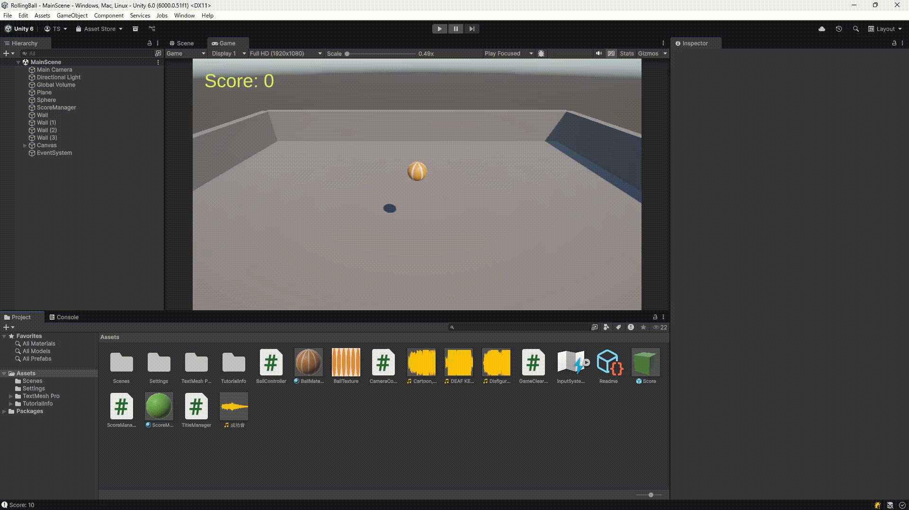

再生ボタンを押してみてください. スコアにふれると音が鳴ることがわかります.

## 13.2. BGMを鳴らす

`Hierarchy` で `Main Camera` を選択し, `Inspector` で `Add Component` をクリック → `Audio` → `Audio Source` を選択

`Main Camera` の Inspector にある `Audio Resource` の `AudioClip` にお好きな曲をドラッグアンドドロップしてください. そして,  `Play On Awake` と `Loop` にチェックを入れてください.

これを他の2つのシーン (`Title`, `GameClear`) にも行ってください. どのシーンでどの曲を鳴らすかはお好みで構いません.

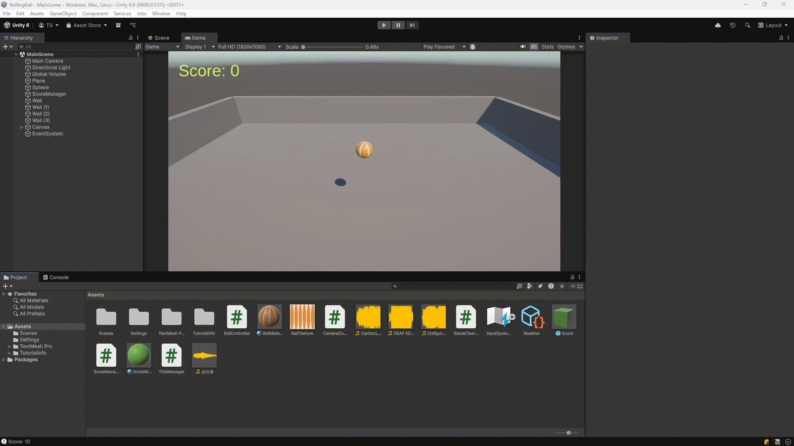

再生ボタンを押してみてください. BGMが流れることがわかります.

## 13.3. スクリプトの説明

`AudioSource` は, Unity でオブジェクトから音を鳴らすためのコンポーネントです. `AudioClip` は, 音声データを保持するためのクラスです. Unityでは,音源データはすべて `AudioClip` として扱われます.`Audio Source` コンポーネントの`Audio Resource` には, `AudioClip` を設定することで, その音声データを再生できます. `Play On Awake` は, ゲームオブジェクトが生成されたときに自動的に音を再生するかどうかを設定します. `Loop` は, 音声データをループ再生するかどうかを設定します.

`AudioSource.PlayOneShot()` 関数は, 引数で指定された `AudioClip` を一度だけ再生します. ここでは, 得点を取ったときに `ScoreSound` を再生しています. この関数は, スコアを取ったときなど, 一瞬だけ音を鳴らしたいときに使います.

# 14. ゲームをビルドする

ここでは, ゲームをビルドして実行ファイルを作成します.

## 14.1. シーンの設定

`File` → `Build Profiles` で `Scene List` を開いてください. `Scene List` で,  `TitleScene` が一番上に来るようにドラッグアンドドロップしてください. ビルド後のゲームは, 一番上にあるシーンから始まります.

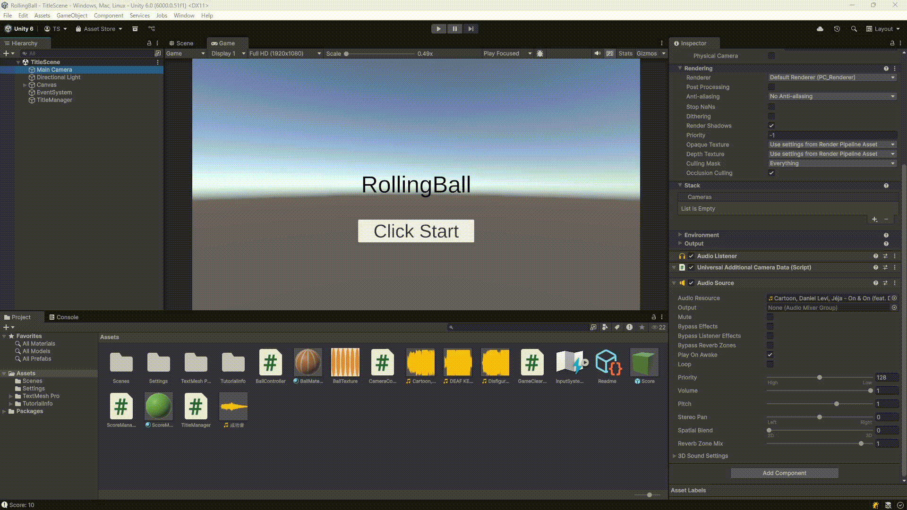

## 14.2. ビルド

`File` → `Build Profiles` でPlatformsから自身のOSを選択してください.

* Windows


`Build` をクリックすると, どのフォルダに保存するか聞かれるので, 右クリックして `Build` というフォルダを作って, 選択してください.

ビルド後, `Build` フォルダに実行ファイルが作成されます. 自分でつけたゲームのタイトル名の実行ファイルがビルドしてできたゲームです.


# 15. さいごに

これで, Unity でのゲーム制作の基本的な流れを学ぶことができました. ゲーム制作は, アイデアを形にする楽しいプロセスです. 今回のチュートリアルを通じて, Unity の基本的な使い方や C# の基礎を学ぶことができたと思います. これからも, Unity を使って様々なゲームを作ってみてください.

## 15.1. ビルドしたらボールの動きが早くなる！？

Unity でビルドしたゲームを実行すると, エディタ上での動きと比べてボールの動きが速くなることがあります. これは, Unity のエディタでのフレームレートとビルド後のフレームレートが異なるためです. Unity のエディタ上でゲームを再生してる際は,デバックのしやすさのために様々な処理が動いています.そのため,エディタ上でのフレームレートは低くなりがちです. しかし, ビルドをすると, エディタ上でのデバック処理がなくなり, プログラムの最適化も行われます. そのため, 同じコードでもビルド後の方がフレームレートが高くなり, `Update`関数がより多くの回数呼び出されるため, ボールの動きが速くなることがあります.
