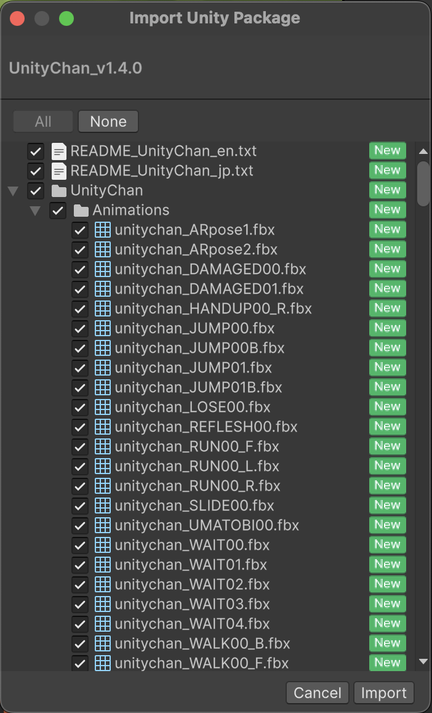
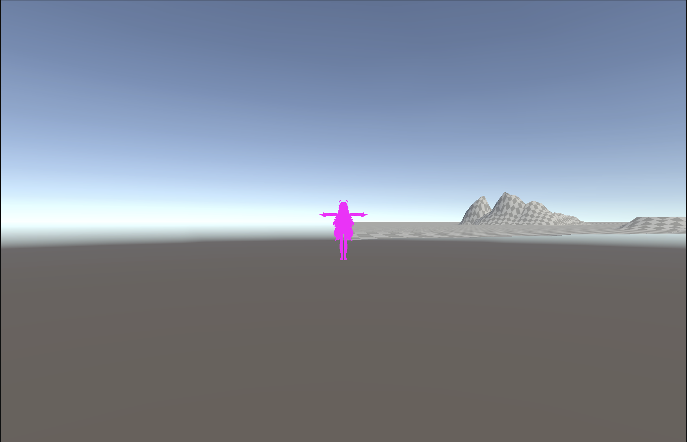
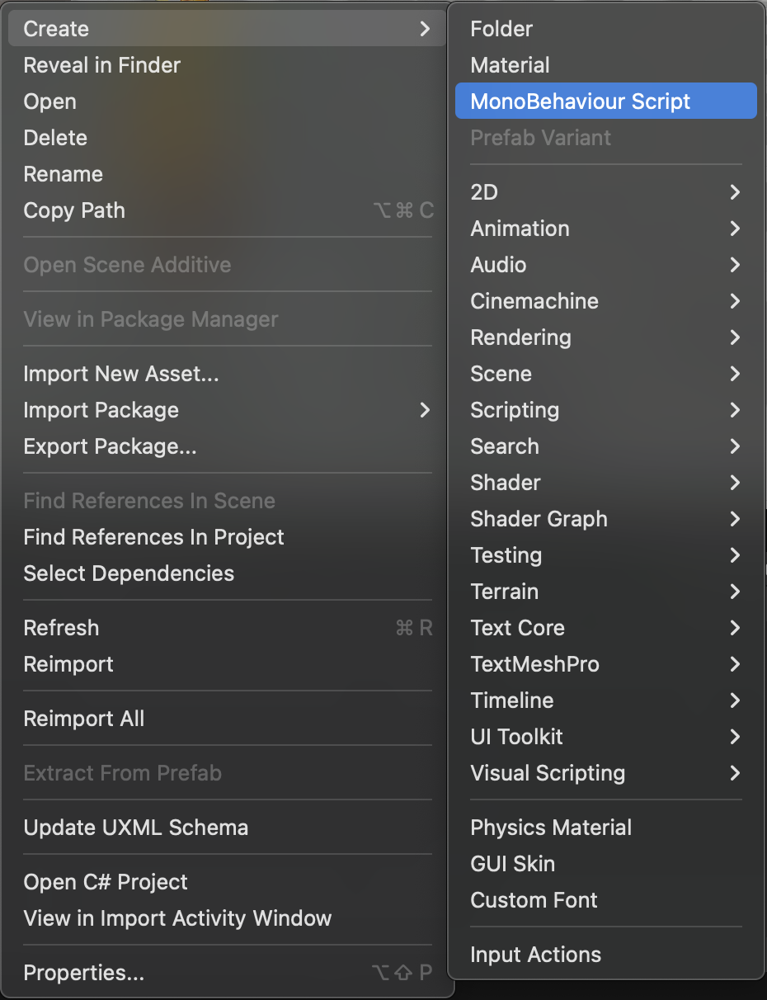

難易度: ★★☆☆☆ 初級レベル

# 1. はじめに

* この記事は Unity 講習会 2025 その2 の資料です。
* **本資料は、Unity 講習会 2025 その1 を受講している前提で書かれています。** Unity 講習会 2025 その1 をまだ読んでいない、または内容に不安がある場合は、[こちらのリンク](https://github.com/tuatmcc/Unitylec2025-1)からお読みいただけます。

## 1.1. 本講習会で学ぶ内容
　本講習会では、3Dマリオ風のゲームを作りながら、以下の項目について学びます。
* Terrain
* .unitypackage / Unity Package Manager
* InputSystem
* Chinemacine
* Animation Clip / Animator Controller
* DOTween
* UniTask

# 2. プロジェクトを新規作成する
　第1回の講習会と同じ手順でに、`Unity Hub`を使って新規プロジェクトを作成します。

`Unity Hub` から `New Project` ボタンを押して、`Unity Editor` のバージョンは前回同様 `6000.0.51f1`、または`6000.0.55f1`を選択します。`Template` は `Universal 3D`、プロジェクト名は `Mario3D` としてください (`Connenct to Unity Cloud` のチェックは外しましょう)。

# 3. ステージの地形を作る

　本章では、キャラクターが走り回るステージを作成します。

## 3.1. Terrainを作成する
ステージの地形は `Terrain` という機能を使って作成します。Terrain を用いると、ブラシで絵を描くようにして、ゲームで使う地形を作成することができます。

 Terrain は `Hierarchy` タブで右クリック > `3D Objects` > `Terrain` の順に操作することで作成できます。


Terrainを作成すると、`Hierarchy` タブに `Terrain` という名前のオブジェクトが追加されます。

## 3.2. Terrainを編集する
　先ほど作成して `Hierarchy` タブに現れた `Terrain` をクリックすると、`Inspector` タブに以下のような画面が出てきます。


上部に5つ並ぶボタンは左から順にそれぞれ「隣接領域に新しいTerrainを作る」「Terrainの編集」「木の追加」「Terrainのディティールを編集する」「Terrainの設定をする」ためのモードに切り替えるボタンになります。

今回は地形の編集、つまりTerrainの編集をするので、左から2番目のボタンを押します。

その下にあるプルダウンメニューからは、編集モードを切り替えることができます。これに関しては詳細は後述します。今は一旦 `Raise or Lower Terrain` に設定してください。

`Brushes` ではTerrainの編集に使うブラシの形状を選択します。お好みのブラシを選択してください。

この状態で `Scene` タブを開くと、以下のような画面になっていると思います。チェッカーボードのような見た目をしているのが先ほど作成したTerrainで、マウスカーソルを合わせると青い影が表示されます。


この状態でTerrainの上をドラッグすると、ドラッグした箇所が隆起します。


Terrainの地形編集には、地面を隆起させる以外にもさまざまな操作を行うことができます。これを設定するのが先ほど説明を省いたプルダウンメニューです。クリックすると以下のような項目が表示されます。


例えば `Set Height` では、塗りつぶした部分の高さを一定にそろえます。また、 `Paint Hole` では、Terrain の一部を削って穴を開けることができます。

# 4. キャラクターを用意する

　本章では、プレイヤーが操作するキャラクターを配置し、前後左右移動とジャンプができるようにします。

　キャラクターのデータは、インターネット上で無料公開されているユニティちゃんというキャラクターを利用します。

## 4.1. ユニティちゃんのアセットをインポートする

Unityでは、3Dモデルをはじめとする様々なアセットがインターネット上で公開されていますが、これらのアセットは `.unitypackage` という形式で配布されていることが多いです。

`.unitypackage`を使うと、Unityを使う人が自分のプロジェクトに簡単にアセットを導入することができます。


[こちらのリンク](https://unity-chan.com/download/releaseNote.php?id=UnityChan)から、ユニティちゃん 3Dモデルデータ をダウンロードします。ダウンロードするバージョンは最新の `1.4.0` を選択してください。


すると、 `UnityChan_v1.4.0.unitypackage` がダウンロードされます。

次に、Projectタブを右クリック > 表示されるメニューから、 `Import Package` > `Custom Package...` の順に選択します。


すると、ファイルマネージャーが開くので、先ほどダウンロードした `UnityChan_v1.4.0.unitypackage` を選択します。

ウィンドウが表示されたら、右下の `Import` を押します。



## 4.2. ユニティちゃんをシーン上に配置する
ユニティちゃん 3Dモデルデータ を正しくインポートすると、Projectタブのファイル一覧に `UnityChan` というフォルダが生成されます。

ユニティチャンをシーンに配置するために、`UnityChan/Prefabs/unitychan` を選択し、`Hierarchy` タブ上にドラッグ&ドロップします。


なんということでしょう〜

ユニティちゃんが全身ピンク色になってしまったではありませんか！



これは、3Dモデルの見た目を作るために不可欠な「シェーダー」関係のエラーが発生した時に起こります。今回は必要なシェーダーを導入しないままユニティちゃんをインポートしたため、エラーが発生しました。

3Dモデルの見た目がピンク色になることはUnityを触っていたら時々遭遇するので覚えておきましょう。

さて、ユニティちゃんをピンク色のまま放置しておくわけにはいかないので、前述した通り、「シェーダー」を導入します。ユニティちゃんは `Unity Toon Shader` を使っているので、これを導入します。

Unityでは、前述した `.unitypackage` を用いる以外にも、`Unity Package Manager` と呼ばれるパッケージ管理機能を用いてアセットの管理・導入をすることができます。ここでは `Unity Package Manager` 自体の詳細な使い方の説明は省略します。

画面上部のメニューから `Window`ボタン > `Package Manager` の順番に選択します。


以下の画面が `Unity Package Manager` です。


左上の「＋▼」ボタンから、`Install package from git URL...` を押します。


URLの欄には `com.unity.toonshader` と入力して `Install` ボタンを押します。すると、`Unity Toon Shader` がインストールされます。


これでユニティちゃんが正しく表示されるようになりました！

## 4.3. ユニティちゃんに Rigidbody と Collidar を取り付ける
　`Hierarchy` 上の `unitychan` をクリックし、`Inspector` タブから `Add Component` をクリックし、`Rigidbody`と `Box Collidar` を追加します (検索欄に入力すると簡単に見つけられます)。パラメータは以下の画像の通りになるようにしてください (折りたたまれている項目は左側の ▶ をクリックすると表示されます)。


また、`Idle Changer (Script)` と `Face Update (Script)` は不要なので、コンポーネント名を右クリック > `Remove Component` をクリックします。


再生ボタン「▶」を押すと、ユニティちゃんが落下していくと思います (落下しないこともあるかも)。


初めから落下してはゲームにならないので、ユニティちゃんが落下してしまう場合には `Hierarchy` タブから先ほど作成した `Terrain`を選択し、Inspectorから `Transform` の `Position` を適当な値に設定し、ユニティちゃんの下側に地面が来るようにしてください。


## 4.4. 操作のためのInput Actionsを作成する
　ゲームを作る際には、キーボードやコントローラーの入力を受け取って、キャラクターの操作を行うことが多いです。

　ゲームを開発していると、途中でキー入力を変更したくなったり、キーボードじゃなくてコントローラーで操作できるようにしたくなったりすることもあります。

そんな時、InputActions を使っていないと、操作の入力に関するコードを全て書き換える必要があり、非効率的です。

　InputActionsは、操作の内容とそれに対応するキーバインドを対応させて管理しています。そのため、途中で入力デバイスを変更したい際には、スクリプトは一切いじらず、InputActionsだけを書き換えれば対応が可能です。

まず、`Project` タブで `Assets` を開いて右クリック > `Create` > `Folder` の順に選択します。フォルダ名は `InputActions` とします。


次に、`InputActions` フォルダをダブルクリックしてフォルダの中に入り、`Project` タブを右クリック > `Create` > `Input Actions` の順に選択します。名前は `Player` とします。


　作成した `Player` をダブルクリックすると、以下のようなウィンドウが表示されます。


まず、左側の `Action Maps` の「+」ボタンをクリックします。名前は `main`としてください。

すると、真ん中の列に `New action` というのが生成されます。右クリック > `Rename` を押して、名前を `Move` としてください。


次に、右側の `Action Properties` の `Action` を編集します。`Action Type` は `Value` に、`Control Type` は `Vector 2` とします。これは、十字キーやアナログスティックでの操作を割り当てるために用います。


次に、`Actions` タブの `Move` の左側の ▶ をクリックして `<No Binding>` を右クリック > `Delete` を押して、削除します。 削除したら、`Move` の右側にある「+」ボタンを押して、 `Add Up/Down/Left/Right Composite` を選択します。


すると、以下のように `Move` の下側に新しく `2D Vector` が作られます。さらに `2D Vector` の左側の ▶ をクリックすると `Up` `Down` `Left` `Right` が表示されます。


`Up` `Down` `Left` `Right`をそれぞれ押すと、右側の列に `Binding Properties` が表示されます。
`Binding Properties` > `Binding` > `Path`のプルダウンを押すと、各方向の入力にどのキーを割り当てるかを設定することができます。ここでは上下左右をWSADに割り当てます。`Path` のプルダウンをクリックした後、`Listen` を押して選択したいキーを押すと下に候補が表示されるのでそこから選択すると簡単です。


ここまでで、キャラクターの移動に関する部分が作成できました。

次に、キャラクターのジャンプに関する部分を作ります。`Actions` タブの右側にある「+」ボタンを押すと、新しく`New action`が生成されます。名前は `Jump`としてださい。また、`Action Type`は `Button` (デフォルトのまま)にしてください。

次に、`Jump` の中の `<No Binding>` をクリックし、`Binding Properties` > `Binding` > `Path` のプルダウンを押してキーバインドを設定します。ここではスペースキー (`Space [Keyboard]`) を用います。


設定が終わったら `Player` のウィンドウを閉じてください。保存するか聞かれるので、`Save` を選択します。

## 4.5. 操作用スクリプトを作成 / アタッチする
　キャラクターの動きを司るスクリプトを作成します。まずは `Assets` フォルダ内に `Scripts` というフォルダを作成します (右クリック > `Create` > `Folder`)。次に、`Scripts` フォルダ内で右クリック > `Create` > `MonoBehavior Script` をクリックし、新しいスクリプトを作成します。名前は`MarioController`とします。



`MarioController` の中身は次のようにしてください。
```csharp
using System;
using UnityEngine;
using UnityEngine.InputSystem;

[RequireComponent(typeof(Rigidbody))]
public class MarioController : MonoBehaviour
{
    
    private Rigidbody _rb;
    private Transform _cameraTransform;
    private Vector2 _inputVector;
    
    void Start()
    {
        _rb = GetComponent<Rigidbody>();
        _cameraTransform = Camera.main.transform;
    }

    private void FixedUpdate()
    {
        //キャラクターの移動
        
        Vector3 camForward = _cameraTransform.forward;
        camForward.y = 0;
        camForward.Normalize();

        Vector3 camRight = _cameraTransform.right;
        camRight.y = 0;
        camRight.Normalize();

        // 入力をカメラ基準に変換
        Vector3 moveDir = camForward * _inputVector.y + camRight * _inputVector.x;
        moveDir.Normalize();
        
        // Rigidbodyの速度に反映
        Vector3 velocity = moveDir * 4;
        velocity.y = _rb.linearVelocity.y; // ジャンプや重力は維持
        _rb.linearVelocity = velocity; 
        // キャラクターの向きをカメラの角度と入力ベクトルの方向に合わせる
        this.transform.rotation = Quaternion.Euler(0, _cameraTransform.eulerAngles.y + Mathf.Atan2(_inputVector.x, _inputVector.y) * Mathf.Rad2Deg, 0);
    }

    public void OnMove(InputAction.CallbackContext ctx)
    {
        //WASDの入力をVector2に変換
        _inputVector= ctx.ReadValue<Vector2>();
    }

    public void OnJump(InputAction.CallbackContext ctx)
    {
        if (ctx.performed)
        {
            this.GetComponent<Rigidbody>().AddForce(new Vector3(0, 7, 0), ForceMode.Impulse);
        }
    }
}
```

次に、作成したスクリプトをHierarchy上の `unitychan` にドラッグ&ドロップして、スクリプトをアタッチします。

## 4.6. Input Actionsをユニティちゃんに割り当てる

　次に、Hierarchyから `unitychan` を選択し、Inspectorから `Add Component` をクリックし、`Player Input` を追加します。

追加したら、`Actions` の欄の右の「◉」をクリックして、先ほど作成した `Player` を選択します。次に、`Default Map` のプルダウンを押して、`main` を選択します。また、`Behavior` のプルダウンで `Invoke Unity Events` を選択します。

つぎに、「▶︎ Events」「▶︎ main」の順に押すと、`Move (CallbackContext)`と`Jump (CallbackContext)`があるので、以下のようにして設定します。


再生ボタン「▶」を押して、WASDでキャラクターが動き、スペースキーでキャラクターがジャンプすることを確認してください。ここまでお疲れ様でした！

# 5. カメラを連動させる
　本章では、Cinemachineというパッケージを用いて、カメラがいい感じに動くようにします。

# 5.1. Cinemachineを導入する
　画面上部 `Window` > `Package Manager` から `Package Manager`を開いて、`Unity Registry`を選択、検索欄に`Cinemachine`と入力すると、以下のようにCinemachineが表示されます。


右側の`Install`ボタンを押して、`Cinemachine`をインストールします。

# 5.2. カメラの設定をする
　`Hierarchy` タブから `Main Camera` を選択し、Inspector から `Add Component` を押して、`Cinemachine Brain` を追加します。

　次に、Hierarchyタブを右クリックして、 `Cinemachine` > `Targeted Cameras` > `FreeLook Camera` を追加します。


　Hierarchy上に追加された `FreeLook Camera` を選択し、Inspector 上の `Cinemachine Camera` > `Tracking Target` に、Hierarchy上の `unitychan` をドラッグ&ドロップします。


再生ボタン「▶」を押して、WSADを押すと、カメラがキャラクターを追いかけるようになります。


# 6. キャラクターにアニメーションをつける
　現状では、WASDキーを操作するとユニティちゃんが直立したまま平行移動してしまいます。本章では、キャラクターが移動したときにキャラクターが動くようにするために、アニメーションを設定します。

## 6.1. キャラクターのAnimator Controllerを設定する
　`Animator Controller` を使うと、Unity 上の物体に対してアニメーションをつけることができます。`Animator Controller` は自分で作ることもできますが、今回はユニティちゃんのアセットに付属していたものを利用します。

　Hierarchy上の `unitychan` を選択し、インスペクターから `Animator` の `Controller` の横の「◉」をクリックし、`Controller` を `UnityChanLocomotions` に差し替えます。


ちなみに、`Animator Controller` の中身は、以下のようなステートマシンになっています。この画面は Inspector タブの `Animator` で `Controller` を指定している箇所の `UnityChanLocomotions` と書いてある部分をダブルクリックすると、Scene, Gameタブがある部分に表示されます。


　`Animator Controller` では、各ステートごとに `Animation Clip` と呼ばれる物体のアニメーションを決めるものを割り当てます。

## 6.2. スクリプトを編集する
`MarioController.cs` を以下のように書き換えます。

```csharp
using System;
using UnityEngine;
using UnityEngine.InputSystem;

[RequireComponent(typeof(Rigidbody))]
public class MarioController : MonoBehaviour
{
    
    private Rigidbody _rb;
    private Transform _cameraTransform;
    private Vector2 _inputVector;
    private Animator _animator;
    
    void Start()
    {
        _rb = GetComponent<Rigidbody>();
        _cameraTransform = Camera.main.transform;
        _animator = GetComponent<Animator>();
    }

    private void FixedUpdate()
    {
        //キャラクターの移動
        
        Vector3 camForward = _cameraTransform.forward;
        camForward.y = 0;
        camForward.Normalize();

        Vector3 camRight = _cameraTransform.right;
        camRight.y = 0;
        camRight.Normalize();

        // 入力をカメラ基準に変換
        Vector3 moveDir = camForward * _inputVector.y + camRight * _inputVector.x;
        moveDir.Normalize();
        
        // アニメーションの更新
        _animator.SetFloat("Speed", moveDir.magnitude);
        
        // Rigidbodyの速度に反映
        Vector3 velocity = moveDir * 4;
        velocity.y = _rb.linearVelocity.y; // ジャンプや重力は維持
        _rb.linearVelocity = velocity; 
        // キャラクターの向きをカメラの角度と入力ベクトルの方向に合わせる
        this.transform.rotation = Quaternion.Euler(0, _cameraTransform.eulerAngles.y + Mathf.Atan2(_inputVector.x, _inputVector.y) * Mathf.Rad2Deg, 0);
    }

    public void OnMove(InputAction.CallbackContext ctx)
    {
        //WASDの入力をVector2に変換
        _inputVector= ctx.ReadValue<Vector2>();
    }

    public void OnJump(InputAction.CallbackContext ctx)
    {
        if (ctx.performed)
        {
            this.GetComponent<Rigidbody>().AddForce(new Vector3(0, 7, 0), ForceMode.Impulse);
        }
    }
}
```

これで、キャラクターを移動させた際にキャラクターが走る動作をするようになります。具体的には、ユニティちゃんの速度に応じてアニメーションが再生されるようになります。

再生ボタン「▶」を押して、WASDでキャラクターを操作すると、移動するときにアニメーションがついていることを確認しましょう。

# 7. 叩けるブロックを作る
　本章では、ユニティちゃんが叩くと消えるブロックを作ります。また、`DOTween` というアセットを用いて、ブロックに動きをつけます。

## 7.1. ブロックのPrefabを作る
　Hierarchy上で右クリック > `3D Object` > `Cube` を選択し、立方体を生成します。作成した `Cube` の `Transform` の Y 軸を変更し、以下の図のようにユニティちゃんがジャンプして届く程度の高さにしてください (`3` くらいがよさそう)。


次に、Hierarchy上の作成した `Cube` を右クリック > `Rename` で名前を `Block` に変更します。

次に、`Project` タブで `Assets` 直下に `Prefabs` という名前のフォルダを作成して、その中に先ほど作成した `Hierarchy` タブ上の `Block` をドラッグ&ドロップして、ブロックの Prefab を作成します。

(`Assets` 上で右クリック > `Create` > `Folder` でフォルダを作成できます)

## 7.2. マテリアルを作成してブロックにアタッチする
　次に、ブロックの見た目を変更するためのマテリアルを作成します。

　`Assets` 直下に `Materials` という名前のフォルダを作成し、フォルダ内に入って右クリック > `Create` > `Material` の順に選択し、新しいマテリアルを作成します。名前は `Hatena` としてください。

次に、マテリアルにテクスチャを割り当てます。以下の画像をダウンロードしてください。


ダウンロードしたら、この画像をUnityにインポートします。`Materials` フォルダ内で右クリック > `Import New Assets...` から、ダウンロードした画像を選択してください。

次に、Projectタブから先ほど作成した `Hatena` マテリアルを選択 > Inspectorタブの `Surface Inputs` > `Base Map` の左側にある「◉」をクリックして、先ほどインポートした画像を選択します。


　これでマテリアルの作成は完了です。

あとは、`Project` タブから先ほど作成した `Block` の Prefab をダブルクリックして Prefab を編集できる状態にした上で、以下の通りにしてマテリアルをアタッチします。


## 7.3. ブロックのスクリプトを作成 / アタッチする
ブロックが叩いたら消えるようにするためのスクリプトを作成します。名前は `BlockHandler.cs` として、内容は以下の通りにしてください。

(スクリプトの作成は `Project` タブで `Assets/Scripts` を開いて右クリック > `Create` > `MonoBehavior Script` です)

```cs
using System;
using UnityEngine;

namespace DefaultNamespace
{
    public class BlockHandler: MonoBehaviour
    {
        [SerializeField] private  BlockType blockType;

        public enum BlockType
        {
            Breakable,
            Unbreakable,
            Coin,
            PowerUp,
        }
        
        private void OnCollisionEnter(Collision other)
        { 
           if(other.gameObject.CompareTag("Player") && other.contacts[0].normal.y > 0.5f){
               switch (blockType)
               {
                   case BlockType.Breakable:
                       Debug.Log("空のブロック");
                       Destroy(gameObject);
                       break;
                   case BlockType.Unbreakable:
                       break;
                   case BlockType.Coin:
                       Debug.Log("コイン");
                       Destroy(gameObject);
                       break;
                   case BlockType.PowerUp:
                       Debug.Log("きのこ");
                       Destroy(gameObject);
                       break;
               }
           }
        }
    }
}
```

スクリプトを作成したら、`Peoject` タブで `Assets/Prefabs` フォルダにある `Block` の Prefab を選択 > `Inspector` タブから `Add Component` > `Block Handler` を選択します。


　ブロックは、`Breakable` 、`Unbreakable`、`Coin`、`PowerUp` の4種類が用意されています。これらの設定を変更することで、ブロックの挙動を変更することができるようになっています。今回は `Coin` を選択します。


## 7.4. ユニティちゃんがブロックを叩けるようにする
　ニティちゃんがブロックを叩けるようにするために、`unitychan` にタグを設定します。`Hierarchy` タブで `unitychan` を選択し、以下のようにして Inspector の上部にある `unitychan` のタグを `Player` に変更します。


これで、ユニティちゃんがブロックの下でジャンプするとブロックが消えるようになります。


ブロックを選択した状態で Hierarchy 上で `CTRL + C` を押すことでコピーでき、`CTRL + V` でペーストできます。たくさん配置して楽しいステージを作ってみましょう！

配置が終わったら、再生ボタン「▶」を押して WASD でブロックの下に移動し、スペースを押してブロックを叩いてみましょう。叩かれたブロックは消えるはずです。

# 8. ブロックを壊した時に振動させる

　6.1 章では、`Animator Controller` を使うことでアニメーションを作成できることを学びました。

　ゲーム内で使うアニメーションは、フェードインやフェードアウトなどの簡単なものから、キャラクターの動きを速度に応じて変更したいような複雑なものまで様々あります。

　`DOTween` というアセットを用いると、`Animator Controller` や `Animation Clip` を作成することなく、簡単なアニメーションを作成することができます。

## 8.1. DOTweenの導入

　[このリンク](https://assetstore.unity.com/packages/tools/animation/dotween-hotween-v2-27676)から、あなたのUnityアカウントでDOTweenが利用できるようにするために、アセットを購入(無料なので安心してください)します。

　次に、画面上部の `Window` > `Package Manager` から `My Assets` を選択し、検索欄に `DOTween` と入力し、 表示された `DOTween (HOTween v2)` を `Import ~ to project`ボタンを押してインポートします (確認画面が表示されるので、右下の `Import` をクリックしてください)。

　`DOTWEEN SETUP REQUIRED` 東井ウィンドウが表示されるので、`Open DOTWEEN Utility Panel` をクリックします。ウィンドウが切り替わったら、ウィンドウの中央にある `Setup DOTween` と書かれた緑のボタンをクリックしてください。しばらく待つと左下の `Apply` ボダンが押せるようになるのでクリックしてください。これでセットアップが終わったので DOTWeen のウィンドウは閉じてください。


## 8.2. UniTaskの導入
　ゲームを作っていると、ある処理をして、一定時間又はある条件を満たすまで待ってから、別の処理に移るというプログラムが必要になる場面が出てきます。これを実現するための方法はいくつか考えられますが、今回は `UniTask` というライブラリを使います。

　`Package Manager` を開き、左上の「＋ ▼」ボタンから、 `Install package from git URL...` を押し、`https://github.com/Cysharp/UniTask.git?path=src/UniTask/Assets/Plugins/UniTask` と入力して `Install` ボタンを押します。

　これで `UniTask` の導入ができました。

## 8.3. スクリプトを書き換える

`BlockHandler.cs` を以下のように書き換えます。

```cs
using System;
using DG.Tweening;
using UnityEngine;
using Cysharp.Threading.Tasks;

namespace DefaultNamespace
{
    public class BlockHandler: MonoBehaviour
    {
        [SerializeField] private  BlockType blockType;

        public enum BlockType
        {
            Breakable,
            Unbreakable,
            Coin,
            PowerUp,
        }
        
        private async UniTask OnCollisionEnter(Collision other)
        { 
           if(other.gameObject.CompareTag("Player") && other.contacts[0].normal.y > 0.5f)
           {
                //ブロックの振動 (DOPunchPosition)と、振動が終わるまで待つ(await , AsyncWaitForCompletion)
               await transform.DOPunchPosition(
                   new Vector3(0, 0.5f, 0), 
                   0.2f, 
                   10, 
                   1f).SetEase(Ease.OutBack).AsyncWaitForCompletion();
               
               switch (blockType)
               {
                   case BlockType.Breakable:
                       Debug.Log("空のブロック");
                       Destroy(gameObject);
                       break;
                   case BlockType.Unbreakable:
                       break;
                   case BlockType.Coin:
                       Debug.Log("コイン");
                       Destroy(gameObject);
                       break;
                   case BlockType.PowerUp:
                       Debug.Log("きのこ");
                       Destroy(gameObject);
                       break;
               }
           }
        }
    }
}
```

これで、ユニティちゃんがブロックを叩くと、ブロックが振動するようになりました。


# 9. コインを集められるようにする

　だいぶマ○オっぽくなってきたのではないでしょうか。本章ではマ○オの醍醐味でもあるコイン収集ギミックと、集めたコインの枚数を表示する機能を実装します。

## 9.1. UIを作る
　Hierarchy 上で右クリック > `UI` > `Canvas` を選択し、Canvasを作成します。

次に、作成した`Canvas`を右クリック > `UI` >  `Text - TextMeshPro` を選択します。

　以下のようなウィンドウが表示されたら、`Import TMP Essencial`ボタンを押してください。これだけ押したらこのウィンドウは閉じて大丈夫です。

　作成した `Text (TMP)` は `Hierarchy` 上で名前を `Score` に変更してください。また、Inspector から以下のようにプロパティを設定してください (以下の画像の下に細かい設定方法が書かれているのでそちらを参照してください)。


　`Canvas`の中に配置したテキストなどのオブジェクトは、ユニティちゃんやブロックが持っていた`Transform`の代わりに`Rect Transform`という設定項目を持っています。`Rect Transform`はUIの位置や回転の設定に特化しています。

　`Rect Transform`の中の左側にある`left`とか`top`とか書いてある部分は、以下のようにして変更することができます。これは、画面上のどこをXY座標の原点に設定するかを決められる機能です。


## 9.2. スコア管理機能を追加する

スコアを管理するためのスクリプト `ScoreManager.cs` を作成します。


```cs
using UnityEngine;
using TMPro;

namespace DefaultNamespace
{
    public class ScoreManager: MonoBehaviour
    {
        [SerializeField] TextMeshProUGUI scoreText;
        
        public int score = 0;
        
        public void AddScore(int points)
        {
            score += points;
            scoreText.text = "Coin : " + score;
        }
    }
}
```

次に、Hierarchy 上で右クリック > `Create Empty` を押して、空のGameObjectを作成します。名前は `ScoreManager` とします。

　作成した `ScoreManager` を選択し、Inspector から `Add Component` > `ScoreManager` を追加します。

また、先ほど作成した Hierarchy 上の `Score` を `ScoreManager` 内の `Score Text` にドラッグ&ドロップします。


　次に、`BlockHandler` を編集します。

```cs
using System;
using DG.Tweening;
using UnityEngine;
using Cysharp.Threading.Tasks;

namespace DefaultNamespace
{
    public class BlockHandler: MonoBehaviour
    {
        [SerializeField] public BlockType blockType;

        public enum BlockType
        {
            Breakable,
            Unbreakable,
            Coin,
            PowerUp,
        }
        
        private async UniTask OnCollisionEnter(Collision other)
        { 
           if(other.gameObject.CompareTag("Player") && other.contacts[0].normal.y > 0.5f)
           {
               await transform.DOPunchPosition(
                   new Vector3(0, 0.5f, 0), 
                   0.2f, 
                   10, 
                   1f).SetEase(Ease.OutBack).AsyncWaitForCompletion();
               
               switch (blockType)
               {
                   case BlockType.Breakable:
                       Debug.Log("空のブロック");
                       Destroy(gameObject);
                       break;
                   case BlockType.Unbreakable:
                       break;
                   case BlockType.Coin:
                       Debug.Log("コイン");
                       
                       GameObject.Find("ScoreManager").GetComponent<ScoreManager>().AddScore(1);
                       
                       Destroy(gameObject);
                       break;
                   case BlockType.PowerUp:
                       Debug.Log("きのこ");
                       Destroy(gameObject);
                       break;
               }
           }
        }
    }
}
```

これで、ブロックを壊すとスコアが加算されるようになりました！

再生ボタン ▶ を押して、画面上にスコアが表示され、ブロックを叩くとスコアが増えることを確認しましょう。

# 10. おわりに
お疲れ様でした！
<!-- 　今回の講習会は、Unity初心者の方がUnityのエディターの使い方に慣れ、Unityが持っている機能を知ってもらうことを目的としました。そのため、今回皆さんが作っていただいたコードは、できる限りわかりやすさを重視して作成しました。

　聞いて驚かないでくださいね。結論から言うと**大人数が携わる大規模なプロジェクトで今回のコードをそのまま使うのは論外**です。

　大人数で開発をする際には、プログラムをその役割ごとに細かく分割することが重要であり、そのためにはプログラム全体の設計が重要です。 -->

