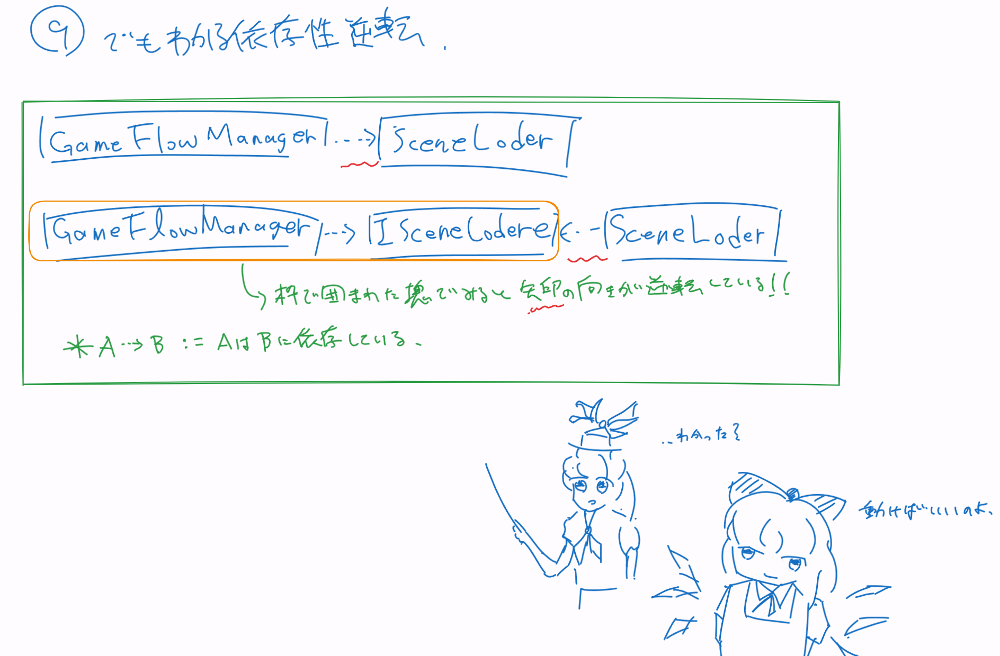

---
title: 【VContainer】VContainer講習会
date: 2026-08-26
author: ru322
---
# はじめに
この講習会資料は以下を前提とします。
- Unity 6000.3.21f1のインストール
- https://github.com/tuatmcc/VContainerLecture　のクローン
- Rider or VisualStudio等、エディタの導入(推奨)

また前提知識としてUnity, C#の基礎的な理解を想定しています。(Class, Method, SerializeField, FindObject)
講習会当日であればサポートがある(見込み)ですし、リポジトリごとChatGPTに投げて逐次聞きながら進めるのも良いでしょう

また、この資料は一からDIを意識した設計が行えるようになるというよりかは、DIが用いられている既存プロジェクトで、DIを意識して機能の追加が行えることを目標にします。

またフォルダ構成は次のようになってます。
```
Assets
└── VContainerLecture
    ├── Core : シーン間で共通
    │   ├── Scripts : スクリプト
    │   ├── RootLifetimeScope : RootLifetimeScopeがアタッチされたPrefab
    │   └── VContainerSettings
    ├── Lecture : 講習会資料
    ├── Play : Playシーンに関するもの
    │   ├── FBX : モデル
    │   ├── Materials : マテリアル
    │   ├── Prefabs : プレファブ
    │   ├── Scripts : スクリプト
    │   ├── Shaders : シェーダ
    │   └── PlayScene : Playシーン
    ├── Result
    │   ├── Scripts
    │   └── ResultScene
    └── Title
        ├── Scripts
        │   ├── TitleLifetimeScope
        │   └── TitleManager
        └── TitleScene
```

# VContainerとは何か？
依存性注入(Dependency Injection, 以下DIと表記)のためのライブラリです。
詳しくは公式のページを参考にしてください

https://vcontainer.hadashikick.jp/ja/

Extenjectというライブラリもあります(去年はこれでした)。なぜ切り替えたかというと、半分くらいはノリです。

速かったり、シンプルだったりします。

詳しい違いは

https://vcontainer.hadashikick.jp/ja/comparing/comparing-to-zenject

を見てください

# 依存性注入とはなにか？

ざっくり言えば、依存性注入とは

**(何らかの形で結びつけられた)外部のオブジェクトを受け取る**

テクニックです。

これを上手いことゴニョゴニョすると
- 疎結合なプログラムがつくれる
- モックと本番コードの切り替えが簡単にできる
- MonoBehaviourの継承を減らせる

DIを使わない場合、例えば`GameFlowManager`がシーン遷移のために`SceneLoader`を必要としているとします。
```csharp
public class GameFlowManager
{
    private SceneLoader _sceneLoader;

    public GameFlowManager()
    {
        _sceneLoader = new SceneLoader();
    }
}
```
このコードでももちろん動きますが、GameFlowManagerはSceneLoaderを使うだけではなく、作成するまでを担ってしまっています。
例えばあとから、SceneLoaderをテスト用のTestSceneLoaderに切り替えたくなったときGameFlowManagerを書き換える必要があります。

そこで、依存するインスタンスを自分で作成することなく、外部から受け取るような概念を考えます。
```csharp
public class GameFlowManager
{
    private readonly ISceneLoader _sceneLoader;

    public GameFlowManager(ISceneLoader sceneLoader)
    {
        _sceneLoader = sceneLoader;
    }
}
```
これがDIの基本的な概念です。でも一体どうやって`sceneLoader`を受け取るのでしょう？

そうです。これを担うのがVContainerというわけです。
では実際に、VContainerを使って実際にGameFlowManagerにSceneLoaderをDIしてみましょう！

[※蛇足]DIを用いた設計思想に依存性逆転とかがあります。興味のある人は調べてみても良いとは思いますが、依存方向の矢印の向きだったりそもそも逆の逆、順方向はどっちだとか頭がパンクするので軽く眺める程度にすることをおすすめします。

# (Pure C#に)DIしてみる

`lecture/checkpoint-1`ブランチへ移動してください。

`Assets/VContainerLecture/Core/Scripts/GameFlowManager.cs`に`SceneLoader`をDIしてみましょう！
`GameFlowManager`はシーンを跨いだ状態の管理を担い、`SceneLoader`はシーンのロードを担います(SceneLoaderのインターフェイスがISceneLoaderです)。

`ISceneLoader`をDIすることで`GameFlowManager`へ`SceneLoader`が注入される訳です。

一般的なDIの手順は次のとおりです。
1. 注入されるクラスを書く(インターフェイスは必須ではありません!!)
2. LifetimeScopeに登録する
3. 注入する

3分◯ッキング的手法として1.の注入するコードは用意してあります。

`GameFlowManager`, `IGameFlowManager`がそれです。
それぞれ次のように記述されています。
```csharp
public enum GameState
{
    Title,
    Play,
    Result,
}

public enum TransitionType
{
    Enter,
    Exit
}
public interface IGameFlowManager
{
    public event Action<GameState> OnGameStateChange;
    public GameState CurrentState { get; }
    GameState NextState(TransitionType  transitionType);
} 
```

```csharp
public class GameFlowManager : IGameFlowManager
{
    public event Action<GameState> OnGameStateChange;
    public GameState CurrentState { get; private set; }

    private ISceneLoader _sceneLoader;

    public GameFlowManager(ISceneLoader sceneLoader)
    {
        _sceneLoader = sceneLoader;
        CurrentState = SceneManager.GetActiveScene().name switch
        {
            "PlayScene" => GameState.Play,
            "ResultScene" => GameState.Result,
            _ => GameState.Title,
        };
    }
    //以下略
}
```

ただのピュア(MonoBehaviourを継承していない)なC#のコードです(ピュアなC#で書けるというのが偉大なことなんですよ！)

次に`RootLifetimeScope`に登録していきましょう。
(ZenjectでいうところのInstallerですね)

一部コメントアウトされているのでこれを解除してください。

```csharp
using VContainer;
using VContainer.Unity;

namespace VContainerLecture.Core.Scripts
{
    public class RootLifetimeScope : LifetimeScope
    {
        protected override void Configure(IContainerBuilder builder)
        {
            builder.Register<SceneLoader>(Lifetime.Singleton).As<ISceneLoader>();
            builder.Register<GameFlowManager>(Lifetime.Singleton).As<IGameFlowManager>();
        }
    }
}
```
こんな感じです。依存性注入というのは注入する何かしらをどこかしらから持ってくるものですが、これは当たり前に指定してあげる必要があります。

素のC#であれば
```csharp
builder.Register<クラス名>(Lifetime.Singleton).As<インターフェイス1>.As<インターフェイス2>
```
このようにするということです。(インターフェイスは注入されるクラスが継承しているインターフェイスです)

`Lifetime.Singleton`はインスタンスのスコープです。
VContainerでは登録したインスタンスをどの範囲で使い回すかをLifetimeで指定できます。
- Singleton: シーン(異なるLifetimeScope)を跨いで同じインスタンを利用する
- Scope: 同じシーン(同じLifetimeScope)内では使い回す
- Transient: 注入のたびに新しく生成する

とりあえず今はSingletonで同じインスタンスが入る、という理解で大丈夫です。

3.さてインジェクトされてみましょう。MonoBehaviourを継承しないクラスは大体コンストラクタインジェクションを使えば良いと思います。つまりこういうことです。(コメントアウトされているだけなので解除しておいてください)
3.インジェクトされてみましょう。MonoBehaviourを継承しないクラスは大体コンストラクタインジェクションを使えば良いと思います。つまりこういうことです。

コメントアウトされているだけなので解除しておいてください

```csharp
//GameFlowManager.cs
public GameFlowManager(ISceneLoader sceneLoader)
{
    _sceneLoader = sceneLoader;
    //以下、その他の初期化処理
}
```
この例だと`ISceneLoader`を継承したクラス`SceneLoader`のインスタンスが引数`sceneLoader`として注入されています。

TitleSceneを開いてシーン遷移ができれば、正常にDIできています。

# (MonoBehaviourに)DIしてみる
次はMonoBehaviourを継承したクラスにDIしてみましょう。

`lecture/checkpoint-2`ブランチへ移動してください。
`Assets/VContainerLecture/Play/Scripts/PlayerController.cs`へ、プレイヤーの入力を扱う`IPlayerInput`を注入します。
```csharp
public interface IPlayerInput
{
    Vector2 Move { get; }
    Vector2 Look { get; }
    bool JumpPressed { get; }
}
```
```csharp
public class PlayerInput : IPlayerInput, IDisposable, ITickable
{
    private readonly  GameInputs _gameinputs;

    private bool jumpPressed;

    //...
    
    public Vector2 Move => _gameinputs.Player.Move.ReadValue<Vector2>();
    public Vector2 Look => _gameinputs.Player.Look.ReadValue<Vector2>();

    public PlayerInput()
    {
        _gameinputs = new GameInputs();
        _gameinputs.Player.Jump.performed += _ => jumpPressed = true;
        _gameinputs.Player.Enable();
    }

    public void Tick()
    {
    }
    public void Dispose()
    {
        _gameinputs.Player.Disable();
    }
}
```

先と同様にコード自体はすでに出来合いの物があるのでLifetimeScopeへ登録していきましょう。

`PlayLifetimeScope`にコメントアウトしてあると思うので解除しておいてください。

```csharp
namespace VContainerLecture.Play.Scripts
{
    public class PlayLifetimeScope : LifetimeScope
    {
        protected override void Configure(IContainerBuilder builder)
        {
            builder.Register<PlayerInput>(Lifetime.Singleton)
                .As<IPlayerInput>()
                .As<ITickable>()
                .As<IDisposable>();
            
            //シーン上にあるPlayerControllerがアタッチされたゲームオブジェクトから自動で登録
            builder.RegisterComponentInHierarchy<PlayerController>();
        }
    }
}

```
次に注入していきましょう。

先のPure C#のクラスではコンストラクタを用いましたが、MonoBehaviourを継承したクラスはコンストラクタを持てません。
そこでメソッドインジェクションを使います。

つまり次のような塩梅です。実際のコードは複数注入していますが、まぁ気にしないでください。
```csharp
// PlayerController.cs
[Inject]
public void Construct(IPlayerInput playerInput)
{
    _playerInput = playerInput;
}
```
また、MonoBehaviourを継承したクラス(RegisterComponentInHierarchy)で注入されているクラスについては、スクリプトがアタッチされたゲームオブジェクトがシーン上に1つ存在している必要があります。

というわけでHierarchyにいるunitychanにPlayerControllerをアタッチしてあげてください。

この時点で`PlayScene`を再生して無事に操作できれば成功です。

# VContainerによるPure C#エントリの話
`PlayLifetimeScope`をみると`PlayerInput`を次のように登録します。
```csharp
builder.Register<PlayerInput>(Lifetime.Singleton)
                .As<IPlayerInput>()
                .As<ITickable>()
                .As<IDisposable>();
```
`PlayerInput`は`IPlayerInput`に加えて`ITickable`と`IDisposable`を継承しているということになります。

例えば`ITickable`は`Tick`関数をもち、これを継承した`PlayerInput`は`Tick`関数を実装します。
このTick関数はMonoBehaviourでいうところの`Update`関数に(大体)対応します。
つまり、非MonoBehaviourでありながらMonoBehaviourのようなエントリを持てるということです。
(基本的にゲームロジックからはMonoBehaviourを排除したいという原則が根底にあります。このへんはMVP設計の話とかの話に繋がったりします)

よく使う系の対応表を次にまとめておきます。

| VContainer | Extenject | MonoBehaviour |
| --- | --- | --- |
| `IStartable.Start()` | `IInitializable.Initialize()` | `Start()` |
| `ITickable.Tick()` | `ITickable.Tick()` | `Update()` |
| `IFixedTickable.FixedTick()` | `IFixedTickable.FixedTick()` | `FixedUpdate()` |
| `ILateTickable.LateTick()` | `ILateTickable.LateTick()` | `LateUpdate()` |
| `IDisposable.Dispose()` | `IDisposable.Dispose()` | `OnDestroy()` |


## ちょっとした余談(読まなくて良いです)
実際はライフサイクルを持つようなクラスは`builder.Register<>(Lifetime.Singleton)`
を使わずに`builder.RegisterEntryPoint<>()`を用いると公式Referenceにはあります。

ではこの`builder.RegisterEntryPoint<>()`は何者かというと次のコードと等価(というより実装)なようです
```csharp
EntryPointsBuilder.EnsureDispatcherRegistered(builder);

builder.Register<PlayerInput>(Lifetime.Singleton)
    .AsImplementedInterfaces();
```
`.AsImplementedInterfaces()`は実装しているすべてのインターフェイスを追加しています。つまり`As<>()`をいちいち書かなくてよいということです。

さらに`EntryPointsBuilder.EnsureDispatcherRegistered(builder)`は`IStartable`とかを橋渡ししてくれます。
こんなコード入っていないと思った人は正しいです。

本資料において`PlayLifetimeScope`にはすでに`RegisterEntryPoint`が存在します。
実は`LifetimeScope`上で一回でも実行されていれば他のRegisterされたインスタンスにも適用されます。
というわけで本講習ではわざわざ書かなくても動いたという話です。

余談終わり！

# ScriptableObject(SO)をDIしてみる
[//]: # (Pure C#, MonoBehaviour以外にもSciptableObject&#40;SO&#41;とかあったりしますが、ここでは割愛します。)
[//]: # (実装例が見たい場合は `PlaySetting.cs`あたりを参考にしてみてください。)
ゲームの設定値をまとめたScriptableObjectもDIできます！

`lecture/checkpoint-3`へ移動してください。

カメラ感度や移動速度をまとめた
`Assets/VContainerLecture/Play/Scripts/PlaySettings.cs`
を登録してみましょう。

`PlaySettings.cs`は次のような感じです。
```csharp
using UnityEngine;

namespace VContainerLecture.Play.Scripts
{
    [CreateAssetMenu(fileName = "PlaySettings", menuName = "Scriptable Objects/PlaySettings")]
    public class PlaySettings : ScriptableObject
    {
        [field: SerializeField] public float LookSensitivity { get; private set; } = 0.1f;
        [field: SerializeField] public float MinPitch { get; private set; } = -35f;
        [field: SerializeField] public float MaxPitch { get; private set; } = 65f;
        //...
    }
}
```
設定値はAssetとして保持できるためデバッグ用のパラメータも作っておいて切り替えられたりとかもでき便利です。

まず、作成済みのPlaySetting.assetを`PlayLifetimeScope`のインスペクタへ登録します。
(ちなみに、PlaySetting.csを右クリックして`Create`→`Scriptable Object`で`PlaySetting.asset`を作成できます)

次に、インスタンスをVContainerに登録します。コメントアウトしてあるので解除してください。
```csharp
// PlayerCameraController.cs
namespace VContainerLecture.Play.Scripts
{
    public class PlayLifetimeScope : LifetimeScope
    {
        [SerializeField] private PlaySettings playSettings;

        protected override void Configure(IContainerBuilder builder)
        {
            builder.RegisterInstance(playSettings);
        }
    }
}
```

`Register<T>`が`RegisterInstance`になっていることに注意すると良いかも。
あとは通常のDIと同じように受け取れるはずです。(毎度恒例のコメントアウトをしてください)
```csharp
private PlaySettings _playSettings;

[Inject]
public void Construct(PlaySettings playSettings)
{
    _playSettings = playSettings;
}
```

`PlayScene`に入って`PlaySettings.asset`の`Move Speed`とかを弄って実際に変化することを確かめてみるとDIされている実感がでると思います。

# テスト用コードの切り替え
先に`注入されるクラスを書く(実はインターフェイスは必須ではありません!!)`みたいなことを書きました。

そもそもなんでインターフェイスを切り替えたかといえば、振る舞いの切り替えが容易になるからです。
実際にテスト用コードに切り替えられるようにして、その嬉しさを実感してみましょう。

`lecture/checkpoint-4`へ移動してください。

`PlayManager`をデバッグ用の`TestPlayManager`へ切り替えられるようにします。
この２つのクラスはどちらも共通のインターフェイス`IPlayManager`の実装です。

`PlayLifetimeScope`にテスト用実装をつかうか否かのフィールドを追加して切り替えられるようにします。

```csharp
[SerializeField]
private bool isTest;

//...

protected override void Configure(IContainerBuilder builder)
{
    if (isTest)
    {
        builder.RegisterEntryPoint<TestPlayManager>();
    }
    else
    {
        builder.RegisterEntryPoint<PlayManager>();
    }
}
```
こんな塩梅にします。

注入される側のコードを変更する必要はありません。

実際にチェックボックスをON/OFFして振る舞いが変わることを確認しましょう！

`isTest`がONだと`Console`にデバッグログが出力されるはずです。

# DIが壊れたとき
実際の開発ではDIの破壊が偶によくあります。その復旧方法を学んで起きましょう。

(UnityのエラーログをChatGPTに投げれば良いとか言ってはいけません！)

DI関連でエラーがでるなら大体次のような感じです
1. LifetimeScopeに登録されていない
2. `As<Interface>()`が注入する型と一致していない
3. `RegisterComponentInHierarchy`ならHierarchy上に存在していない

`lecture/di-broken`ブランチに移動してエラーを実際に修正してみましょう!

(Codexに適当にぶっ壊させたら悪辣な壊し方をしてきたので結構難易度高いと思います)

# [演習]実際に自分でDIしてみよう
なにか好きな機能を作成して実際にDIしてみましょう！
学祭開発の予習だと思ってください。

思いつく機能がなければステージに回転機能でもつけてみてください。MonoBehaviourへのDI, SOの注入とか復習できると思います。
- `IRotationService`, `RotationService`をPure C#で
- `PlaySettings.cs`に`StageRotationSettings`を追加
- `MonoBehaviour`の`StageRotatior.cs`

みたいな？
# APPENDIX

# 依存性逆転とは何かという話。ちょうざっくり



[学マスで理解する ver by 部長](https://qiita.com/Xia7an/items/f3ad29896bfb55e154b6)

# Project Root LifetimeScopeに関するお話
VContainerではExtenjectと同様にシーンをまたぐLifetimeScopeを定義できます。

本講習においては実は`RootLifetimeScope`がそれです。
またRoot LifetimeScopeはすべてのLifetimeScopeの親になります。

具体的には`GameFlowManager`は`RootLifetimeScope`でのみ登録され、`TitleScene`から`PlayScene`とシーンが遷移しても同じインスタンでDIされます。

これによって`RootScene`なんて使わなくてもシーン間の状態が保存できるので非常に便利です。

# Reference
この資料は去年(2025年度)のExtenject講習会資料を参考に作成されました。

https://github.com/tuatmcc/ExtenjectLecture/tree/main

VContainerの公式リファレンス

https://vcontainer.hadashikick.jp/


